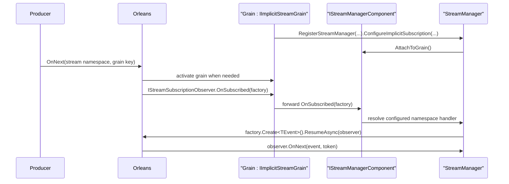

# Egil.Orleans.Messaging — API Design

Working design doc for the abstractions in the `Egil.Orleans.Messaging`
library.

Each section captures the decided shape, the rationale, and any explicit
non-goals. Decisions are settled top-down via grilling sessions; revisit
only when a new constraint surfaces.

Status legend: **Settled** = won't change without a new force; **Open** =
still under design; **Deferred** = explicitly postponed past the spike.

---

## 0. Scope & packaging

**Status:** Settled.

### What this library is

A set of composable building blocks for Orleans grains that need:

1. **Atomic, recoverable state writes** — grain's observable `State` is
   never out of sync with what is durably persisted, even on ambiguous
   write failures.
2. **Outbox pattern** — durable, co-located message buffer that commits
   atomically with business-state changes.
3. **Outbox processing (postman)** — timer + reminder driven dispatch
   with retry, telemetry, and failure callbacks.
4. **Receiver-side dedup** — `MessageTracker` that tracks high-water
   positions from both outbox senders and Orleans streams.
5. **Stream subscription management** — fluent configure/resume/error
   facade over Orleans implicit and explicit stream subscriptions.

### What this library is NOT

- Not CQRS in the read/write-model-separation sense. No read-model
  projections, no query stores, no event sourcing.
- Not a replacement for `IGrainStorage`. It wraps `IPersistentState<T>`,
  not the provider layer.

### Packaging

One NuGet package for now. Internal boundaries (state management vs
messaging vs streaming) are kept clean so a future split is mechanical.
Split only when dependency weight becomes a concrete problem.

### Capability namespaces and folders

Source and test files are grouped by library tool. Tests mirror production
folders so behavior is easy to find from the type under test.

| Capability | Production namespace | Test folder |
| ---------- | -------------------- | ----------- |
| State management | `Egil.Orleans.Messaging.State` | `State/` |
| Outbox | `Egil.Orleans.Messaging.Outboxes` | `Outboxes/` |
| Receiver tracking | `Egil.Orleans.Messaging.Tracking` | `Tracking/` |
| Streams | `Egil.Orleans.Messaging.Streams` | `Streams/` |
| Event Hub stream enrichment | `Egil.Orleans.Messaging.Streams.EventHubs` | `Streams/EventHubs/` |

Extension entry points live in the namespace of the type they extend so they
are discoverable from normal Orleans, hosting, and DI imports:

- Grain registration methods: `namespace Orleans`.
- `IServiceCollection` registration methods:
  `namespace Microsoft.Extensions.DependencyInjection`.
- `ISiloBuilder` and `IEventHubStreamConfigurator` registration methods:
  `namespace Orleans.Hosting`.

C# 14 extension blocks are the preferred shape for new extension entry
points.

### Name

**`Egil.Orleans.Messaging`** — the outbox, postman, dedup, and stream
manager are all messaging infrastructure. `IStateManager` exists to make
the messaging atomic. Messaging is the reason the library exists; safe
state is the enabler.

---

## 1. `IStateManager<T>` — atomic state writes with in-flight recovery

**Status:** Settled.

### Goal

Replace direct grain use of `IPersistentState<T>` with a thin wrapper
that guarantees the grain's observable `State` is never out of sync with
what is durably persisted, even when `WriteStateAsync` fails ambiguously
(timeout, network drop, server 5xx, ETag conflict).

Grain code injects `IPersistentState<MyState>` as normal, then registers an
`IStateManager<MyState>` wrapper during activation. After that point, the raw
`IPersistentState<MyState>` should stay internal to the wrapper. This is
non-negotiable — exposing both is the loophole that lets grain authors read
stale `storage.State` after a failed write.

### Interface

```csharp
public interface IStateManager<T> where T : class, IEquatable<T>
{
    T State { get; }
    Task ReadAsync();
    Task WriteAsync(T newState);
    Task ClearAsync();
}
```

Constraints on `T`:

- `class` — atomic reference swap of `State` from `[AlwaysInterleave]`
  handlers is a single pointer load, no torn reads.
- `IEquatable<T>` — recovery path compares server-side state to
  attempted write to decide swallow-vs-rethrow. Records implement this
  for free.

Users pick one of two paths for `T`:

- **Path A — plain record + structural equality**
  (`MyState : IEquatable<MyState>`). User owns `Equals`. Works trivially
  for record-of-primitives shapes. Breaks silently if state holds
  `ImmutableArray<>` (reference-equality trap) — user must override
  `Equals` themselves in that case.
- **Path B — inherit `VersionedState`**
  (`MyState : VersionedState`). Library stamps a per-write `Guid Version`.
  Recovery path pattern-matches on `VersionedState` and compares `Version`
  directly — immune to collection-equality issues in the state graph.
  Recommended default for any non-trivial state.

See §3a for `VersionedState` and why the generic layer was removed.

### Activation: state is auto-populated

`IStateManager<T>` behaves like `IPersistentState<T>` from the grain's
point of view: by the time `OnActivateAsync` runs, `State` already
reflects what is durably stored. Grain code does **not** call `ReadAsync`
during activation.

This is achieved by composition rather than reimplementation: the
default `StateManager<T>` wraps an `IPersistentState<T>` facet that
Orleans hydrates during the `SetupState` grain-lifecycle stage. The
manager exposes `State` as a proxy onto that underlying storage, so it
sees the hydrated value the moment Orleans's lifecycle hook fires —
before `OnActivateAsync` is invoked.

`ReadAsync` is retained for the rare case where the grain wants to
force a re-read of authoritative state mid-activation (e.g. after a
known external mutation). It is not required by the activation flow.

### `WriteAsync` semantics

A single default `StateManager<T>` handles both shapes. It branches on
the non-generic `VersionedState` marker (see §3a) at runtime: if `T`
derives from it, the manager stamps a fresh `Guid Version` before every
write and uses that version for the recovery-path equality check;
otherwise it falls back to `T.Equals(...)`.

```csharp
internal sealed class StateManager<T>(IPersistentState<T> storage) : IStateManager<T>
    where T : class, IEquatable<T>
{
    public T State => storage.State;

    public Task ReadAsync() => storage.ReadStateAsync();

    public async Task WriteAsync(T newState)
    {
        var previous = storage.State;

        if (newState is VersionedState versioned)
        {
            versioned.Version = Guid.CreateVersion7();
        }

        storage.State = newState;

        try
        {
            await storage.WriteStateAsync();
        }
        catch (Exception ex)
        {
            try { await storage.ReadStateAsync(); }
            catch
            {
                storage.State = previous;
                throw;
            }

            if (ex is not InconsistentStateException && IsEquivalent(storage.State, newState))
            {
                return; // write actually persisted; lost-response, swallow
            }

            throw;
        }
    }

    private static bool IsEquivalent(T persisted, T attempted) =>
        persisted is VersionedState pv && attempted is VersionedState av
            ? pv.Version.Equals(av.Version)
            : persisted.Equals(attempted);
}
```

Behaviour matrix:

| Failure                            | After `WriteAsync` returns/throws               |
| ---------------------------------- | ------------------------------------------------ |
| Success                            | `State == newState`, returns                     |
| Timeout, write actually persisted  | `State == newState`, returns (silent recovery)   |
| Timeout, write did not persist     | `State == server's value`, throws original ex    |
| 5xx / transient                    | Same as timeout — re-read decides                |
| `InconsistentStateException`       | `State == server's value`, **always rethrows**   |
| Re-read also fails (double failure)| `storage.State` reverted, throws original ex     |

### Double failure behaviour

When both `WriteStateAsync` and the recovery `ReadStateAsync` fail, the
manager reverts `storage.State` to `previous` and rethrows. After this
the grain holds correct data but a **stale ETag**. The next write
attempt may hit `InconsistentStateException` if the first write actually
persisted.

**Library does not auto-recover from double failure.** The grain must
call `ReadAsync()` before its next write to refresh the ETag if it
suspects this state. This is a documented contract — the library
surfaces the failure, the grain decides the policy (retry, deactivate,
alert).

### Notes

- **No internal `Deactivate` call.** Grain code decides deactivation
  policy.
- **Always rethrow on `InconsistentStateException`**, even if equality
  matches. A coincidental match would silently swallow a real concurrent
  write; the contract "if we threw conflict, your command read stale
  data" must hold.
- **`newState`'s reference is mutated for versioned state.** `Version`
  is `set` (not `init`), so `versioned.Version = ...` updates the
  caller's reference. Documented contract.
- **No `ReferenceEquals` pre-write short-circuit.** Functional
  `with { ... }` produces a fresh reference even when no fields changed.

### Provider-specific implementations

`IStateManager<T>` wraps an existing `IPersistentState<T>`, not a
replacement for grain storage providers. No new `IGrainStorage`
implementation is introduced.

Each storage provider we care to optimise for may ship its own
`IStateManager<T>` that:

- Inspects provider-specific exception types to classify failures as
  *DefinitelyDidNotPersist* (skip re-read, revert + rethrow) vs
  *UnknownOutcome* (re-read).
- Optionally exploits provider features (conditional writes, blob
  versions) to avoid the re-read.

### Why a wrapper, not extension methods

The wrapper was debated — recovery logic is stateless, could be an
extension method on `IPersistentState<T>`. But the wrapper does a fourth
thing extensions cannot: **it hides `IPersistentState<T>.State`**.

`IStateManager<T>.State` exposes only the **committed** snapshot — the
value after the last successful `WriteAsync`. During an in-flight write,
`IPersistentState<T>.State` already holds the uncommitted value. Read
methods marked `[AlwaysInterleave]` that access `storage.State` directly
could observe uncommitted state — and if the write fails, they returned
data that never persisted.

The wrapper is a **concurrency safety boundary**, not just convenience.
Extension methods can't provide this fence because the grain still holds
`IPersistentState<T>` and any method can access `.State` directly.

### Grain wiring

```csharp
// User injects IPersistentState<T> as normal, registers wrapper in activation.
[PersistentState("state")] IPersistentState<MyState> storage;
IStateManager<MyState> stateManager;

public override Task OnActivateAsync(CancellationToken ct)
{
    stateManager = this.RegisterStateManager("state", storage);
    // ...
}
```

`RegisterStateManager()` is an extension method on `IGrainBase`. Internally:

```csharp
public static IStateManager<TState> RegisterStateManager<TGrain, TState>(
    this TGrain grain,
    string storageName,
    IPersistentState<TState> storage)
    where TGrain : IGrainBase
    where TState : class, IEquatable<TState>
```

The silo must register a keyed `IStateManagerFactory<T>` for each storage
name used by grains:

```csharp
siloBuilder.AddDefaultStateManager("state");
```

Provider-specific overrides can be supplied with `AddStateManagerFactory(...)`.
The activation-time `RegisterStateManager(...)` call mirrors
`RegisterStreamManager(...)` and `RegisterGrainTimer(...)`: the grain registers
the runtime helper once during activation and uses the returned manager for
all subsequent state reads and writes.

---

## 2. `Outbox<T>` storage placement

**Status:** Settled.

The `Outbox<T>` collection lives **inside the grain's main state
record**. Atomicity is the whole point — a state change and the messages
announcing it commit in one ETag-protected write or neither commits.
Splitting into a separate `IPersistentState` blob would re-introduce
the "told one party, not the other" failure mode.

### Write amplification

Co-locating the outbox means every command's `WriteStateAsync`
re-serialises both halves. Accepted.

Provider-level mitigation is allowed: a storage provider may detect
unchanged sub-graphs and skip writing unchanged bytes. That stays a
provider concern.

### Non-goal: outbox-only writes

The grain does not expose "enqueue without committing other state."
Every outbox change rides the same `WriteAsync(newState)` as the
business-state change that produced it.

---

## 3. `Outbox<T>` — message collection inside grain state

**Status:** Settled.

### Goal

`Outbox<T>` is the per-grain durable buffer of messages that have been
*announced* (committed alongside a state change) but not yet *delivered*
(handed off to a postman successfully). It lives as a property on the
grain's state record for atomic writes.

The collection behaves like `ImmutableArray<OutboxMessageEnvelope<T>>`
— read-only iteration, indexer, value semantics, mutators return new
instances — with three additions:

- A baked-in `Sender` (grain id).
- A monotonic `LatestSequenceNumber` that persists independently of the
  message array contents.
- An `Add(T payload)` mutator that owns sequence assignment.

### Shape

```csharp
[GenerateSerializer]
public sealed record OutboxSequenceToken(
    [property: Id(0)] long SequenceNumber,
    [property: Id(1)] GrainId Sender,
    [property: Id(2)] DateTimeOffset Timestamp,
    [property: Id(3)] DateTimeOffset Epoch);

[GenerateSerializer]
public sealed record OutboxMessageEnvelope<T>(
    [property: Id(0)] OutboxSequenceToken Token,
    [property: Id(1)] T Message);

[GenerateSerializer]
public sealed class Outbox<T> : IReadOnlyList<OutboxMessageEnvelope<T>>, IEquatable<Outbox<T>>
{
    [Id(0)] private readonly GrainId sender;
    [Id(1)] private readonly long latestSequenceNumber;
    [Id(2)] private readonly ImmutableArray<OutboxMessageEnvelope<T>> items;
    [Id(3)] private readonly DateTimeOffset? epoch;

    // Non-persisted; no [Id]. Mutable, registered post-construction.
    [NonSerialized]
    [JsonIgnore]
    private TimeProvider time = TimeProvider.System;

    internal Outbox(
        GrainId sender,
        long latestSequenceNumber,
        ImmutableArray<OutboxMessageEnvelope<T>> items,
        DateTimeOffset? epoch)
    {
        this.sender = sender;
        this.latestSequenceNumber = latestSequenceNumber;
        this.items = items;
        this.epoch = epoch;
    }

    public static Outbox<T> Create(GrainId sender) =>
        new(sender, latestSequenceNumber: 0, items: [], epoch: null);

    public void RegisterTimeProvider(TimeProvider time) => this.time = time;

    public GrainId Sender => sender;
    public long LatestSequenceNumber => latestSequenceNumber;
    public DateTimeOffset? Epoch => epoch;
    public int Count => items.Length;
    public bool IsEmpty => items.IsDefaultOrEmpty;
    public OutboxMessageEnvelope<T> this[int index] => items[index];

    public IEnumerator<OutboxMessageEnvelope<T>> GetEnumerator()
        => ((IEnumerable<OutboxMessageEnvelope<T>>)items).GetEnumerator();
    IEnumerator IEnumerable.GetEnumerator() => GetEnumerator();

    public Outbox<T> Add(T message) { /* increments seq, stamps epoch on first call */ }
    public Outbox<T> Remove(OutboxSequenceToken token) { /* removes FIFO head if token matches */ }
    public Outbox<T> RemoveRange(IEnumerable<OutboxSequenceToken> tokens) { /* removes matching FIFO prefix */ }
    public Outbox<T> Clear() { /* removes all items, preserves LatestSequenceNumber + Epoch */ }

    // O(1) sequence equality — see below.
    public bool Equals(Outbox<T>? other) { /* metadata + first/last sequence check */ }
    public override bool Equals(object? obj) => obj is Outbox<T> o && Equals(o);
    public override int GetHashCode() { /* metadata + first/last sequence hash */ }
}
```

### Epoch semantics

- `Create(sender)` → `epoch = null`, `LatestSequenceNumber = 0`.
- First `Add()` → stamps `epoch = now`. Persisted with state.
- Subsequent `Add()` → same epoch, incrementing sequence number.
- `Clear()` → removes items, **preserves** `LatestSequenceNumber` and
  `Epoch`. This is the normal "postman drained successfully" path.
- `Create(sender)` again → **resets both** epoch (to null) and sequence
  number (to 0). This is the nuclear option — the next `Add` starts a
  fresh epoch. Receivers see `token.Epoch > stored.Epoch` and accept.

**`Clear()` is the normal path.** Grains should almost never call
`Create(sender)` on an active outbox. `Create` is for construction-time
initialisation and deliberate ops-level sequence-space resets.
Document and warn.

### Outbox depth telemetry and configurable maximum

The outbox can grow unbounded if postman targets are down. Mitigation:

- **Telemetry:** gauge for outbox depth per grain type, emitted on every
  write. Operators see growth before it becomes a crisis.
- **Configurable maximum:** users can set a max outbox size when
  configuring the outbox processor. When exceeded, oldest messages are
  automatically dropped (FIFO). This is opt-in; default is no cap.
- **Documentation:** storage providers have entity size limits (e.g.
  Azure Table = 1MB). Document the risk of unbounded growth.

### O(1) sequence equality

Two `Outbox<T>` values are equal when
`(Sender, LatestSequenceNumber, Epoch, Count, first sequence number, last sequence number)`
matches. Constant-time regardless of `items.Length`.

This relies on the outbox invariant that sequence numbers are assigned
only by `Add` and pending items are removed only in FIFO order. Under
that invariant, matching first and last sequence numbers with matching
count identifies the same contiguous pending sequence window. Equality
therefore stays independent of outbox depth and does not need a separate
persisted fingerprint field.

If two outboxes have the same sender, epoch, high-water mark, count, and
sequence-window endpoints but different payloads, the outbox was used in
a way that broke encapsulation/invariants. Equality does not attempt to
detect that invalid state.

### Why these choices

- **Sealed class, not record.** No `with`, no synthesized copy
  constructor. Mutation through four methods only. Reference type because
  `RegisterTimeProvider` is a void mutator.
- **`Add(T payload)` not `Add(envelope)`.** Outbox owns sequence
  assignment. Callers cannot fabricate sequence numbers.
- **`RegisterTimeProvider` not per-call argument.** Matches
  `MessageTracker`. Successor instances carry the provider forward.
- **Lazy `Epoch`.** A grain that never sends doesn't burn a fresh epoch
  on storage.
- **`Remove(token)` not `Remove(envelope)`.** Token is the identity, but
  removal is constrained to the FIFO head to preserve the contiguous
  pending-sequence invariant.
- **`LatestSequenceNumber` is a separate field.** After flush, items are
  empty; high-water mark persists independently.

### Retry diagnostics

Envelope stays immutable. `SendAttempts` and `LastException` do NOT
appear on `OutboxMessageEnvelope<T>`. The postman tracks attempts
in-memory keyed on `OutboxSequenceToken`. On re-activation, counts
restart from zero. Acceptable for burst retry policies.

---

## 3a. `VersionedState` — version-based equality for recovery

**Status:** Settled. Generic `VersionedState<TSelf>` removed — see below.

### Problem

`ImmutableArray<T>.Equals` compares the underlying `T[]` reference, not
contents. Record-auto-generated `Equals` on state records holding
`ImmutableArray<>` returns false for identical-content different-backing
arrays. This breaks `IStateManager.WriteAsync`'s recovery path.

### Resolution

```csharp
[GenerateSerializer]
public abstract record VersionedState
{
    [Id(0)] public Guid Version { get; internal set; } = Guid.CreateVersion7();
}
```

User state:

```csharp
[GenerateSerializer]
public sealed record MyState : VersionedState
{
    [Id(1)] public Outbox<MyEvent> Outbox { get; init; } = Outbox<MyEvent>.Create(sender);
    [Id(2)] public ImmutableArray<Something> Items { get; init; } = [];
}
```

### Why the generic `VersionedState<TSelf>` was removed

The original design had a two-layer hierarchy where the generic layer
overrode `Equals` to compare only `Version`, bypassing `ImmutableArray`
reference-equality. However:

1. **The Equals override was broken.** When the user writes
   `sealed record MyState : VersionedState<MyState>`, the compiler
   generates `MyState.Equals(MyState?)` that calls `base.Equals(other)`
   (the version-only check) **AND** adds property-level checks for all
   of `MyState`'s declared properties. So `ImmutableArray` comparisons
   still happen in the generated code.
2. **The recovery path doesn't need it.** `IStateManager<T>.WriteAsync`
   does `if (newState is VersionedState v)` and compares `v.Version`
   directly via pattern matching — it never relies on `T.Equals()` for
   VersionedState-derived types.
3. **`IEquatable<T>` on `IStateManager<T>` is satisfied automatically**
   by the record-generated equality for non-VersionedState types.

The non-generic `VersionedState` provides everything the library needs:
the `Version` property, a single type for pattern matching at runtime,
and the `[JsonInclude]` + `internal set` fence.

### Why `Version` is internal-set, not user-settable

`IPersistentState<T>.Etag` is storage concurrency. `Version` is
library-internal recovery decoration. Conflating them erases a layer.

---

## 4. `MessageTracker`

**Status:** Settled.

Receiver-side, persisted dedup state. Tracks high-water position from
each upstream source. Two source kinds:

- **Orleans streams** — keyed by `StreamId`; position is a
  `StreamCursor` wrapping `(StreamId, StreamSequenceToken)`.
- **Outbox messages** — keyed by sender `GrainId`; position is an
  `OutboxSequenceToken`.

### Shape

**Sealed class** (not record — consistent with `Outbox<T>`, avoids
`time` field participating in record-synthesized equality).

```csharp
[GenerateSerializer]
[Alias("egil.orleans.messaging.MessageTracker")]
[JsonConverter(typeof(MessageTrackerJsonConverter))]
public sealed class MessageTracker
{
    [Id(0)] private ImmutableDictionary<StreamId, StreamEntry> streams;
    [Id(1)] private ImmutableDictionary<GrainId, OutboxEntry> outbox;

    // Non-persisted; no [Id]. Mutable.
    [NonSerialized]
    [JsonIgnore]
    private TimeProvider time = TimeProvider.System;

    public void RegisterTimeProvider(TimeProvider time) => this.time = time;

    public bool ProcessMessage(StreamCursor cursor, out MessageTracker next);
    public bool ProcessMessage(OutboxSequenceToken token, out MessageTracker next);

    public StreamCursor? LatestStream(StreamId stream);
    public OutboxSequenceToken? LatestOutbox(GrainId sender);

    public MessageTracker Evict(DateTimeOffset olderThan);
    public MessageTracker EvictStreams(DateTimeOffset olderThan);
    public MessageTracker EvictOutboxes(DateTimeOffset olderThan);
    public MessageTracker Evict(StreamId stream, DateTimeOffset olderThan);
    public MessageTracker Evict(GrainId sender, DateTimeOffset olderThan);

    [GenerateSerializer]
    private readonly record struct StreamEntry(
        [property: Id(0)] StreamCursor LastPosition,
        [property: Id(1)] DateTimeOffset Received);

    [GenerateSerializer]
    private readonly record struct OutboxEntry(
        [property: Id(0)] DateTimeOffset Epoch,
        [property: Id(1)] long LastSequenceNumber,
        [property: Id(2)] DateTimeOffset Received);
}
```

### Identity model (no OriginId)

- Outbox identity: `OutboxSequenceToken.Sender` in the envelope.
  Payloads stay clean.
- Stream identity: `StreamId` from runtime. Sufficient under the
  one-provider-per-namespace convention (code-review enforced, not
  runtime enforced). This is Orleans's own constraint — the library
  doesn't make it worse.

### `ProcessMessage(StreamCursor)` semantics

| Prior entry                      | Decision | Effect                                         |
| -------------------------------- | -------- | ---------------------------------------------- |
| None                             | Accept   | Insert `(LastPosition = cursor, Received = now)` |
| `cursor > stored.LastPosition`   | Accept   | Update position + received                     |
| `cursor <= stored.LastPosition`  | Reject   | No change                                      |

### `ProcessMessage(OutboxSequenceToken)` semantics

| Prior entry | Comparison                                   | Decision | Effect                   |
| ----------- | -------------------------------------------- | -------- | ------------------------ |
| None        | —                                            | Accept   | Insert                   |
| Exists      | `token.Epoch > stored.Epoch`                 | Accept   | Replace (sender reset)   |
| Exists      | Same epoch, `token.Seq > stored.LastSeq`     | Accept   | Update seq + received    |
| Exists      | Same epoch, `token.Seq <= stored.LastSeq`    | Reject   | Duplicate                |
| Exists      | `token.Epoch < stored.Epoch`                 | Reject   | Stale epoch              |

### `Evict` — uniform cleanup

Five overloads, one rule: remove entries where `entry.Received <= olderThan`.
No separate `Forget` API — `Evict(id, DateTimeOffset.MaxValue)` is the
documented idiom for unconditional clear.

### `RegisterTimeProvider` — void by design

Mutable field, non-persisted, excluded from equality. After
deserialization, grain must re-register. Falls back to
`TimeProvider.System` if skipped — correct for production, breaks
fake-clock tests.

---

## 5. `StreamManager` — stream subscription handler facade

**Status:** Settled.

Grain-level facade around Orleans stream subscription handler attachment.
The API must preserve Orleans' distinction between implicit and explicit
subscriptions:

- **Implicit subscriptions** are declared by Orleans attributes such as
  `[ImplicitStreamSubscription("namespace")]`. Orleans owns activation and
  subscription creation. The library only attaches handler logic when Orleans
  calls `IStreamSubscriptionObserver.OnSubscribed(...)`.
- **Explicit subscriptions** are created by the grain via Orleans'
  `SubscribeAsync(...)`. Orleans persists the subscription handle, and the
  grain must resume existing handles after reactivation using
  `GetAllSubscriptionHandles()` + `ResumeAsync(...)`.

Four responsibilities:

1. **Configure** stream namespaces during `OnActivateAsync`.
2. **Attach** handlers to implicit subscription handles provided by Orleans.
3. **Resume or ensure** durable explicit subscription handles.
4. **Dispatch** with projected `StreamCursor` and per-subscription error
   handling via the optional `onError` callback.

### Why a facade, not a base class

Extension/composition over inheritance. Grain inherits from `Grain`,
registers a `StreamManager`, and optionally implements marker interfaces for
runtime callbacks.

For implicit streams, the grain implements `IImplicitStreamGrain`; it does
not expose a `StreamManager` property. `StreamManager` follows the same
component pattern as `OutboxProcessor.AttachToGrain()`:

1. `RegisterStreamManager(...)` creates the manager.
2. The manager attaches itself to `grain.GrainContext` as an internal
   stream component.
3. The `IImplicitStreamGrain` default interface method receives Orleans'
   `OnSubscribed(...)` callback.
4. The default method resolves the attached component and forwards the
   callback to `StreamManager`.



### Shape

```csharp
public interface IImplicitStreamGrain : IStreamSubscriptionObserver
{
    Task IStreamSubscriptionObserver.OnSubscribed(
        IStreamSubscriptionHandleFactory handleFactory);
}

public sealed class StreamManager
{
    public StreamManager ConfigureImplicitSubscription<TEvent>(
        string streamNamespace,
        Func<TEvent, StreamCursor, ValueTask> onNextAsync,
        Action<string, Exception>? onError = default);

    public StreamManager ConfigureImplicitSubscription<TEvent>(
        string streamNamespace,
        Func<TEvent, StreamCursor, Task> onNextAsync,
        Action<string, Exception>? onError = default);

    public StreamManager ConfigureExplicitSubscription<TEvent>(
        string streamProviderName,
        string streamNamespace,
        Func<TEvent, StreamCursor, ValueTask> onNextAsync,
        Action<string, Exception>? onError = default);

    public StreamManager ConfigureExplicitSubscription<TEvent>(
        string streamProviderName,
        string streamNamespace,
        Func<TEvent, StreamCursor, Task> onNextAsync,
        Action<string, Exception>? onError = default);

    public Task ResumeExplicitSubscriptionsAsync(
        CancellationToken cancellationToken = default);

    public Task EnsureExplicitSubscriptionsAsync(
        CancellationToken cancellationToken = default);
}

public static class StreamManagerExtensions
{
    public static StreamManager RegisterStreamManager<TGrain>(
        this TGrain grain,
        MessageTracker trackerSnapshot)
        where TGrain : IGrainBase;
}

```

`ConfigureImplicitSubscription` intentionally has no provider-name
parameter. Orleans provides the concrete provider and stream id through
`IStreamSubscriptionHandleFactory` when the implicit subscription fires.

`ConfigureExplicitSubscription` requires a provider name because the library
must ask Orleans for the stream and durable subscription handles itself.

### Typical implicit wiring

```csharp
public override async Task OnActivateAsync(CancellationToken ct)
{
    var state = await stateManager.ReadAsync();
    state.Tracker.RegisterTimeProvider(timeProvider);

    this.RegisterStreamManager(state.Tracker)
        .ConfigureImplicitSubscription("electricity-prices", HandlePriceTickAsync, LogStreamError)
        .ConfigureImplicitSubscription("tariff-events", HandleTariffChangedAsync);
}
```

The grain must also be attributed and implement `IImplicitStreamGrain`:

```csharp
[ImplicitStreamSubscription("electricity-prices")]
public sealed class PriceProjectionGrain : Grain, IImplicitStreamGrain
{
    // OnSubscribed is supplied by IImplicitStreamGrain's default method.
}
```

No `SubscribeAsync` call belongs in implicit activation. Orleans activates
the grain and calls `OnSubscribed(...)` when an event targets the implicit
subscription.

### Typical explicit wiring

```csharp
public override async Task OnActivateAsync(CancellationToken ct)
{
    var state = await stateManager.ReadAsync();
    state.Tracker.RegisterTimeProvider(timeProvider);

    streamManager = this.RegisterStreamManager(state.Tracker)
        .ConfigureExplicitSubscription("StreamProvider", "tariff-events", HandleTariffChangedAsync);

    await streamManager.EnsureExplicitSubscriptionsAsync(ct);
}
```

The `TEvent` generic argument is usually inferred from the handler method
group. Users only specify it for inline lambdas or ambiguous method groups.

### Implementation changes from the previous design

- Rename `AddSubscription(...)` to the more explicit
  `ConfigureImplicitSubscription(...)` and
  `ConfigureExplicitSubscription(...)`.
- Replace `SubscribeAsync(...)` with explicit-only
  `ResumeExplicitSubscriptionsAsync(...)` and
  `EnsureExplicitSubscriptionsAsync(...)`.
- Add `IImplicitStreamGrain` as a public convenience interface with a default
  `IStreamSubscriptionObserver.OnSubscribed(...)` implementation.
- Add an internal `IStreamManagerComponent`, attach `StreamManager` to
  `IGrainContext`, and let `IImplicitStreamGrain` forward through that
  component.
- Change stream handlers to receive `StreamCursor` instead of raw
  `StreamSequenceToken?`.
- Keep explicit subscription unsubscribe orchestration out of the initial API.
  The first version only resumes or ensures explicit subscriptions.

### Implicit subscription semantics

- `ConfigureImplicitSubscription(...)` records the handler shape only.
- It does not call `SubscribeAsync(...)`, inspect existing explicit handles,
  or create Orleans subscription state.
- When Orleans calls `OnSubscribed(factory)`, `StreamManager` matches
  `factory.StreamId.GetNamespace()` to a configured implicit subscription,
  creates the typed handle with `factory.Create<TEvent>()`, and calls
  `ResumeAsync(observer, token)` to attach the handler. The token comes from
  the activation-time `MessageTracker` snapshot when a cursor exists for the
  same provider and namespace.
- Orleans controls activation and target stream identity. If the grain is not
  active, a matching stream event can activate it.
- Implicit subscriptions do not show up as explicit handles from
  `GetAllSubscriptionHandles()` and cannot be removed by `UnsubscribeAsync()`
  on an explicit handle.

### Explicit subscription semantics

- `ConfigureExplicitSubscription(...)` records the provider, namespace, event
  type, handler, and error callback.
- `ResumeExplicitSubscriptionsAsync(...)` resumes all existing durable
  handles for each configured explicit stream from the activation-time
  `MessageTracker` cursor when one exists. It never creates a new
  subscription.
- `EnsureExplicitSubscriptionsAsync(...)` resumes existing handles when
  present. If none exist for a configured explicit stream, it creates exactly
  one explicit subscription with `SubscribeAsync(observer, token)`, using the
  tracked cursor token when available.
- Repeated calls to `EnsureExplicitSubscriptionsAsync(...)` are idempotent:
  once a durable explicit handle exists, later calls resume it instead of
  creating duplicates.
- Explicit handles persist across grain deactivation until Orleans removes
  them via `UnsubscribeAsync()`. The initial version does not expose
  unsubscribe orchestration; consumers can use Orleans handles directly if
  they need to intentionally detach.

### Cursor semantics

- Stream handlers receive a `StreamCursor`, not a raw
  `StreamSequenceToken?`.
- The cursor includes the stream namespace, provider name when known, and the
  delivered Orleans sequence token.
- `MessageTracker` provides provider-aware resume tokens for both implicit
  handle resume and explicit subscribe/resume.
- For explicit streams, the durable Orleans subscription handle is still the
  primary subscription identity. `MessageTracker` remains the
  application-level dedup and high-water marker; handlers update it after
  accepting events.

### Per-subscription `OnError`

Signature: `Action<string, Exception>`, where the string is the stream
namespace. Default when omitted: log + emit counter, do NOT rethrow.

### One-provider-per-namespace

Accepted as a code-review convention for implicit subscriptions. Explicit
subscriptions carry a provider name in configuration, so provider/namespace
ambiguity is visible in code.

### `StreamCursor` projection constraint

`StreamCursor` carries an opaque `StreamSequenceToken`. Library ships an
STJ converter for a closed set of known subtypes discriminated on
`$kind`:

| Subtype                         | Source                          |
| ------------------------------- | ------------------------------- |
| `EventSequenceToken`            | Orleans SimpleMessageStream     |
| `EventHubSequenceToken`         | Orleans EH provider v1          |
| `EventHubSequenceTokenV2`       | Orleans EH provider v2          |
| `EnrichedEventHubSequenceToken` | Library-shipped v2 subclass     |

Unknown subtype throws at serialization time — silently dropping the
cursor would corrupt dedup.

### Event Hub adapter for enriched tokens

The library ships `EnrichedEventHubAdapter`, a public unsealed
`EventHubDataAdapter` subclass. It opts Event Hub streams into
`EnrichedEventHubSequenceToken`, which carries:

- `EnqueuedTime` — broker-side enqueue time for lag measurement.
- `ProviderName` — provider identity for dedup and multi-provider
  edge cases.
- `TraceParent` — W3C traceparent captured from the producer-side
  `Activity.Current?.Id`.

Users who want the built-in behavior register it with
`UseEnrichedDataAdapter()` on `IEventHubStreamConfigurator`:

```csharp
siloBuilder.AddEventHubStreams("orders", b =>
{
    b.UseEnrichedDataAdapter();
    // ... other Event Hub config
});
```

Users who need custom adapter behavior can subclass
`EnrichedEventHubAdapter` and register their subclass via Orleans'
`UseDataAdapter` directly. The library intentionally provides no
generic registration helper for custom subclasses because those adapters
usually need extra services/options.

`StreamManager` is unaware of Event Hubs specifically — enrichment
surfaces through `StreamCursor.TryGetEnqueuedTime(...)`,
`StreamCursor.TryGetProviderName(...)`, and
`StreamCursor.TryGetTraceParent(...)`.

### OpenTelemetry trace correlation

Orleans streams lose `Activity.Current` across the queue boundary. To
correlate consumer-side spans with producer-side spans without creating
multi-hour distributed traces, `StreamManager` should use
`ActivityLink`s, not parent chaining:

- Producer side (`EnrichedEventHubAdapter.ToQueueMessage<T>`): stash
  `Activity.Current?.Id` into `EventData.Properties["traceparent"]`
  before the event hits EH.
- Adapter ingest side (`EnrichedEventHubAdapter.GetStreamPosition`):
  extract `EventData.Properties["traceparent"]` into
  `EnrichedEventHubSequenceToken.TraceParent`.
- Consumer side (in `StreamManager`'s OnNext wrapper): read the
  token's traceparent, parse into `ActivityContext`, start the OnNext span with
  `ActivityKind.Consumer` and `links: [new ActivityLink(parsedContext)]`.

This produces separate traces per delivery, each with a link back to
the producer span. OTel backends render the cross-trace arrow without
collapsing weeks of traffic into one trace.

The built-in adapter owns producer-side propagation for users who call
`UseEnrichedDataAdapter()`. Custom adapters should preserve the same
`traceparent` property behavior if they want `StreamManager` to create
links.

### Telemetry

Track at minimum (see `OutboxProcessor` for the meter pattern):

- Counter: messages delivered per `(streamNamespace, accepted|rejected)`.
- Counter: subscriptions established / torn down / errored.
- Histogram: handler latency per `streamNamespace`.
- Histogram (when `EnrichedEventHubSequenceToken` is available):
  end-to-end lag = `now - cursor.TryGetEnqueuedTime()`. Surfaces
  consumer lag against the broker, parallel to outbox sender-to-receiver
  timing.

---

## 6. Opinionated grain pattern — functional commands, interleaved reads

**Status:** Settled (guidance, not enforced by library API).

### The pattern

Grains using this library should follow a functional-command model:

1. **State is immutable.** Grain state is a `record` (or sealed record)
   composed of immutable types (`ImmutableArray<T>`, `Outbox<T>`,
   `MessageTracker`, value objects). No mutable collections, no mutable
   fields.

2. **Commands run sequentially.** Methods that mutate state ("commands")
   produce a new state value from `(currentState, commandPayload)` and
   call `IStateManager<T>.WriteAsync(newState)`. They run under
   Orleans' default non-reentrant turn-based concurrency — one at a
   time, no interleaving.

3. **Reads interleave freely.** Methods that only read committed state
   can be marked `[AlwaysInterleave]`. They see the last
   `WriteAsync`-committed snapshot via `IStateManager<T>.State` — the
   committed-state fence (§1) ensures they never observe in-flight
   uncommitted values. Multiple reads execute in parallel.

4. **No external I/O in command handlers.** Commands should not call
   HTTP, query databases, or invoke other grains. All input needed for
   the decision must arrive in the command payload. External data is
   fetched by the caller *before* invoking the grain. If a command needs
   to trigger downstream work, enqueue it via `Outbox<T>.Add(...)` and
   let the `OutboxProcessor` dispatch it after the write.

### Why this works

- **Deterministic commands.** Same state + same payload → same result.
  Easy to test, easy to reason about, no ambient dependencies.
- **Safe concurrency.** Reads never block writes. Writes are serialised
  by the runtime. No custom locks.
- **Recovery-friendly.** `IStateManager<T>.WriteAsync` recovery path
  pattern-matches `VersionedState` and compares `Version` directly —
  works because the library stamps a v7 UUID on every write.
- **Outbox replaces side effects.** Instead of "write state + call
  service" (two failure points), it's "write state with outbox item"
  (one atomic write) + "processor retries delivery" (idempotent).

### What the library does NOT enforce

- No compile-time prevention of injecting `HttpClient` or calling
  external services in command methods. This is a documentation and
  code-review concern.
- No base class. The pattern emerges from the types: `VersionedState`
  is a record (immutable), `IStateManager<T>.WriteAsync` takes a new
  value (not mutation), `Outbox<T>.Add` returns a new instance.
- Future: Roslyn analyzers could warn on external I/O inside methods
  that call `WriteAsync`. Not in scope for v1.

---

## 7. `OutboxProcessor<T>` — timer + reminder driven dispatch

**Status:** Open, current direction captured here.

Grain-scoped component that owns the timer, reminder, and postman
dispatch lifecycle for draining `Outbox<T>`. Modelled after the
[spike](https://gist.github.com/egil/2f3318d1bd22045268e11a5d988ba938)
in the `Clever.PricingEngine` codebase.

### Architecture

- **Grain-scoped, not silo-scoped.** Each grain with an outbox gets its
  own `OutboxProcessor`. No external scan, no registry, no second store.
- **GrainTimer** for in-process fast retry while activated.
- **Durable Reminder** for cross-activation recovery. Reactivates the
  grain if it deactivates with pending items. Timer arms on activation.
- **Single active drain.** At most one send attempt may run per activation.
  `PostAsync`, `PostInBackgroundAsync`, timer callbacks, and reminder
  callbacks all coalesce through the same drain gate. If a post run is
  already active, additional requests mark another run as desired rather
  than starting concurrently.
- **Callback interleaving is explicit.** `Interleave` mirrors Orleans'
  `GrainTimerCreationOptions.Interleave` and controls whether processor
  callbacks run interleaved with other grain turns. It does not by itself
  permit overlapping post runs.
- **Keep-alive is explicit.** `KeepAlive` mirrors Orleans'
  `GrainTimerCreationOptions.KeepAlive` and controls whether an active
  processor timer keeps the grain activation alive.

### Postman dispatch

**Callback-based.** The grain registers one or more postmen via
`AddPostman<TSub>(...)`, each handling a subtype of `TOutbox`. Matching
is first-registered-wins against the item's runtime type — order from
most specific to least specific (like a `switch`).

- Per-item exceptions are caught and surfaced through `ReconcileFailedAsync`
  with attempt count (in-memory, resets on reactivation) — the grain
  decides: leave item in state to retry, or remove to dead-letter after
  N attempts.
- Each item dispatches to exactly **one** postman (first-registered-wins).
  Items whose runtime type matches no postman → reported as failed with
  `NoPostmanRegisteredException`.
- `PostAsync` only throws `TimeoutException` (per-run timeout),
  `OperationCanceledException` (caller token), or callback exceptions.

Postman callbacks can run in one of two execution modes:

```csharp
public enum OutboxPostmanExecutionMode
{
    /// <summary>
    /// Executes postman callbacks on the Orleans activation scheduler.
    /// </summary>
    /// <remarks>
    /// This is the default and recommended mode.
    ///
    /// The Orleans activation scheduler is the per-activation scheduler that
    /// provides Orleans' turn-based execution model. Work scheduled on it
    /// runs as grain work: it is single-threaded per activation and obeys
    /// Orleans request scheduling, reentrancy, and timer interleaving rules.
    ///
    /// Use this mode for normal async postmen. Well-behaved async libraries
    /// should be awaited directly and do not need to be moved to the .NET
    /// thread pool.
    /// </remarks>
    GrainScheduler,

    /// <summary>
    /// Executes postman callbacks on the .NET thread pool, outside the
    /// Orleans activation scheduler.
    /// </summary>
    /// <remarks>
    /// This is an escape hatch for blocking or legacy postmen which would
    /// otherwise block the grain scheduler. It should not be used merely
    /// because a postman performs asynchronous I/O.
    ///
    /// Postmen in this mode must not read or mutate activation-local grain
    /// state. They may call other grains through IGrainFactory or use
    /// external services which are safe to use from thread-pool code.
    /// PendingItems, AcknowledgePostedAsync, and ReconcileFailedAsync still
    /// execute on the Orleans activation scheduler.
    /// </remarks>
    ThreadPool
}
```

`GrainScheduler` is the safe default. Postmen may close over activation
state because they execute under Orleans activation scheduling.

`ThreadPool` is for blocking or legacy postmen. In this mode postmen must
not read or mutate activation-local grain state. They should be static or
otherwise state-free and use services such as `IGrainFactory` to deliver the
message. Only the fast grain callbacks (`PendingItems`,
`AcknowledgePostedAsync`, `ReconcileFailedAsync`) run on the Orleans
activation scheduler and respect `Interleave`.

### Grain integration pattern

```csharp
// 1. Marker interface — DIM handles ReceiveReminder.
public interface IOutboxGrain : IRemindable
{
    Task IRemindable.ReceiveReminder(string reminderName, TickStatus status)
    {
        var grainBase = (IGrainBase)this;
        var component = grainBase.GrainContext.GetComponent<IOutboxComponent>();
        if (component is null)
        {
            throw new InvalidOperationException(
                "No OutboxProcessor is attached to the grain context.");
        }

        return component.ReceiveReminderAsync(reminderName, status).AsTask();
    }
}

// 2. C# 14 extension for RegisterOutboxProcessor.
extension<TGrain>(TGrain grain) where TGrain : IOutboxGrain, IGrainBase
{
    public OutboxProcessor<TOutbox> RegisterOutboxProcessor<TOutbox>(
        OutboxProcessorOptions<TOutbox> options) where TOutbox : notnull
    {
        var services = grain.GrainContext.ActivationServices;
        var processor = new OutboxProcessor<TOutbox>(
            grain, options,
            services.GetRequiredService<ILoggerFactory>()
                    .CreateLogger($"OutboxProcessor<{typeof(TOutbox).Name}>"),
            services.GetService<TimeProvider>() ?? TimeProvider.System,
            services.GetRequiredService<IReminderRegistry>());
        processor.AttachToGrain();
        return processor;
    }
}
```

### `OutboxProcessorOptions<TOutbox>`

```csharp
public sealed class OutboxProcessorOptions<TOutbox> where TOutbox : notnull
{
    /// Snapshot of pending items. Called once per post run from a grain turn.
    public required Func<ImmutableArray<TOutbox>> PendingItems { get; init; }

    /// Acknowledges successfully posted items.
    /// Expected to remove those items from the durable outbox state.
    public required Func<ImmutableArray<TOutbox>, CancellationToken, ValueTask>
        AcknowledgePostedAsync { get; init; }

    /// Failed items with exception and attempt count (in-memory, resets on
    /// reactivation). Grain decides: leave to retry, or remove to
    /// dead-letter after N attempts. If null, failed items retry silently.
    public Func<ImmutableArray<(TOutbox Item, Exception Error, int Attempt)>,
        CancellationToken, ValueTask>? ReconcileFailedAsync { get; init; }

    /// Max time per post run. Set below grain's response timeout.
    public TimeSpan ProcessingTimeout { get; init; } = TimeSpan.FromSeconds(20);

    /// Timer + reminder period. Orleans reminders fire at most once/minute.
    public TimeSpan RetryDelay { get; init; } = TimeSpan.FromMinutes(2);

    /// Whether processor timer callbacks may interleave with other grain turns.
    /// Mirrors GrainTimerCreationOptions.Interleave.
    public bool Interleave { get; init; } = false;

    /// Whether an active processor timer keeps the activation alive.
    /// Mirrors GrainTimerCreationOptions.KeepAlive.
    public bool KeepAlive { get; init; } = false;

    /// Controls whether postmen run on the Orleans activation scheduler or on
    /// the .NET thread pool.
    public OutboxPostmanExecutionMode PostmanExecution { get; init; } =
        OutboxPostmanExecutionMode.GrainScheduler;
}
```

Naming note: `PendingItems` intentionally names the role of the callback
rather than an imperative method (`GetPending`). `OutboxAccessor` was
considered, but it is less precise because the processor does not need
general outbox access, only a pending-item snapshot.

`AcknowledgePostedAsync` and `ReconcileFailedAsync` are reconciliation
callbacks, not passive notifications:

- `AcknowledgePostedAsync` is expected to remove successfully posted items
  from the durable outbox and persist that change. If acknowledged items
  still appear in `PendingItems` after the callback returns, the processor
  treats them as pending and they may be posted again.
- `ReconcileFailedAsync` is the grain's policy hook for failed items. The
  grain may leave them in the outbox for retry, remove them, move them to
  dead-letter state, or make any other durable state change. If null, failed
  items are left pending and retried silently.
- After either callback returns, the processor reads `PendingItems` again
  before scheduling retry/reminder work. The latest pending snapshot is the
  source of truth.

### `OutboxProcessor<TOutbox>`

```csharp
public sealed partial class OutboxProcessor<TOutbox> : IOutboxComponent
    where TOutbox : notnull
{
    public OutboxProcessor<TOutbox> AddPostman<TSub>(
        Func<TSub, ValueTask> postman) where TSub : TOutbox;
    public OutboxProcessor<TOutbox> AddPostman<TSub>(
        Func<TSub, Task> postman) where TSub : TOutbox;
    public OutboxProcessor<TOutbox> AddPostman<TSub>(
        Func<TSub, CancellationToken, Task> postman) where TSub : TOutbox;
    public OutboxProcessor<TOutbox> AddPostman<TSub>(
        Func<TSub, IGrainFactory, CancellationToken, ValueTask> postman)
        where TSub : TOutbox;

    /// Posts pending items. Safe to call from grain's task scheduler.
    /// Arms timer/reminder if items remain, unregisters if empty.
    public ValueTask PostAsync(CancellationToken cancellationToken = default);

    /// Schedules posting through the same timer-backed drain path used for
    /// retry. Returns after the run has been scheduled, not after posting
    /// completes. Multiple calls coalesce into a single active drain.
    public ValueTask PostInBackgroundAsync(
        CancellationToken cancellationToken = default);

    /// Called by IOutboxGrain DIM. No-ops for unknown reminder names.
    public ValueTask ReceiveReminderAsync(string reminderName, TickStatus status);
}

internal interface IOutboxComponent
{
    ValueTask ReceiveReminderAsync(string reminderName, TickStatus status);
}
```

### Grain author experience

Two obligations (both compiler-enforced):

1. Implement `IOutboxGrain`.
2. Call `RegisterOutboxProcessor(...)` in `OnActivateAsync`.

No `ReceiveReminder` override needed (DIM handles it). No manual
timer/reminder lifecycle. No telemetry wiring.

Escape hatch for grains with their own reminders:

```csharp
public async Task ReceiveReminder(string name, TickStatus status)
{
    if (name == MyOwnReminder) { await DoMyReminderWork(); return; }
    await outbox.ReceiveReminderAsync(name, status);
}
```

### Why these choices

- **Grain-scoped, not silo-scoped.** Grain already knows its own outbox
  state. No external scan needed. Reminder ensures cross-activation
  recovery. Timer handles fast retry. Pattern Orleans itself uses.
- **Callback-based, not DI service.** Grain controls dispatch logic,
  can pass its own state to the postman. DI service adds indirection
  without clear benefit.
- **`PendingItems`, not `GetPending`.** The option is a callback consumed
  by the processor, not a method users call. The name describes the data
  supplied to the processor and avoids implying ad-hoc outbox operations.
- **First-registered-wins postman matching.** Simple dispatch model.
  Order most-specific first. Unmatched items → `NoPostmanRegisteredException`
  via `ReconcileFailedAsync`.
- **`PostAsync` swallows per-item errors.** Grain observes failures via
  `ReconcileFailedAsync` with attempt count. Processor never drops items
  silently unless the grain explicitly removes them.
- **Acknowledgement is explicit.** Successfully posted items are not removed
  by the processor directly. The grain removes and persists them in
  `AcknowledgePostedAsync`, preserving the outbox invariant that all durable
  state changes go through the owning grain's state manager.
- **`PostInBackgroundAsync` uses the same path as retry.** It schedules a
  timer-backed drain and returns quickly so a grain command can commit an
  outbox item and return to its caller without waiting for external
  delivery.
- **No overlapping drains, regardless of `Interleave`.** `Interleave`
  controls Orleans callback scheduling only. Internal drain gating still
  ensures one send attempt at a time.
- **`ThreadPool` is opt-in.** Blocking or legacy delivery can run outside
  the Orleans activation scheduler, but postmen in that mode must not
  touch activation-local grain state. Use `IGrainFactory` or injected
  services instead.
- **Do not offload normal async libraries.** Orleans guidance is to await
  well-behaved async libraries directly. `ThreadPool` exists for code
  that blocks synchronously or otherwise must escape the Orleans
  scheduler.
- **One postman per item.** First-registered-wins, not broadcast.
  Simpler error semantics, no partial-success ambiguity.
- **DIM on `IOutboxGrain`.** Zero ceremony. Grain author never writes
  `ReceiveReminder` unless they have their own reminders.
- **C# 14 extension members.** Generic constraint on `TGrain :
  IOutboxGrain, IGrainBase` means the extension won't compile on types
  that don't implement the marker. Type-safe opt-in.

---

## 8. Naming, serialization & telemetry conventions

**Status:** Settled.

### Namespace

Flat: all public types in `Egil.Orleans.Messaging`. One `using`
statement. ~15-20 public types — not crowded enough to split.

### Orleans `[Alias]` on serializable types

All public serializable types get `[Alias]` for version-tolerant
serialization. Aliases are **globally scoped** — must be unique across
the entire application.

**Pattern:** `egil.orleans.messaging.TypeName`. Generic types include
backtick + arity.

Examples:

```
[Alias("egil.orleans.messaging.Outbox`1")]
[Alias("egil.orleans.messaging.OutboxMessageEnvelope`1")]
[Alias("egil.orleans.messaging.MessageTracker")]
[Alias("egil.orleans.messaging.OutboxSequenceToken")]
[Alias("egil.orleans.messaging.StreamCursor")]
[Alias("egil.orleans.messaging.VersionedState")]
```

### `[Id]` numbering

Sequential per type, scoped per inheritance level (matches Orleans
convention). New fields get the next number. Never reuse removed IDs.

```csharp
[GenerateSerializer]
public abstract record VersionedState
{
    [Id(0)] public Guid Version { get; internal set; }
}
```

> **Note:** The generic `VersionedState<TSelf>` layer was removed.
> See §3a for rationale. Child record IDs start fresh at `[Id(0)]`.

### System.Text.Json serialization

All serializable types carry `[JsonConverter]` attributes referencing
library-shipped converters. STJ discovers them automatically — users
need no registration, no `JsonSerializerOptions` configuration.

This ensures correct round-tripping through storage providers that use
STJ (e.g., Orleans's Cosmos, blob, or custom providers configured with
`System.Text.Json`).

**Newtonsoft.Json is not supported out of the box.** Users whose storage
providers use Newtonsoft can write and register their own converters.
Documented as a known limitation.

| Type | Converter approach |
|------|-------------------|
| `Outbox<T>` | `[JsonConverter(typeof(OutboxJsonConverterFactory))]` — factory creates closed `JsonConverter<Outbox<T>>` |
| `OutboxMessageEnvelope<T>` | `[JsonConverter(typeof(OutboxMessageEnvelopeJsonConverterFactory))]` |
| `MessageTracker` | `[JsonConverter(typeof(MessageTrackerJsonConverter))]` |
| `OutboxSequenceToken` | `[JsonConverter(typeof(OutboxSequenceTokenJsonConverter))]` |
| `StreamCursor` | `[JsonConverter(typeof(StreamCursorJsonConverter))]` |
| `VersionedState` | No custom converter — `[JsonInclude]` on `Version` property makes `internal set` visible to STJ |

**Why custom converters (not `[JsonInclude]` on private fields):**

`Outbox<T>` and `MessageTracker` are sealed classes with private
backing fields. Exposing them via `[JsonInclude]` would leak internals
and weaken the fingerprint invariant. Custom converters keep
encapsulation intact and control the exact wire format.

**`VersionedState` exception:** `Version` is a single `Guid` property
with `internal set`. `[JsonInclude]` is sufficient — no encapsulation
risk, and a full custom converter for an abstract base class is
unnecessary complexity.

**Generic converters:** STJ requires `JsonConverterFactory` for open
generic types. The factory's `CreateConverter` method creates the closed
`JsonConverter<Outbox<T>>` for the specific `T`.

### Non-serialized fields

Service-reference fields like `TimeProvider time` get both
`[NonSerialized]` and `[JsonIgnore]` — belt-and-suspenders:

- **No `[Id]`** → Orleans `[GenerateSerializer]` skips them.
- **`[NonSerialized]`** → .NET runtime serializers skip them.
- **`[JsonIgnore]`** → STJ skips them even if a storage provider
  bypasses our custom converter and falls back to reflection.
- **Custom converters** also skip them explicitly.

All four layers prevent accidental serialization of non-restorable
service references. `RegisterTimeProvider()` re-injects after
deserialization.

### Telemetry

**Meter name:** `egil.orleans.messaging` (matches package name).

**Outbox-specific metrics only** — do not duplicate Orleans-provided
metrics for state read/write, activation lifecycle, messaging layer.

| Instrument                | Type      | Description                          |
|---------------------------|-----------|--------------------------------------|
| `outbox.post.duration`    | Histogram | Post run duration (ms)               |
| `outbox.post.item.duration` | Histogram | Per-item postman dispatch duration |
| `outbox.post.item.age`    | Histogram | Message age at dispatch time (ms), when the item carries a sent/enqueued timestamp |
| `outbox.post.items`       | Counter   | Items successfully dispatched        |
| `outbox.post.errors`      | Counter   | Items that failed dispatch           |
| `outbox.depth`            | Gauge     | Pending items per grain type         |

**Tags** (matching spike pattern):
- `grain.type` — owning grain type name
- `event.type` — outbox item type name
- `success` — `true`/`false` on per-item histograms
- `postman.execution` — `grain_scheduler` or `thread_pool`
- `failure.type` — exception type name for failed dispatch
- `postman.type` — registered postman target type or delegate owner, when available

**ActivitySource:** `egil.orleans.messaging` for distributed traces.

### Public interface surface

- `IOutboxGrain` — marker + DIM for `ReceiveReminder`. Kept: DIM saves
  real boilerplate for the 80% case (grains with no other reminders).
  Generic constraint on `RegisterOutboxProcessor` ensures type-safe
  opt-in.
- `IOutboxComponent` — internal. Not part of public API.

---

## 9. Test strategy

**Status:** Settled.

### Test runner

All tests run through `Egil.Orleans.Testing`'s `InProcessTestCluster` —
real Orleans runtime, fast boot, no mocking of Orleans internals. Even
pure-logic types (`Outbox<T>`, `MessageTracker`) are tested through
grain interactions to validate real serialization, persistence, and
concurrency behavior.

### Coverage targets

Matching `Egil.Orleans.Testing` convention:

- **100% branch coverage** on core types: `Outbox<T>`,
  `MessageTracker`, `StateManager<T>`, `VersionedState`,
  `OutboxProcessor<T>`.
- **95% branch coverage** on supporting types: `OutboxSequenceToken`,
  `StreamCursor`, `StreamManager`, `OutboxMessageEnvelope<T>`.

### Test grain shape

Purpose-built test grains in the test assembly, each targeting a
specific behavior:

- **Write recovery grain** — exercises `StateManager<T>.WriteAsync`
  failure + recovery path and double failure.
- **Outbox drain grain** — exercises `Outbox<T>` Add/Remove/Clear,
  epoch reset, `OutboxProcessor` timer/reminder lifecycle, postman
  dispatch + error callback with attempt count.
- **Dedup grain** — exercises `MessageTracker.ProcessMessage` for both
  stream cursors and outbox tokens, epoch-aware acceptance, eviction.
- **Interleaved-read grain** — exercises `[AlwaysInterleave]` reads
  seeing only committed state while a write is in-flight.
- **Stuck postman grain** — exercises `ProcessingTimeout` behavior,
  `ReconcileFailedAsync` with timeout exception.
- **Multi-reminder grain** — exercises `IOutboxGrain` DIM with grain
  that also has its own reminders (DIM shadowing).

### Serialization round-trip tests

Dedicated tests for every type with `[GenerateSerializer]`:
- **Orleans serialization:** Serialize → bytes → deserialize → assert equal.
- **System.Text.Json:** Serialize → JSON string → deserialize → assert
  equal. Validates `[JsonConverter]` attributes and converter correctness.
- Catches: missing `[Id]`, wrong `[Alias]`, `ImmutableArray<T>` edge
  cases, version-tolerance regressions, STJ converter bugs.

Types covered: `Outbox<T>`, `OutboxMessageEnvelope<T>`,
`MessageTracker`, `OutboxSequenceToken`, `StreamCursor`,
`VersionedState` subtypes.

### No mocks

No mocking `IPersistentState<T>` or Orleans internals. The cluster
provides real storage (in-memory), real timers, real reminders. Test
grains exercise the library through the same code path production grains
use.
