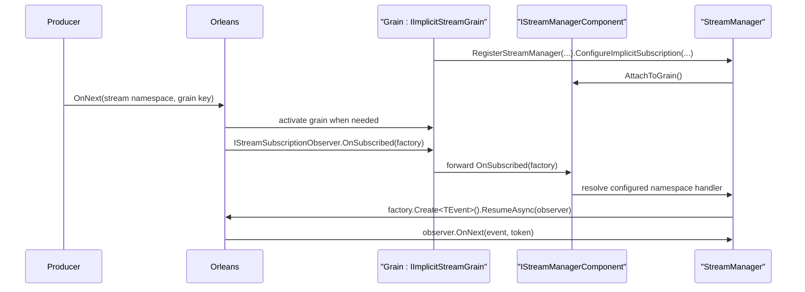
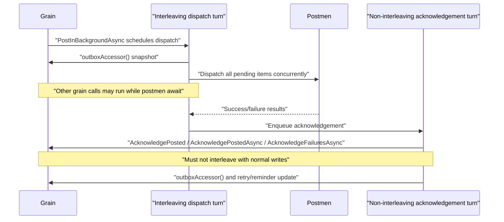

# Egil.Orleans.Messaging — API Design

Working design doc for the abstractions in the `Egil.Orleans.Messaging`
library.

Each section captures the decided shape, the rationale, and any explicit
non-goals. Decisions are settled top-down via grilling sessions; revisit
only when a new constraint surfaces.

Status legend: **Settled** = won't change without a new force; **Open** =
still under design; **Deferred** = explicitly postponed past the spike.

Constructor registration, absent-state defaults, and payload-level postmen follow
[issue #179](https://github.com/egil/framework/issues/179). These are intentional beta breaking changes.

---

## 0. Scope & packaging

**Status:** Settled.

### What this library is

A set of composable building blocks for Orleans grains that need:

1. **Atomic, recoverable state writes** — grain's observable `State` never
   exposes a value whose durability is unknown, even on ambiguous write
   failures. Absent deferred writes (§1), that is the same as never being out of sync
   with what is durably persisted.
2. **Outbox pattern** — durable, co-located message buffer that commits
   atomically with business-state changes.
3. **Outbox processing (postman)** — timer + reminder driven dispatch
   with retry, telemetry, and failure callbacks.
4. **Receiver-side dedup** — `MessageTracker` that tracks high-water
   positions from both outbox senders and Orleans streams.
5. **Stream subscription management** — fluent configure/resume/error
   facade over Orleans implicit and explicit stream subscriptions.

### What this library is NOT

- Not CQRS in the read/write-model-separation sense. No read-model
  projections, no query stores, no event sourcing.
- Not a replacement for `IGrainStorage`. It wraps `IPersistentState<T>`,
  not the provider layer.

### Packaging

Provider-neutral state/outbox/tracking and core stream manager APIs live in
`Egil.Orleans.Messaging`. Provider-specific integrations live in companion
packages so consumers do not inherit optional Azure/Event Hubs dependencies
unless they use those providers.

Current packages:

| Package | Contents |
| ------- | -------- |
| `Egil.Orleans.Messaging` | State manager base/default implementation, outbox, postman, tracking, stream manager, provider-neutral stream cursor/token metadata. |
| `Egil.Orleans.Messaging.Streams.EventHubs` | Orleans Event Hubs stream adapter and enriched Event Hubs sequence token support. |
| `Egil.Orleans.Messaging.State.AzureStorage` | Azure Table/Blob storage-aware state manager factory and failure classification. |

Future provider integrations should follow the same shape, for example
dedicated packages for provider-specific state manager behavior rather than
adding those dependencies to the core package. This follows Orleans' own
package shape, where optional stream and storage providers live behind
provider packages instead of the core runtime package.

### Capability namespaces and folders

Source and test files are grouped by library tool. Tests mirror production
folders so behavior is easy to find from the type under test.

| Capability | Package | Production namespace | Test folder |
| ---------- | ------- | -------------------- | ----------- |
| State management | `Egil.Orleans.Messaging` | `Egil.Orleans.Messaging.State` | `State/` |
| Outbox | `Egil.Orleans.Messaging` | `Egil.Orleans.Messaging.Outboxes` | `Outboxes/` |
| Receiver tracking | `Egil.Orleans.Messaging` | `Egil.Orleans.Messaging.Tracking` | `Tracking/` |
| Streams | `Egil.Orleans.Messaging` | `Egil.Orleans.Messaging.Streams` | `Streams/` |
| Event Hub stream enrichment | `Egil.Orleans.Messaging.Streams.EventHubs` | `Egil.Orleans.Messaging.Streams.EventHubs` | `EventHubs/` |
| Azure Storage state manager | `Egil.Orleans.Messaging.State.AzureStorage` | `Egil.Orleans.Messaging.State.AzureStorage` | `AzureStorage/` |

Extension entry points live in the namespace of the type they extend so they
are discoverable from normal Orleans, hosting, and DI imports:

- Grain registration methods: `namespace Orleans`.
- `IServiceCollection` registration methods:
  `namespace Microsoft.Extensions.DependencyInjection`.
- `ISiloBuilder` and `IEventHubStreamConfigurator` registration methods:
  `namespace Orleans.Hosting`.

C# 14 extension blocks are the preferred shape for new extension entry
points.

### Name

**`Egil.Orleans.Messaging`** — the outbox, postman, dedup, and stream
manager are all messaging infrastructure. `IStateManager` exists to make
the messaging atomic. Messaging is the reason the library exists; safe
state is the enabler.

---

## 1. `IStateManager<T>` — atomic state writes with in-flight recovery

**Status:** Settled.

### Goal

Replace direct grain use of `IPersistentState<T>` with a thin wrapper
that guarantees the grain's observable `State` never exposes a value whose
durability is *unknown*, even when `WriteStateAsync` fails ambiguously
(timeout, network drop, server 5xx, ETag conflict). Absent deferred writes, that is the
same as saying `State` never drifts from what is durably persisted.

Deferring a write is the one deliberate exemption, and it is an exemption from
synchronisation rather than from the fence: assigning `State` publishes a value whose
durability is knowingly *deferred*, `HasUnsavedChanges` says so, and the grain
chooses when it is written. Write candidates stay fenced either way.

Grain code injects `IPersistentState<MyState>` as normal, then registers an
`IStateManager<MyState>` wrapper during activation. After that point, the raw
`IPersistentState<MyState>` should stay internal to the wrapper. This is
non-negotiable — exposing both is the loophole that lets grain authors read
stale `storage.State` after a failed write.

### Interface

```csharp
public interface IStateManager<T> where T : class, IEquatable<T>
{
    T State { get; set; }
    bool HasUnsavedChanges { get; }
    Task ReadAsync(CancellationToken cancellationToken = default);
    Task WriteAsync(T newState, CancellationToken cancellationToken = default);
    Task SaveChangesAsync(CancellationToken cancellationToken = default);
    Task ClearAsync(CancellationToken cancellationToken = default);
}
```

Tokens are forwarded through constructor-registered managers to storage operations
and recovery reads. Cancellation is cooperative and depends on provider support.
An already canceled token prevents storage access and write-version stamping.
Cancellation after a write or clear starts does not prove whether it persisted.
If recovery is also canceled, `State` reverts to the last stored value — which is
not the previously visible snapshot when there were unsaved changes — and the manager
rethrows the original operation exception. Re-read with a fresh token before
another mutation to refresh state and ETag. Provider-confirmed successes are
adopted even if cancellation arrives concurrently.

Custom `IStateManager<T>` implementations must add these parameters. Existing
callers can omit the optional tokens after recompilation.

Constraints on `T`:

- `class` — atomic reference swap of `State` from `[AlwaysInterleave]`
  handlers is a single pointer load, no torn reads.
- `IEquatable<T>` — recovery path compares server-side state to
  attempted write to decide swallow-vs-rethrow. Records implement this
  for free.

Users pick one of two paths for `T`:

- **Path A — plain record + structural equality**
  (`MyState : IEquatable<MyState>`). User owns `Equals`. Works trivially
  for record-of-primitives shapes. Breaks silently if state holds
  `ImmutableArray<>` (reference-equality trap) — user must override
  `Equals` themselves in that case.
- **Path B — inherit `VersionedState`**
  (`MyState : VersionedState`). Library stamps a per-write `Guid Version`.
  Recovery path pattern-matches on `VersionedState` and compares `Version`
  directly — immune to collection-equality issues in the state graph.
  Recommended default for any non-trivial state.

See §3a for `VersionedState` and why the generic layer was removed.

### Activation and absent state

Registration in the grain constructor returns a stable handle. At lifecycle stage
`SetupState + 1`, after Orleans hydration and before `OnActivateAsync`, that handle
creates the configured provider-specific manager. Even custom manager factories
therefore see hydrated storage. Access before initialization throws clearly.
Registration in `OnActivateAsync` remains supported and creates the manager immediately.

`State` is non-null and read-only. Activation and `ReadAsync` adopt the stored value
when `RecordExists` is true; otherwise they invoke `createInitialState`, even if
the provider created its own default. Successful `ClearAsync` exposes a fresh
configured default. Defaults are never automatically written. An existing null
record or a null factory result is an error.


`ClearAsync` deletes storage before calling the default-state factory. The factory
must return a valid, non-null state. If it throws or returns null, the error
propagates and the deletion remains completed. A null result is rejected with
`InvalidOperationException` as a diagnostic. After this factory contract violation,
the manager has no guaranteed usable state: `State` may still reference the previous
snapshot and must not be treated as the current persisted state.

The optional `configureState` callback restores runtime dependencies, such as the
tracker's clock, on each adopted instance. It must not change business data or
perform storage I/O. It applies after reads and recovery as well as initial hydration.
The manager and raw storage facet adopt the new snapshot before configuration.
If configuration fails, that snapshot stays visible and the callback exception
propagates. Configuration after a successful write/clear runs outside storage
recovery, so a callback failure never causes an extra recovery read or silent retry.
After successful recovery reads, state validation, default factories, and configuration
also run outside the storage-read catch. Their errors propagate rather than being
replaced by the original write/clear exception. Failed recovery reads still restore
the last stored value — not the previously visible snapshot, which may be unsaved —
and preserve the original storage error.

### `WriteAsync` semantics

A single default `StateManager<T>` handles both shapes. It branches on
the non-generic `VersionedState` marker (see §3a) at runtime: if `T`
derives from it, the manager stamps a fresh `Guid Version` before every
write and uses that version for the recovery-path equality check;
otherwise it falls back to `T.Equals(...)`.

The manager retains a separate observable snapshot. It assigns the write candidate
to storage, awaits persistence, then adopts the successful value. A recovery read
adopts the server value (or an absent-record default) while retaining the refreshed
ETag. Equivalence can confirm a lost response only when a persisted record exists;
a reconstructed default must never be mistaken for proof that a write landed.

Behaviour matrix:

| Failure                            | After `WriteAsync` returns/throws               |
| ---------------------------------- | ------------------------------------------------ |
| Success                            | `State == newState`, returns                     |
| Timeout, write actually persisted  | `State == newState`, returns (silent recovery)   |
| Timeout, write did not persist     | `State == server's value`, throws original ex    |
| Recovery read finds no record     | `State == configured default`, throws original ex |
| 5xx / transient                    | Same as timeout — re-read decides                |
| `InconsistentStateException`       | `State == server's value`, **always rethrows**   |
| Re-read also fails (double failure)| Reverted to last stored state, throws original ex |

### Double failure behaviour

When both `WriteStateAsync` and the recovery `ReadStateAsync` fail, the
manager reverts `storage.State` to the last stored value and rethrows. After this
the grain holds correct data but a **stale ETag**. The next write
attempt may hit `InconsistentStateException` if the first write actually
persisted.

**Library does not auto-recover from double failure.** The grain must
call `ReadAsync()` before its next write to refresh the ETag if it
suspects this state. This is a documented contract — the library
surfaces the failure, the grain decides the policy (retry, deactivate,
alert).

### Deferred writes

assigning `State` replaces the visible snapshot without touching storage.
`HasUnsavedChanges` reports that the visible value has not been persisted yet,
and the parameterless `WriteAsync(cancellationToken)` writes it, or does nothing
when there is nothing to save.

The motivating case is an outbox acknowledgement: removing delivered items is a
change the grain wants to see immediately but does not need to pay a storage
write for, because an unpersisted acknowledgement causes redelivery rather than
message loss (§2). Instrumenting the storage layer of the consumer this library
was extracted from, roughly one write in four to grain storages that own an
outbox existed only to persist an acknowledgement.

The manager keeps two snapshots: the visible one, which may be unsaved, and the
last value known to correspond to storage. The second is what every recovery
path in the matrix above reverts to. Keeping them apart is what lets `State` be
called repeatedly with no intervening write without the recovery baseline
drifting onto a value storage never accepted. With nothing unsaved the two are the
same reference, so behaviour without deferred writes is unchanged.

Assignment deliberately does **not** stamp a fresh `Version` on `VersionedState`: a
unsaved snapshot is not a storage revision. Stamping happens in `WriteAsync`. It
does mirror into `IPersistentState<T>.State`, which keeps the facet consistent
with the fence and is what makes the migration behaviour below work — except while
a storage operation is running. The facet holds the `GrainState` the provider was
handed, and a provider may serialize it after its first await, so replacing the
value there mid-write would persist the unsaved snapshot instead of the one being
written. A stage that interleaves a write therefore publishes to `State` only, and
is discarded when that write completes.

`HasUnsavedChanges` is true only while `State` holds a value that no storage
operation has confirmed. Every operation that settles the durability question
clears it, **including the ones that settle it by failing**: a failed write reverts
`State` to the last stored value and discards the unsaved work rather than
preserving it. For an outbox that
costs one redelivery of the already-delivered batch, which the next post run
corrects — cheaper to reason about than a marker that survives failures.

An operation that settles nothing changes nothing. An already-canceled token —
checked first by all three operations — leaves the unsaved value visible and
flagged, so the call can be retried. The same holds for a rejected argument, and
for a `ReadAsync` whose storage read throws: it learns nothing about a value it
never wrote. A read that *returns* settles the question, so the marker clears
before the returned record is resolved — an invalid record or a throwing
default-state factory is the caller's contract, not storage's answer, and must not
leave an unsaved value behind to be written back on top of what was just read.

A *successful* `ReadAsync`, and `ClearAsync`, do discard unsaved changes. A read is
an explicit request for what storage holds, so storage wins. `ClearAsync` clears the marker as
soon as storage confirms the delete, *before* the default-state factory runs: a
factory that throws already leaves the manager with no usable-state guarantee, and
a surviving marker would let the documented deactivation save write the unsaved
value straight back over the record the grain just deleted.

**Deactivation is the caller's job.** There is no automatic flush, opt-in or
otherwise. `ILifecycleObserver.OnStop` receives only a `CancellationToken`, never
the `DeactivationReason` — that lives on the internal `ActivationData` with no
public route from a lifecycle observer — so an automatic flush could not tell an
idle deactivation from a silo shutdown or a failure-driven one. The stop token is
also routinely already cancelled during shutdown, which would force the library to
invent swallow-or-propagate semantics for a write the caller never asked for. The
grain is the one that can decide, so the hook belongs there:

```csharp
public override async Task OnDeactivateAsync(DeactivationReason reason, CancellationToken cancellationToken)
{
    try
    {
        await stateManager.SaveChangesAsync(cancellationToken);   // no-op when nothing is unsaved
    }
    catch (Exception ex)
    {
        logger.LogWarning(ex, "Could not save state while deactivating.");
    }

    await base.OnDeactivateAsync(reason, cancellationToken);
}
```

Unconditional, and not filtered on `DeactivationReason`. Every reason code skipped
is a reason code that drops unsaved data, and `ShuttingDown` is an orderly, expected
event on every deployment. The parameterless `WriteAsync` does not observe its
token when there is nothing to save, precisely so this call is safe to make
unconditionally — but with unsaved changes it does observe it, and deactivation
tokens can already be cancelled, so the write is guarded rather than allowed to
throw out of the hook and skip the rest of it.

A grain that stages and then never writes again never drains its durable outbox.
Each activation that posts redelivers the same items, acknowledges them into a
stage, and loses the stage at deactivation; later post runs in that same
activation see the deferred, empty view and do nothing. And it is not
self-correcting on a timer: a deferred acknowledgement empties the view the
processor reconciles against, so retry and the durable reminder are disabled, and
registering a processor does not post on activation. The items therefore stay in
storage until a fresh activation reads them back and something posts again. It is the same class of exposure as a write that fails
just before deactivation, which has always been possible; what is new is that it
can become permanent rather than exceptional. The snippet above is the fix, which
is why it ships as an `<example>` on the API itself rather than in a caveats
section.

`OutboxProcessor<T>` reconciles its retry timer and durable reminder against
`outboxAccessor`, which reads through the manager. A deferred acknowledgement that
empties the outbox therefore disables retry, which is correct from the processor's
point of view — it was told there is nothing pending, though on the strength of a
removal that is not durable yet. Anything that later discards the change brings
those items back as pending: a write that fails, a successful `ReadAsync` or
`ClearAsync`, or a business write that was already in flight when the stage
happened and finishes by adopting its own value.
Neither re-arms the processor, and there is no activation hook that posts on its
own. The documented pattern is to post again in either case. Coupling the
processor to `HasUnsavedChanges` would remove the need, at the cost of making an
outbox-only component depend on the state manager; that trade is not taken here.

`OutboxProcessorOptions<T>.InterleaveAcknowledgementCallbacks` defaults to `false`,
so an acknowledgement callback cannot normally run while a business `WriteAsync`
is in flight. In `[Reentrant]` grains, or with that option on, it can. The
in-flight write then finishes by adopting **the value it wrote**, not whatever is
sitting in the storage facet by then, and so discards an assignment that happened
while it was awaiting. The result is a redelivery, not a loss. Adopting the facet
instead would be the actual hazard: assignment mirrors into it, so the write would
mark a value storage never saw as durable and drop its own fence.

### Deferred writes and grain migration

Orleans can move a live activation between silos without a storage round trip. The
activation is deactivated with `DeactivationReasonCode.Migrating`, and instead of
discarding in-memory state the runtime builds a dehydration context — a string-keyed
bag of serialized values — ships it to the destination, and replays it there.
`[PersistentState]` hands the grain an `Orleans.Core.StateStorageBridge<T>`, which
takes part in that handoff itself, carrying `GrainState<T>` (value, ETag and
`RecordExists`).

**This library does not take part.** A migrating activation persists like any other
one: the deactivation hook above runs before Orleans dehydrates, so the write lands
first and the destination inherits a value storage genuinely holds.

The alternative was tried and removed. Participating means carrying the unsaved
snapshot and the recovery baseline in the dehydration context, which needs a facet
identity both silos compute independently and agree on — and Orleans keys its own
handoff on a facet name that `IPersistentState<T>` does not expose. Substituting one
costs a public API parameter, a canonical type identity stable across assembly
versions, a uniqueness rule enforced at registration, and a failure mode where two
facets restore each other's state. All of it to avoid **one storage write per
migration that has unsaved changes**. That is not a trade worth making, and it is
not one Orleans makes either: `IGrainMigrationParticipant` does not appear anywhere
in `Orleans.Journaling`, whose grains replay from storage on the destination.

What a grain gives up by skipping the write is documented rather than hidden. The
unsaved value still rides along inside the storage facet, but the destination cannot
tell it was never written: it treats the value as durable and loses it at its own
next deactivation. A stage made before the grain's first write is worse — the facet
arrives with `RecordExists` false, so the destination resolves its configured
initial state and the change is gone on arrival. Both are the exposure deferred
writes already document for an activation that ends without writing, and both are closed
by the same unconditional hook.

### Notes

- **No internal `Deactivate` call.** Grain code decides deactivation
  policy.
- **Always rethrow on `InconsistentStateException`**, even if equality
  matches. A coincidental match would silently swallow a real concurrent
  write; the contract "if we threw conflict, your command read stale
  data" must hold.
- **Versioned writes copy the candidate.** `Version` is public `init`
  for consumer source-generated JSON. The manager stamps a `with` copy,
  leaving the caller's record unchanged.
- **No `ReferenceEquals` pre-write short-circuit.** Functional
  `with { ... }` produces a fresh reference even when no fields changed.

### Provider-specific implementations

`IStateManager<T>` wraps an existing `IPersistentState<T>`, not a
replacement for grain storage providers. No new `IGrainStorage`
implementation is introduced.

Each storage provider we care to optimise for may ship its own
`IStateManager<T>` that:

- Inspects provider-specific exception types to classify failures as
  `StorageFailureKind.DidNotPersist` (skip re-read, revert + rethrow),
  `StorageFailureKind.Conflict` (re-read to refresh the local ETag baseline,
  then always rethrow — a coincidental value match never suppresses the
  original exception), or `StorageFailureKind.UnknownOutcome` (re-read).
- Optionally exploits provider features (conditional writes, blob
  versions) to avoid the re-read.

`StorageFailureKind` is intentionally named for storage operations rather
than only writes. The same classification is useful for clear operations:
an Azure Storage HTTP 412/ETag conflict definitely did not clear the record
this attempt, but proves the local ETag is stale and so goes through
`Conflict`; transient 5xx errors remain ambiguous and require read-back
recovery through `UnknownOutcome`.
Read failures do not use the classification because no local committed state
has been tentatively changed.

The Azure Storage companion package follows Orleans' Azure provider semantics:
the Orleans provider wraps Azure Table/Blob optimistic-update failures
(precondition failed, conflict, and not found during conditional write/clear)
as `InconsistentStateException`, so those are classified as `Conflict`. The
recovery read then refreshes the ETag, and the exception is always rethrown so
the grain sees the concurrency failure even when the value happens to match.

It also understands Azure SDK `RequestFailedException` directly:

- `Conflict`: optimistic-concurrency rejections where the write did not
  persist but the stored version was contradicted. Includes HTTP 412,
  HTTP 409, HTTP 404, and Azure Table/Blob error codes such as
  `ConditionNotMet`, `UpdateConditionNotSatisfied`, `BlobAlreadyExists`,
  `BlobNotFound`, `EntityAlreadyExists`, `EntityNotFound`,
  `ResourceAlreadyExists`, and `ResourceNotFound`. These trigger a
  recovery read followed by an unconditional rethrow.
- `DidNotPersist`: rejected/client-side service responses where Azure has
  definitively not applied the mutation and the stored version was not
  contradicted, including HTTP 400/401/403, payload-too-large responses, and
  Azure Table/Blob error codes such as `ContainerNotFound`, `TableNotFound`,
  and other append/sequence/source/target precondition mismatches that do not
  reflect the state facet's own ETag.
- `UnknownOutcome`: ambiguous or transient outcomes where a write/clear may
  have landed before the caller observed failure, including no HTTP response,
  HTTP 408, HTTP 429, all 5xx responses, `ServerBusy`, `OperationTimedOut`,
  `InternalError`, account IOPS throttling, `TimeoutException`, and
  cancellation-like failures.

For aggregate Azure SDK failures, any ambiguous inner failure makes the whole
operation `UnknownOutcome`. Otherwise, a `Conflict` inner outranks a
`DidNotPersist` inner, because the ETag mismatch it reports must still refresh
the local baseline. This preserves correctness over optimization: read-back is
skipped only when the provider response proves the mutation did not persist
*and* did not contradict the stored version.

### Why a wrapper, not extension methods

The wrapper was debated — recovery logic is stateless, could be an
extension method on `IPersistentState<T>`. But the wrapper does a fourth
thing extensions cannot: **it hides `IPersistentState<T>.State`**.

`IStateManager<T>.State` exposes the loaded or **committed** snapshot, the
configured default for absent storage, or a value the grain deliberately
assigned to it. What it never exposes is an in-flight **write
candidate**. During a write, `IPersistentState<T>.State` already holds the
uncommitted value; read methods marked `[AlwaysInterleave]` that access
`storage.State` directly could observe it — and if the write fails, they
returned data that never persisted.

The two words carry the whole distinction. A **write candidate** is a value
whose durability is *unknown* because a write is running, and `State` never
exposes one. An **unsaved** value is one whose durability is *knowingly
deferred*: `State` does expose it and `HasUnsavedChanges` reports it. The
caller-visible consequence is that an `[AlwaysInterleave]` reader can observe,
and answer from, a value that will vanish if the activation ends without
persisting it. That is the deal a deferred write offers; it is not the fence being
broken.

The wrapper is a **concurrency safety boundary**, not just convenience.
Extension methods can't provide this fence because the grain still holds
`IPersistentState<T>` and any method can access `.State` directly.

### Grain wiring

```csharp
private readonly IStateManager<MyState> stateManager;

public MyGrain([PersistentState("state")] IPersistentState<MyState> storage, TimeProvider time)
{
    stateManager = this.RegisterStateManager("state", storage,
        () => new MyState(),
        state => state.Tracker.RegisterTimeProvider(time));
}
```

Every overload requires `TState : class, IEquatable<TState>`. The convenience
overloads that take no `createInitialState` resolve an absent record through
`IStateDefault<TSelf>` when the state type implements it, and through
`new TState()` otherwise. See
[Injecting the manager as a facet](#injecting-the-manager-as-a-facet).

Register a keyed `IStateManagerFactory` with `AddDefaultStateManager`,
`AddAzureStorageStateManager`, or `AddStateManagerFactory`. Its `Create<T>` method
receives storage, the default factory, and optional runtime configuration.

### Injecting the manager as a facet

**Status:** Settled.

A grain may inject `IStateManager<T>` on the `[PersistentState]` parameter itself:

```csharp
public sealed class MyGrain([PersistentState("state", "Default")] IStateManager<MyState> state)
    : Grain, IMyGrain;
```

Orleans resolves a facet attribute through `IAttributeToFactoryMapper<TMetadata>`,
looked up from DI by the attribute's own type, and registers its own for
`PersistentStateAttribute` with `TryAddSingleton` from the `SiloBuilder`
constructor. That built-in mapper rejects any parameter that is not
`IPersistentState<>`, so `StateManagerFacetMapper` takes the registration over and
delegates every other parameter shape back to whatever was registered before it. It
builds the facet through Orleans' own `IPersistentStateFactory`, so the state
subscribes itself to activation hydration and the migration handoff exactly as a
raw facet does.

**Why reuse Orleans' attribute rather than `[FromKeyedServices]`.** The facet needs
two names — a state record name and a storage provider name — and a DI key is one
string. Encoding both in one key needs a separator and an escaping rule, which this
package has already had one bug from. The mapper is handed the attribute, which
carries both, so the problem does not arise. Reusing the attribute also keeps the
storage provider name in one place: it names the record, selects the Orleans
storage provider, and selects the keyed `IStateManagerFactory`, so those cannot
drift from each other.

**Why the state type carries the default and the configuration.** There is no call
site to pass `createInitialState` and `configureState` to, so `IStateDefault<TSelf>`
and `IConfigurableState` express them on the state type. That is the right home
independently of injection: the need belongs to the state type, so every grain
holding that state needs the same wiring, and putting it there means no call site
can forget it.

This is deliberately type-wide, not per-grain. Nothing stops two grain types from
sharing a state type, and when they do they share its default and its baseline
wiring. That is the intended trade-off, and it is why this library recommends a
state type be owned by a single grain type: under that convention
"state-specific" and "grain-specific" coincide and the question does not arise. A
grain that genuinely needs its own default or extra wiring for a shared state type
passes `createInitialState` or `configureState` to `RegisterStateManager`, which
override and layer on top respectively.

`IGrainContext.ActivationServices` is the same DI scope the grain's constructor is
resolved from, so both contracts reach anything the grain could inject, plus the
grain key and grain type.

Both apply on the `RegisterStateManager` path too — how a manager was obtained
should not change what its state type needs. Explicit arguments win: a
`createInitialState` factory overrides `CreateDefault`, and a `configureState`
callback runs after `Configure`. `StateContract<T>` caches the per-state-type
reflection in a static generic, so it runs once per state type rather than per
activation.

Enabling the facet is not a separate step: every `IStateManagerFactory`
registration helper calls `AddStateManagerFacet()`, which is idempotent, and a
grain needs one of those to obtain a manager at all.

---

## 2. `Outbox<T>` storage placement

**Status:** Settled.

The `Outbox<T>` collection lives **inside the grain's main state
record**. Atomicity is the whole point — a state change and the messages
announcing it commit in one ETag-protected write or neither commits.
Splitting into a separate `IPersistentState` blob would re-introduce
the "told one party, not the other" failure mode.

### Write amplification

Co-locating the outbox means every command's `WriteStateAsync`
re-serialises both halves. Accepted.

Provider-level mitigation is allowed: a storage provider may detect
unchanged sub-graphs and skip writing unchanged bytes. That stays a
provider concern.

### Non-goal: outbox-only appends

The grain does not expose "enqueue without committing other state."
Every outbox **append** rides the same `WriteAsync(newState)` as the
business-state change that produced it. That is the atomicity this non-goal
exists to defend, and deferring a write (§1) does not touch it.

Acknowledgement *removal* is the opposite direction and is not covered by this
non-goal. Deferring it leaves the durable outbox **larger** than the grain's
view — the item is gone from `State` but still in storage — so the risk it
carries is a redelivery, never a lost message. A
grain may therefore assign the acknowledgement to `State` and let the next business write
carry it, which is what §1's deferred writes exist for. The decision here is
sharpened, not reversed.

---

## 3. `Outbox<T>` — message collection inside grain state

**Status:** Settled.

### Goal

`Outbox<T>` is the per-grain durable buffer of messages that have been
*announced* (committed alongside a state change) but not yet *delivered*
(handed off to a postman successfully). It lives as a property on the
grain's state record for atomic writes.

The collection implements `IReadOnlyList<T>` over payloads, with read-only
iteration and indexing. Mutations return new snapshots; equality compares their
persisted revisions rather than payload contents. `Envelopes` exposes the
immutable array of assigned message IDs and payloads. The outbox also provides:

- A sender-free stored `OutboxMessageId` for each item.
- A monotonic `LatestSequenceNumber` that persists independently of the
  message array contents.
- `Add` mutators that own sequence assignment and either sample system
  UTC or accept the caller's current UTC instant explicitly.

### Shape

`OutboxMessageId` stores `(SequenceNumber, Timestamp, Epoch, TraceParent)`. The
stored envelope contains `Id` and `Message`. The processor combines that ID with
the owning grain's identity to construct the delivery `OutboxSequenceToken`; it
never writes the sender back into the outbox. Tokens remain identical across
retries and reactivation.

`TraceParent` is the W3C traceparent of the activity current when the message was
appended, or `null`. It is captured by `Add`, `AddRange`, and collection-expression
construction, omitted from JSON when absent, and ignored by dedup — see
*OpenTelemetry trace correlation*. Capture belongs to the producing path only:
`Restore` never reads `Activity.Current`, and carries envelope traceparents through
verbatim.

```csharp
public sealed record OutboxMessageId(long SequenceNumber, DateTimeOffset Timestamp, DateTimeOffset Epoch, string? TraceParent = null);
public sealed record OutboxMessageEnvelope<T>(OutboxMessageId Id, T Message);

// Public collection operations; mutations return new immutable instances.
Outbox<T> fresh = [];
Outbox<T>.Create();
outbox.Add(message);
outbox.Add(message, utcNow);
outbox.AddRange(messages);
outbox.AddRange(messages, utcNow);
ImmutableArray<OutboxMessageEnvelope<T>> envelopes = outbox.Envelopes;
outbox.Remove(envelope);
outbox.RemoveRange(envelopes);
outbox.Remove(id);          // Removes only a matching FIFO head.
outbox.RemoveRange(ids);    // Removes matching IDs anywhere, preserving remaining order.
outbox.Clear();             // Preserves sequence high-water mark and epoch.

// Reconstructing stored history. Never captures Activity.Current.
Outbox<T>.Restore(payloadTimestampPairs);
Outbox<T>.Restore(payloads, utcNow);
Outbox<T>.Restore(envelopes, latestSequenceNumber);   // Full fidelity; validates ids.
```

The actual types carry Orleans serialization metadata and JSON support. Each stored
ID field is required in JSON so malformed data cannot silently acquire default
sequence metadata. The earlier sender-free ID and revision changes changed the
stored shape without a legacy migration. Payload-first enumeration and the
OutboxAccessor rename do not change that persisted representation.

The public collection implements `IReadOnlyList<T>` over payloads. `Envelopes`
returns the existing immutable envelope array for inspection and acknowledgement.
Collection expressions enqueue payloads in fresh history, including spreads;
`AddRange` extends existing history with one timestamp per batch and one new
snapshot revision. Empty batches return the original instance. Neither operation
mutates payload objects or existing snapshots.

### Epoch semantics

- `Create()` → `epoch = null`, `LatestSequenceNumber = 0`.
- First `Add()` → stamps `epoch = now`. Persisted with state.
- Subsequent `Add()` → same epoch, incrementing sequence number.
- `Clear()` → removes items, **preserves** `LatestSequenceNumber` and
  `Epoch`. This is the normal "postman drained successfully" path.
- `Create()` again → **resets both** epoch (to null) and sequence
  number (to 0). This is the nuclear option — the next `Add` starts a
  fresh epoch. Receivers see `token.Epoch > stored.Epoch` and accept.

**`Clear()` is the normal path.** Grains should almost never call
`Create()` on an active outbox. `Create` is for construction-time
initialisation and deliberate ops-level sequence-space resets.
Document and warn.

### Pending-outbox telemetry and owner policy

The outbox can grow unbounded if postman targets are down. Mitigation:

- **Telemetry:** an observable up/down counter of active activations with
  processor-observed pending outboxes, grouped by grain type. Sustained pending
  counts alongside dispatch errors indicate delivery problems; message growth
  within an individual outbox remains the owner's responsibility.
- **Owner policy:** the owning grain controls the outbox. In
  `AcknowledgeFailuresAsync`, it can leave failed items pending, remove them,
  dead-letter them, or trim old entries according to domain policy.
- **Documentation:** storage providers have entity size limits (e.g.
  Azure Table = 1MB). Document the risk of unbounded growth.

### O(1) snapshot equality

`Revision` is a persisted UUIDv7, an outbox-specific ETag. `Create` and each
mutation that changes the outbox assign a fresh revision. No-op operations
preserve the existing snapshot and revision. JSON and Orleans serialization
preserve the revision; JSON requires it to be non-empty.

Equality and hashing use only `Revision`; distinct snapshots with an empty
revision cannot compare equal.
It remains O(1) without scanning payloads. Two competing appends or removals
have different revisions even when endpoint IDs and sequence metadata match.
A deserialized copy of the saved snapshot retains its revision, allowing recovery
to confirm a successful write with a lost response. Independently constructed
snapshots are unequal even when their contents match. Recovery uses revision
equality, never revision ordering. Message IDs and delivery tokens are unchanged.

### Why these choices

- **Sealed class, not record.** No `with`, no synthesized copy
  constructor. Mutation through controlled collection operations, preserving
  sequence and epoch invariants.
- **`Add(T payload)` not `Add(envelope)`.** Outbox owns sequence
  assignment. Callers cannot fabricate sequence numbers on the producing path.
- **`Restore` is the one seam where callers supply identity.** Reconstructing
  stored history — a migration, an import, a replay — is a different operation
  from producing a message, so it carries a different name rather than an extra
  argument on `Add`. That name is the contract: `Restore` never reads
  `Activity.Current`, because the activity rebuilding an outbox did not produce
  its messages. The payload overloads still own sequence assignment; the envelope
  overload accepts pre-built ids and therefore validates them, requiring strictly
  increasing sequence numbers within a single epoch so FIFO removal and per-epoch
  receiver dedup keep working. It also takes the source's `LatestSequenceNumber`
  as a required argument rather than inferring it: `Envelopes` exposes only
  pending items, so a source whose highest-numbered messages were already
  delivered and removed would restore a lower high-water mark, and the next `Add`
  would reuse a sequence number the receiver has already recorded and reject as a
  duplicate. A mark is rejected when there are no envelopes to anchor it to an
  epoch, because receiver dedup compares epochs first and consults sequence
  numbers only within the same epoch — carrying one there would hide that the
  source epoch was dropped. Envelope sequence numbers must be positive, matching
  what `Add` can assign. Requiring the mark also keeps the overloads apart by
  arity, so a collection expression of target-typed `new` stays unambiguous. Traceparents on restored envelopes are stored
  verbatim, unvalidated. A `Create` overload was rejected for this: the
  collection-builder `Outbox.Create<T>(ReadOnlySpan<T>)` *does* capture, so one
  name would have carried both behaviours with nothing at the call site to tell
  them apart.
- **Time is per append, never retained.** `Add(T)` samples system UTC;
  `Add(T, DateTimeOffset)` accepts the caller's current instant and
  normalizes it to UTC. Persisted values therefore contain no transient
  clock reference and require no post-deserialization registration.
- **Lazy `Epoch`.** A grain that never sends doesn't burn a fresh epoch
  on storage.
- **`Remove(id)` and `RemoveRange(ids)`.** Single removal checks the FIFO head;
  batch acknowledgement removes the successful stored IDs even across gaps.
- **`LatestSequenceNumber` is a separate field.** After flush, items are
  empty; high-water mark persists independently.

### Retry diagnostics

Envelope stays immutable. `SendAttempts` and `LastException` do NOT
appear on `OutboxMessageEnvelope<T>`. The postman tracks attempts
in-memory keyed on `OutboxSequenceToken`. On re-activation, counts
restart from zero. Acceptable for burst retry policies.

---

## 3a. `VersionedState` — version-based equality for recovery

**Status:** Settled. Generic `VersionedState<TSelf>` removed — see below.

### Problem

`ImmutableArray<T>.Equals` compares the underlying `T[]` reference, not
contents. Record-auto-generated `Equals` on state records holding
`ImmutableArray<>` returns false for identical-content different-backing
arrays. This breaks `IStateManager.WriteAsync`'s recovery path.

### Resolution

```csharp
[GenerateSerializer]
public abstract record VersionedState
{
    [Id(0)] public Guid Version { get; init; } = Guid.CreateVersion7();
}
```

User state:

```csharp
[GenerateSerializer]
public sealed record MyState : VersionedState
{
    [Id(1)] public Outbox<MyEvent> Outbox { get; init; } = Outbox<MyEvent>.Create();
    [Id(2)] public ImmutableArray<Something> Items { get; init; } = [];
}
```

### Why the generic `VersionedState<TSelf>` was removed

The original design had a two-layer hierarchy where the generic layer
overrode `Equals` to compare only `Version`, bypassing `ImmutableArray`
reference-equality. However:

1. **The Equals override was broken.** When the user writes
   `sealed record MyState : VersionedState<MyState>`, the compiler
   generates `MyState.Equals(MyState?)` that calls `base.Equals(other)`
   (the version-only check) **AND** adds property-level checks for all
   of `MyState`'s declared properties. So `ImmutableArray` comparisons
   still happen in the generated code.
2. **The recovery path doesn't need it.** `IStateManager<T>.WriteAsync`
   does `if (newState is VersionedState v)` and compares `v.Version`
   directly via pattern matching — it never relies on `T.Equals()` for
   VersionedState-derived types.
3. **`IEquatable<T>` on `IStateManager<T>` is satisfied automatically**
   by the record-generated equality for non-VersionedState types.

The non-generic `VersionedState` provides everything the library needs:
the `Version` property, a single type for pattern matching at runtime,
and a public `init` property that source-generated JSON can restore.

### Why `Version` has a public `init` accessor

`IPersistentState<T>.Etag` is storage concurrency. `Version` is
library recovery decoration. Consumer source-generated serializers need a
public setter to restore persisted versions. Callers can initialize the
property, but each write replaces it with a fresh version on a copy.

---

## 4. `MessageTracker`

**Status:** Settled.

Receiver-side, persisted dedup state. Tracks high-water position from
each upstream source. Two source kinds:

- **Orleans streams** — keyed by `StreamId`; position is a
  `StreamCursor` wrapping `(stream namespace, StreamSequenceToken)`.
- **Outbox messages** — keyed by sender `GrainId`; position is an
  `OutboxSequenceToken`.

### Shape

**Sealed class** (not record — consistent with `Outbox<T>`, avoids
`time` field participating in record-synthesized equality).

```csharp
[GenerateSerializer]
[Alias("egil.orleans.messaging.MessageTracker")]
[JsonConverter(typeof(MessageTrackerJsonConverter))]
public sealed class MessageTracker
{
    [Id(0)] private ImmutableDictionary<StreamSource, StreamEntry> streams;
    [Id(1)] private ImmutableDictionary<GrainId, OutboxEntry> outbox;

    // Non-persisted; no [Id]. Mutable.
    [NonSerialized]
    [JsonIgnore]
    private TimeProvider time = TimeProvider.System;

    public void RegisterTimeProvider(TimeProvider time) => this.time = time;

    public bool TryAcceptMessage(StreamCursor cursor, out MessageTracker next);
    public bool TryAcceptMessage(
        string streamNamespace,
        StreamSequenceToken? token,
        out MessageTracker next);
    public bool TryAcceptMessage(
        string streamProviderName,
        string streamNamespace,
        StreamSequenceToken? token,
        out MessageTracker next);
    public bool TryAcceptMessage(OutboxSequenceToken token, out MessageTracker next);

    public StreamCursor? LatestStream(string streamNamespace);
    public StreamCursor? LatestStream(string streamProviderName, string streamNamespace);
    public StreamCursor? LatestStream(StreamId stream);
    public StreamSequenceToken? LatestStreamSequenceToken(string streamNamespace);
    public StreamSequenceToken? LatestStreamSequenceToken(string streamProviderName, string streamNamespace);
    public OutboxSequenceToken? LatestOutbox(GrainId sender);

    public MessageTracker Evict(DateTimeOffset olderThan);
    public MessageTracker EvictStreams(DateTimeOffset olderThan);
    public MessageTracker EvictOutboxes(DateTimeOffset olderThan);
    public MessageTracker Evict(StreamId stream, DateTimeOffset olderThan);
    public MessageTracker Evict(GrainId sender, DateTimeOffset olderThan);

    [GenerateSerializer]
    private readonly record struct StreamSource(
        [property: Id(0)] string StreamNamespace,
        [property: Id(1)] string? ProviderName);

    [GenerateSerializer]
    private readonly record struct StreamEntry(
        [property: Id(0)] StreamCursor LastPosition,
        [property: Id(1)] DateTimeOffset Received);

    [GenerateSerializer]
    private readonly record struct OutboxEntry(
        [property: Id(0)] DateTimeOffset Epoch,
        [property: Id(1)] long LastSequenceNumber,
        [property: Id(2)] DateTimeOffset Received);
}
```

### Identity model (no OriginId)

- Outbox identity: `OutboxSequenceToken.Sender` supplied by the processor at delivery.
  Payloads stay clean. `TraceParent` rides on the token but is not part of identity:
  both `OutboxSequenceToken` and `OutboxMessageId` exclude it from equality and hash
  code, so two values differing only by traceparent address the same message.
  This is what keeps `MessageTracker` free of telemetry: the tracker stores no
  traceparent, and `LatestOutbox` still reconstructs a token equal to the one it
  accepted. Persisting it per sender instead would hold stale trace context in the
  receiver's durable state for a message already processed.
- Stream identity: stream namespace, plus provider name when available.
  Stream keys are intentionally not part of `MessageTracker` state because
  the tracker is scoped to one grain activation's durable state.

### `TryAcceptMessage(StreamCursor)` and stream token semantics

Users can pass either a `StreamCursor` or the raw Orleans
`StreamSequenceToken` plus stream namespace. Provider-qualified overloads are
available when a grain consumes the same namespace from multiple providers.
The stream namespace stays required even for grains that currently subscribe
to one stream; making it optional would encode a fragile "single stream"
assumption into persisted high-water marks.

| Prior entry                      | Decision | Effect                                         |
| -------------------------------- | -------- | ---------------------------------------------- |
| None                             | Accept   | Insert `(LastPosition = cursor, Received = now)` |
| `cursor > stored.LastPosition`   | Accept   | Update position + received                     |
| `cursor <= stored.LastPosition`  | Reject   | No change                                      |

`LatestStreamSequenceToken(...)` is a convenience for resume-token lookup.
It returns `null` both when no stream is tracked and when the tracked cursor
has a null token; callers that need to distinguish those cases should use
`LatestStream(...)`.

### `TryAcceptMessage(OutboxSequenceToken)` semantics

| Prior entry | Comparison                                   | Decision | Effect                   |
| ----------- | -------------------------------------------- | -------- | ------------------------ |
| None        | —                                            | Accept   | Insert                   |
| Exists      | `token.Epoch > stored.Epoch`                 | Accept   | Replace (sender reset)   |
| Exists      | Same epoch, `token.Seq > stored.LastSeq`     | Accept   | Update seq + received    |
| Exists      | Same epoch, `token.Seq <= stored.LastSeq`    | Reject   | Duplicate                |
| Exists      | `token.Epoch < stored.Epoch`                 | Reject   | Stale epoch              |

### `Evict` — uniform cleanup

Five overloads, one rule: remove entries where `entry.Received <= olderThan`.
No separate `Forget` API — `Evict(id, DateTimeOffset.MaxValue)` is the
documented idiom for unconditional clear.

### `RegisterTimeProvider` — void by design

Mutable field, non-persisted, excluded from equality. After
deserialization, grain may re-register. Without an instance clock the
tracker falls back to the silo-wide clock, then `TimeProvider.System`.

### Silo-wide tracker clock

```csharp
siloBuilder.ConfigureMessageTracker((options, sp) =>
    options.TimeProvider = sp.GetRequiredKeyedService<TimeProvider>("pricing"));
```

Resolution order: instance clock (`RegisterTimeProvider`) → silo-wide clock
(`MessageTrackerOptions.TimeProvider`, else the silo's registered
`TimeProvider`) → `TimeProvider.System`. The registered-clock default matches
`StreamSubscriptionOptions` and `OutboxProcessorOptions`, but the tracker only
uses it when `ConfigureMessageTracker` registered the installer.

The tracker is a persisted value created by grain code (`new MessageTracker()`),
the Orleans serializer, and JSON converters. None of those paths has the silo's
services, and Orleans exposes no public ambient silo or grain context
(`RuntimeContext.Current` is internal; `IGrainContextAccessor` is DI-only).
`[SerializationCallbacks]` hooks were considered: they are DI-aware and
per-silo, but only cover Orleans-serializer paths, not fresh instances or
System.Text.Json storage, so a fresh activation would still stamp with the
system clock.

The fallback is therefore an internal static field, and the silo option is the
only way to set it, so it has one source per silo. A silo lifecycle participant
at `ServiceLifecycleStage.RuntimeInitialize` installs it before grains activate
and withdraws it on stop. `ConfigureMessageTracker` follows the same
`Action<TOptions>` / `Action<TOptions, IServiceProvider>` shape as
`ConfigureStreamManager` and `ConfigureOutboxProcessor`: it configures
`MessageTrackerOptions` through the options pattern, so repeated calls compose
and the silo still has one installer and one resolved value.

The field is process-wide, so silos in one process need an ownership rule. Each
running silo's installer owns one entry in a process-wide list, and the most
recently started entry wins. A stopping silo removes only its own entry, so an
out-of-order stop (A starts, B starts, A stops) keeps B's clock, and when the
last silo stops no stopped silo's clock stays behind. Restoring a saved
"previous" value would get both cases wrong. The tracker stays usable without
the rest of the toolbox; without the silo option it behaves as before.

---

## 5. `StreamManager` — stream subscription handler facade

**Status:** Settled.

Grain-level facade around Orleans stream subscription handler attachment.
The API must preserve Orleans' distinction between implicit and explicit
subscriptions:

- **Implicit subscriptions** are declared by Orleans attributes such as
  `[ImplicitStreamSubscription("namespace")]`. Orleans owns activation and
  subscription creation. The library only attaches handler logic when Orleans
  calls `IStreamSubscriptionObserver.OnSubscribed(...)`.
- **Explicit subscriptions** are created by the grain via Orleans'
  `SubscribeAsync(...)`. Orleans persists the subscription handle, and the
  grain must resume existing handles after reactivation using
  `GetAllSubscriptionHandles()` + `ResumeAsync(...)`.

Four responsibilities:

1. **Configure** stream namespaces during `OnActivateAsync`.
2. **Attach** handlers to implicit subscription handles provided by Orleans.
3. **Resume or ensure** durable explicit subscription handles.
4. **Dispatch** with projected `StreamCursor` and per-subscription error
   handling via `StreamSubscriptionOptions.OnError`.

### Why a facade, not a base class

Extension/composition over inheritance. Grain inherits from `Grain`,
registers a `StreamManager`, and optionally implements marker interfaces for
runtime callbacks.

For implicit streams, the grain implements `IImplicitStreamGrain`; it does
not expose a `StreamManager` property. `StreamManager` follows the same
component pattern as `OutboxProcessor.AttachToGrain()`:

1. `RegisterStreamManager(...)` creates the manager.
2. The manager attaches itself to `grain.GrainContext` as an internal
   stream component.
3. The `IImplicitStreamGrain` default interface method receives Orleans'
   `OnSubscribed(...)` callback.
4. The default method resolves the attached component and forwards the
   callback to `StreamManager`.


```mermaid
sequenceDiagram
    participant Producer
    participant Orleans
    participant Grain as "Grain : IImplicitStreamGrain"
    participant Component as "IStreamManagerComponent"
    participant Manager as "StreamManager"

    Grain->>Manager: RegisterStreamManager(...).ConfigureImplicitSubscription(...)
    Manager->>Component: AttachToGrain()
    Producer->>Orleans: OnNext(stream namespace, grain key)
    Orleans->>Grain: activate grain when needed
    Orleans->>Grain: IStreamSubscriptionObserver.OnSubscribed(factory)
    Grain->>Component: forward OnSubscribed(factory)
    Component->>Manager: resolve configured namespace handler
    Manager->>Orleans: factory.Create<TEvent>().ResumeAsync(observer)
    Orleans->>Manager: observer.OnNext(event, token)
```

### Shape

```csharp
public interface IImplicitStreamGrain : IStreamSubscriptionObserver
{
    Task IStreamSubscriptionObserver.OnSubscribed(
        IStreamSubscriptionHandleFactory handleFactory);
}

public sealed class StreamManager
{
    public static StreamId CreateStreamId(
        string streamNamespace,
        GrainId grainId);

    public StreamManager ConfigureImplicitSubscription<TEvent>(
        string streamNamespace,
        Func<TEvent, StreamCursor, ValueTask> onNextAsync,
        Action<StreamSubscriptionOptions>? configure = null);

    public StreamManager ConfigureImplicitSubscription<TEvent>(
        string streamNamespace,
        Func<TEvent, StreamCursor, Task> onNextAsync,
        Action<StreamSubscriptionOptions>? configure = null);

    public StreamManager ConfigureExplicitSubscription<TEvent>(
        string streamProviderName,
        string streamNamespace,
        Func<TEvent, StreamCursor, ValueTask> onNextAsync,
        Action<StreamSubscriptionOptions>? configure = null);

    public StreamManager ConfigureExplicitSubscription<TEvent>(
        string streamProviderName,
        string streamNamespace,
        Func<TEvent, StreamCursor, Task> onNextAsync,
        Action<StreamSubscriptionOptions>? configure = null);

    public StreamManager ConfigureExplicitSubscription<TEvent>(
        string streamProviderName,
        StreamId streamId,
        Func<TEvent, StreamCursor, ValueTask> onNextAsync,
        Action<StreamSubscriptionOptions>? configure = null);

    public StreamManager ConfigureExplicitSubscription<TEvent>(
        string streamProviderName,
        StreamId streamId,
        Func<TEvent, StreamCursor, Task> onNextAsync,
        Action<StreamSubscriptionOptions>? configure = null);

    public Task ResumeExplicitSubscriptionsAsync(
        CancellationToken cancellationToken = default);

    public Task EnsureExplicitSubscriptionsAsync(
        CancellationToken cancellationToken = default);
}

public sealed class StreamSubscriptionOptions
{
    public Action<string, Exception>? OnError { get; set; }
    public bool UseTrackedResumeToken { get; set; } = true;
    public MessageTraceOptions Trace { get; set; } = MessageTraceOptions.Link;
    public TimeProvider? TimeProvider { get; set; } // null: registered TimeProvider, else TimeProvider.System
}

public static class StreamManagerExtensions
{
    public static StreamManager RegisterStreamManager<TGrain>(
        this TGrain grain,
        Func<MessageTracker?>? getTracker = null)
        where TGrain : IGrainBase;
}

// Silo-wide defaults. Same pair on IServiceCollection.
public static class StreamManagerSiloBuilderExtensions
{
    public static ISiloBuilder ConfigureStreamManager(
        this ISiloBuilder builder,
        Action<StreamSubscriptionOptions> configure);

    public static ISiloBuilder ConfigureStreamManager(
        this ISiloBuilder builder,
        Action<StreamSubscriptionOptions, IServiceProvider> configure);
}

```

`ConfigureImplicitSubscription` intentionally has no provider-name
parameter. Orleans provides the concrete provider and stream id through
`IStreamSubscriptionHandleFactory` when the implicit subscription fires.

`ConfigureExplicitSubscription` requires a provider name because the library
must ask Orleans for the stream and durable subscription handles itself. The
string namespace overload follows the library's grain-keyed convention and
derives the stream id from the complete receiving `GrainId`. Producers call
`StreamManager.CreateStreamId(streamNamespace, target.GetGrainId())` to derive
the same id. The helper uses Orleans' textual grain identity and rejects any
custom identity which does not round-trip through `GrainId.TryParse`. Use the
`StreamId` overload for an arbitrary or application-owned stream identity.

`RegisterStreamManager()` can be called without a `MessageTracker` when the
grain does not persist stream high-water marks. In that mode the manager
attaches handlers without supplying resume tokens. Pass an accessor for the hydrated
tracker snapshot only when the grain wants `StreamManager` to resume from
persisted cursors.

Each configured subscription independently decides whether `StreamManager`
passes the tracked cursor token into Orleans resume/subscribe APIs. The
default is `UseTrackedResumeToken = true` for compatibility: if a tracker
snapshot has a cursor for the stream, the previous token is supplied. Set
`UseTrackedResumeToken = false` when the grain wants Orleans to attach the
handler without a resume token for that subscription, even if a tracker
snapshot is available.

### Subscription options and silo defaults

Per-subscription settings live on `StreamSubscriptionOptions` and reach the
manager through an optional `configure` callback, the same callback shape the
state manager uses for hooks. Settings are layered:

```
StreamSubscriptionOptions property defaults
  -> silo defaults: ConfigureStreamManager(...) / services.Configure<StreamSubscriptionOptions>(...)
    -> the subscription's configure callback
```

The manager resolves `IOptionsFactory<StreamSubscriptionOptions>` from
activation services and creates a fresh instance per subscription, so one
subscription's changes never leak into another or into the silo defaults. It
copies the settings when the callback returns; later changes to the instance
have no effect.

The defaults are one global set per silo, not keyed by provider or namespace.
A grain that consumes both external and internal streams overrides the odd
subscription out in its callback. The `IServiceProvider` overload exists so a
silo can share a registered service, typically a keyed domain
`TimeProvider`, with every subscription without grain code resolving it.

Optional parameters (`onError`, `useTrackedResumeToken`) were folded into
the options type. A parameter list grows one argument per setting and cannot
be set silo-wide; an options type does both.

### Typical implicit wiring

```csharp
public override async Task OnActivateAsync(CancellationToken ct)
{
    var state = await stateManager.ReadAsync();
    state.Tracker.RegisterTimeProvider(timeProvider);

    this.RegisterStreamManager(() => state.Tracker)
        .ConfigureImplicitSubscription("electricity-prices", HandlePriceTickAsync, options => options.OnError = LogStreamError)
        .ConfigureImplicitSubscription("tariff-events", HandleTariffChangedAsync, options => options.UseTrackedResumeToken = false);
}
```

The grain must also be attributed and implement `IImplicitStreamGrain`:

```csharp
[ImplicitStreamSubscription("electricity-prices")]
public sealed class PriceProjectionGrain : Grain, IImplicitStreamGrain
{
    // OnSubscribed is supplied by IImplicitStreamGrain's default method.
}
```

No `SubscribeAsync` call belongs in implicit activation. Orleans activates
the grain and calls `OnSubscribed(...)` when an event targets the implicit
subscription.

For grains that do not track stream positions, omit the tracker:

```csharp
this.RegisterStreamManager()
    .ConfigureImplicitSubscription("electricity-prices", HandlePriceTickAsync);
```

### Typical explicit wiring

```csharp
public override async Task OnActivateAsync(CancellationToken ct)
{
    var state = await stateManager.ReadAsync();
    state.Tracker.RegisterTimeProvider(timeProvider);

    streamManager = this.RegisterStreamManager(() => state.Tracker)
        .ConfigureExplicitSubscription("StreamProvider", "tariff-events", HandleTariffChangedAsync);

    await streamManager.EnsureExplicitSubscriptionsAsync(ct);
}
```

The `TEvent` generic argument is usually inferred from the handler method
group. Users only specify it for inline lambdas or ambiguous method groups.
Publishers targeting the grain-keyed convention derive the stream id from the
target grain reference:

```csharp
var target = grainFactory.GetGrain<ITariffGrain>(customerId);
var streamId = StreamManager.CreateStreamId("tariff-events", target.GetGrainId());
var stream = streamProvider.GetStream<PriceChanged>(streamId);
```

Because the derived key contains the grain type, a grain-type rename changes
the stream id. Use the `StreamId` overload when the target stream needs an
application-owned identity or is not keyed by the receiving grain:

```csharp
streamManager = this.RegisterStreamManager(() => state.Tracker)
    .ConfigureExplicitSubscription<PriceChanged>(
        "StreamProvider",
        StreamId.Create("tariff-events", customerId),
        HandleTariffChangedAsync);
```

The full-identity convention is incompatible with the previous key-only
derivation. Existing durable handles must be recreated while publishers move
to `CreateStreamId`, or retained by configuring their previous ids explicitly.

### Implementation changes from the previous design

- Rename `AddSubscription(...)` to the more explicit
  `ConfigureImplicitSubscription(...)` and
  `ConfigureExplicitSubscription(...)`.
- Replace `SubscribeAsync(...)` with explicit-only
  `ResumeExplicitSubscriptionsAsync(...)` and
  `EnsureExplicitSubscriptionsAsync(...)`.
- Add `IImplicitStreamGrain` as a public convenience interface with a default
  `IStreamSubscriptionObserver.OnSubscribed(...)` implementation.
- Add an internal `IStreamManagerComponent`, attach `StreamManager` to
  `IGrainContext`, and let `IImplicitStreamGrain` forward through that
  component.
- Change stream handlers to receive `StreamCursor` instead of raw
  `StreamSequenceToken?`.
- Derive grain-keyed stream ids from the complete, round-trippable `GrainId`
  and expose `CreateStreamId(...)` for producers.
- Keep explicit subscription unsubscribe orchestration out of the initial API.
  The first version only resumes or ensures explicit subscriptions.

### Implicit subscription semantics

- `ConfigureImplicitSubscription(...)` records the handler shape only.
- It does not call `SubscribeAsync(...)`, inspect existing explicit handles,
  or create Orleans subscription state.
- When Orleans calls `OnSubscribed(factory)`, `StreamManager` matches
  `factory.StreamId.GetNamespace()` to a configured implicit subscription,
  creates the typed handle with `factory.Create<TEvent>()`, and calls
  `ResumeAsync(observer, token)` to attach the handler. The token comes from
  the activation-time `MessageTracker` snapshot when a cursor exists for the
  same provider and namespace and that subscription has
  `UseTrackedResumeToken = true`.
- If no handler is configured for the implicit stream namespace, the manager
  throws during `OnSubscribed(...)`. A mismatched attribute/configuration is a
  delivery-path misconfiguration and should not be a log-only condition.
- Orleans controls activation and target stream identity. If the grain is not
  active, a matching stream event can activate it.
- Implicit subscriptions do not show up as explicit handles from
  `GetAllSubscriptionHandles()` and cannot be removed by `UnsubscribeAsync()`
  on an explicit handle.

### Explicit subscription semantics

- `ConfigureExplicitSubscription(...)` records the provider, stream identity,
  event type, handler, and resolved subscription options. The namespace overload derives the
  stream id from the complete receiving `GrainId`; the `StreamId` overload uses
  the caller-provided stream identity directly.
- `ResumeExplicitSubscriptionsAsync(...)` resumes all existing durable
  handles for each configured explicit stream from the activation-time
  `MessageTracker` cursor when one exists and that subscription has
  `UseTrackedResumeToken = true`. It never creates a new subscription.
- `EnsureExplicitSubscriptionsAsync(...)` resumes existing handles when
  present. If none exist for a configured explicit stream, it creates exactly
  one explicit subscription with `SubscribeAsync(observer, token)`, using the
  tracked cursor token when available and enabled for that subscription.
- Repeated calls to `EnsureExplicitSubscriptionsAsync(...)` are idempotent:
  once a durable explicit handle exists, later calls resume it instead of
  creating duplicates.
- Explicit handles persist across grain deactivation until Orleans removes
  them via `UnsubscribeAsync()`. The initial version does not expose
  unsubscribe orchestration; consumers can use Orleans handles directly if
  they need to intentionally detach.

### Cursor semantics

- Stream handlers receive a `StreamCursor`, not a raw
  `StreamSequenceToken?`.
- The cursor includes the stream namespace, provider name when known, and the
  delivered Orleans sequence token.
- `MessageTracker` provides provider-aware resume tokens for both implicit
  handle resume and explicit subscribe/resume when a subscription opts into
  tracked resume tokens.
- For explicit streams, the durable Orleans subscription handle is still the
  primary subscription identity. `MessageTracker` remains the
  application-level dedup and high-water marker; handlers update it after
  accepting events.

### Per-subscription `OnError`

Signature: `Action<string, Exception>`, where the string is the stream
namespace. Default when omitted: log + emit counter, do NOT rethrow.

### One-provider-per-namespace

Accepted as a code-review convention for implicit subscriptions. Explicit
subscriptions carry a provider name in configuration, so provider/namespace
ambiguity is visible in code.

### `StreamCursor` projection constraint

`StreamCursor` carries an opaque `StreamSequenceToken`. The core package ships
an STJ converter which writes a small discriminator envelope and delegates the
token payload directly to explicitly registered `JsonConverter<TToken>`
instances. The discriminator is the token JSON `Kind` property.

| Subtype                         | Source                          |
| ------------------------------- | ------------------------------- |
| `EventSequenceToken`            | Orleans SimpleMessageStream     |
| `EventSequenceTokenV2`          | Orleans SimpleMessageStream v2  |
| `EventHubSequenceToken`         | Event Hubs companion package    |
| `EventHubSequenceTokenV2`       | Event Hubs companion package    |
| `EnrichedEventHubSequenceToken` | Event Hubs companion package    |

Unknown subtype throws at serialization time — silently dropping the
cursor would corrupt dedup. Unknown discriminator throws at deserialization
time. Provider packages register converters during their normal setup; custom
stream providers can register their own converter with
`AddStreamSequenceTokenJsonConverter<TToken, TConverter>(...)` or
`StreamSequenceTokenJsonConverters.Register(...)`.

### Registration is idempotent

The registry is process-wide, and more than one registrar legitimately wants the
same converter in place: a provider package's silo setup, a test fixture, an
offline state reader. Registering the same type descriptor a second time with
the same token type *and* converter type is therefore a no-op, and registration
order carries no meaning.

`Register(...)` throws `InvalidOperationException` only on a genuine conflict,
where a *different* converter claims a descriptor someone else already owns —
the case that would silently change a persisted wire format. `TryRegister(...)`
returns that same outcome as a `bool` for callers that want to report a conflict
rather than catch one. It returns `true` when the registry holds an equivalent
converter once the call returns, whether it added one or found one; deliberately
not `TryAdd` semantics, because the caller's question is "is my converter in
place?", not "did I mutate the registry?".

**Non-goal:** unregistering, replacing, or enumerating registrations. A
persisted `Kind` must keep decoding the same way for the life of the process.

### Descriptor aliases are read-side fallbacks

The guard above keys on the type descriptor, not the token type, so one token
type may hold several descriptors. That is deliberate: every registered
descriptor decodes, which is how a descriptor can be renamed while previously
persisted state stays readable.

The write side is not symmetric. It takes the first registration matching the
token's exact type, so **the first registration to claim a token type owns its
persisted `Kind`**; a later alias is decode-only and cannot change what is
written. This is the opposite of `IServiceProvider`, where the last registration
for a key wins and is how a caller overrides a default. There is no override
here, by design — the winner is persisted rather than resolved, so making a late
alias change the wire format would let registration order, which no composition
root controls, silently rewrite durable state. Alias to widen what a process can
read; register the descriptor you intend to persist first.

Cursor, discriminator-envelope, and built-in token readers treat JSON object
property order as insignificant and skip unknown properties. Writers keep a
canonical order. This allows older silos to read additive payloads during
rolling upgrades or rollback; newly added properties must still be optional
because an older silo cannot preserve an unknown value when it rewrites the
payload. Custom token converters are responsible for the same forward-tolerant
read behavior inside their payloads.

### Event Hub adapter for enriched tokens

The library ships `EnrichedEventHubAdapter`, a public unsealed
`EventHubDataAdapter` subclass. It opts Event Hub streams into
`EnrichedEventHubSequenceToken`, which carries:

- `EnqueuedTime` — broker-side enqueue time for lag measurement.
- `ProviderName` — provider identity for dedup and multi-provider
  edge cases.
- `TraceParent` — W3C traceparent captured from the producer-side
  `Activity.Current?.Id`.

Users who want the built-in behavior register it with
`UseEnrichedDataAdapter()` on `IEventHubStreamConfigurator`:

```csharp
siloBuilder.AddEventHubStreams("orders", b =>
{
    b.UseEnrichedDataAdapter();
    // ... other Event Hub config
});
```

`UseEnrichedDataAdapter()` also registers Event Hubs sequence-token JSON
converters. That lets `MessageTracker` and `StreamCursor` round-trip
`EnrichedEventHubSequenceToken` without the core package referencing Event
Hubs and without losing `EventHubOffset`, `EnqueuedTime`, `ProviderName`, or
`TraceParent`.

That registration is also reachable on its own, because a silo is not the only
process that reads the state it produces — a test fixture on in-memory storage,
an offline grain-state reader, and an archiver job all need the converters
without configuring an Event Hub stream provider. The companion package exposes
`EventHubStreamSequenceTokenJsonConverters.Register()` for callers with no
container and `services.AddEventHubStreamSequenceTokenJsonConverters()` for
those with one, plus `EventHubSequenceTokenTypeDescriptor` and
`EventHubSequenceTokenV2TypeDescriptor` so no descriptor string has to be
copied. Because registration is idempotent, these compose with
`UseEnrichedDataAdapter()` in any order.

Users who need custom adapter behavior can subclass
`EnrichedEventHubAdapter` and register their subclass via Orleans'
`UseDataAdapter` directly. The library intentionally provides no
generic registration helper for custom subclasses because those adapters
usually need extra services/options.

An adapter reading a payload format the library knows nothing about supplies
its own `IBatchContainer` by overriding `CreateInnerBatchContainer`:

```csharp
protected override IBatchContainer CreateInnerBatchContainer(EventHubMessage message)
    => new DataPlatformBatchContainer(message, logger);
```

`GetBatchContainer(EventHubMessage)` is sealed, so enrichment cannot be
silently dropped: the decorator carrying `EnrichedEventHubSequenceToken` is
internal, and a subclass replacing that method could not reattach the token.
Ownership of the wrapping stays with the adapter and the subclass only says how
to decode. The container therefore does not produce sequence tokens at all —
`null` batch and per-event tokens are supported, and per-event indexes then
follow enumeration order. It must be `[GenerateSerializer]`, because it travels
to consumers inside the decorator's `IBatchContainer` field.

`StreamManager` is unaware of Event Hubs specifically — enrichment
surfaces through `StreamCursor.TryGetEnqueuedTime(...)`,
`StreamCursor.TryGetProviderName(...)`, and
`StreamCursor.TryGetTraceParent(...)`.

### OpenTelemetry trace correlation

Two separate gaps break trace correlation, and both are closed with
`ActivityLink`s rather than parent chaining by default. Stream subscriptions
can opt in to parenting (Gap 2).

#### Gap 1: the outbox store-and-forward delay

An outbox message is stored now and delivered later, so the activity that caused
it is gone by delivery time. Capturing `Activity.Current` at dispatch is not a
fix, for three independent reasons:

- The dispatch timer, the retry timer, and the reminder path are not incoming
  grain calls, so no activity is ambient at all.
- A drain flushes every pending message in one run, with groups dispatched
  concurrently. Reading the ambient activity at dispatch attributes a message
  added by request A to request B, whichever triggered the flush. A wrong link
  is indistinguishable from a right one when reading a trace, which makes this
  the more dangerous failure.
- A span's identity outlives the span. Storing `Activity.Current?.Id` — the W3C
  string, not the `Activity` — keeps a valid `ActivityLink` target after the
  producing span has ended and been exported.

So capture happens at append time, in `Add`, `AddRange`, and
`Outbox.Create<T>`, into `OutboxMessageId.TraceParent`, and reaches the receiver
through `OutboxSequenceToken.TraceParent` / `TryGetTraceParent(...)`.

`OutboxDispatcher` then starts one `orleans.outbox.post` span per item, of
`ActivityKind.Producer`, linked to the captured context, before invoking the
postman. This is what makes the rest work without touching the Event Hubs
adapter or `StreamManager`: `EnrichedEventHubAdapter.ToQueueMessage` already
stamps `Activity.Current?.Id`, and the current activity it now observes is the
per-item dispatch span rather than whatever the concurrent drain left current.

Note that `parentContext: default` does **not** force a root span — .NET falls
back to `Activity.Current` when the supplied context is `default`. The dispatch
span therefore roots its own trace on the timer and reminder paths, where
nothing is ambient, and joins the triggering request's trace when a request
drives the drain. Both are correct: that request genuinely caused the delivery,
and it is happening now. What must never happen is joining the *producing*
trace, which the link handles.

Three decisions taken deliberately here:

- **Ambient capture belongs to the producing path only.** Capture at append time
  is right for a grain appending during a request and wrong for one rebuilding
  stored history: a migration, import, or replay runs under an activity that did
  not produce the message — for a migration inside `JsonMigratable`
  deserialization, the activation — and stamping it links the delivery span to an
  unrelated trace. The same "a wrong link is indistinguishable from a right one"
  argument that rules out capturing at dispatch rules out capturing during a
  rebuild. `Outbox<T>.Restore` is the non-capturing entry point; traceparents it
  carries through from envelopes are stored verbatim and not validated, because
  the dispatcher already tolerates unparseable values by starting an unlinked
  span, hierarchical-format `Activity.Id` values already reach storage through
  the ambient path, and throwing inside deserialization would fail a grain
  activation over a diagnostic field. `Outbox.Create<T>(ReadOnlySpan<T>)` keeps
  capturing with no suppressing overload — the `[CollectionBuilder]` contract
  fixes its signature — which is acceptable because a collection expression
  resets the epoch and sequence space and is therefore already the wrong tool for
  reconstructing history.
- **`tracestate` is not captured.** It is vendor data of up to 512 bytes, sized
  by the vendor rather than by us. The outbox lives inside the grain state
  record, so every pending envelope is rewritten on every `WriteStateAsync`
  until it is delivered — ten pending messages across five state writes is fifty
  copies, and retries widen the window. The 55-byte traceparent is affordable
  under that amplification; a variable 512-byte `tracestate` is not, for a value
  most OTLP users never populate. Revisit as an opt-in option if asked for.
- **Sampling is not consulted.** The traceparent is stored whatever the sampled
  flag says. Sampling configuration is not stable across a store-and-forward gap
  of hours, and the trace id stays useful as the join key between logs and
  traces even when the producing span was never exported.

#### Gap 2: the stream queue boundary

Orleans streams lose `Activity.Current` across the queue boundary. To
correlate consumer-side spans with producer-side spans without creating
multi-hour distributed traces, `StreamManager` uses `ActivityLink`s, not
parent chaining, by default:

- Producer side (`EnrichedEventHubAdapter.ToQueueMessage<T>`): stash
  `Activity.Current?.Id` into `EventData.Properties["traceparent"]`
  before the event hits EH.
- Adapter ingest side (`EnrichedEventHubAdapter.GetStreamPosition`):
  extract `EventData.Properties["traceparent"]` into
  `EnrichedEventHubSequenceToken.TraceParent`.
- Consumer side (in `StreamManager`'s OnNext wrapper): read the
  token's traceparent, parse into `ActivityContext`, start the OnNext span with
  `ActivityKind.Consumer` and `links: [new ActivityLink(parsedContext)]` as a
  root, whatever is ambient (see the modes below).

This produces separate traces per delivery, each with a link back to
the producer span. OTel backends render the cross-trace arrow without
collapsing weeks of traffic into one trace.

Links are the default, not the only option. `StreamSubscriptionOptions.Trace`
takes a `MessageTraceOptions`, per subscription or as a silo default. The type
lives in the root namespace because the outbox processor uses it for its
`orleans.outbox.post` span too:

```csharp
namespace Egil.Orleans.Messaging;

// Link is 0, so default(MessageTraceMode) is the default mode.
public enum MessageTraceMode { Link, Parent, ParentWithinLag, None }

public sealed record MessageTraceOptions
{
    public static MessageTraceOptions Link { get; }
    public static MessageTraceOptions Parent { get; }
    public static MessageTraceOptions None { get; }
    public static MessageTraceOptions ParentWithinLag(TimeSpan maxParentLag);

    public MessageTraceMode Mode { get; }
    public TimeSpan MaxParentLag { get; }
}
```

- `Parent` starts the consumer span with the producer context as
  `parentContext` and no link, since the link would repeat the parent.
- `ParentWithinLag` parents when the magnitude of
  `StreamSubscriptionOptions.TimeProvider.GetUtcNow() - enqueuedTime` is at
  most `MaxParentLag`, and links otherwise. The enqueue time is the broker's
  clock; comparing the magnitude keeps a consumer clock running behind from
  making a backlog message look recent. A token with no enqueue
  time links.
- A linked span is a true root. `parentContext: default` alone falls back to
  `Activity.Current`, so the manager clears the ambient activity before
  starting a linked span and restores it once the span stops. Otherwise a
  delivery running under an ambient activity (for example an in-memory stream
  delivered inside the producer's call) would join that trace despite `Link`.
- `None` never starts a trace. With an ambient activity the span starts as its
  child, with a link to the producer when the traceparent parses. Without one,
  no span starts and the handler runs with no activity. The `stream.*` metrics
  are recorded either way. The outbox's `None` is unconditional: no span.
- A missing or unparseable traceparent produces a span with no link, whatever
  the mode. It joins the ambient activity when there is one, as outbox delivery
  spans do, and starts a new trace otherwise.

The force is internal grain-to-grain streams with bounded fan-out. Backends
that build the transaction tree from the trace id (Application Insights'
end-to-end view) ignore links, and tail samplers decide per trace id, so
linked consumer traces are sampled apart from the producer and usually
dropped. Parenting keeps one causal flow in one trace. The remaining risk is a
backlog after an outage, where parenting would stretch a producer's trace
across hours; `ParentWithinLag` bounds that.

The choice is per subscription, not per grain, because one grain may consume
an external stream (link) and an internal stream (parent) side by side. It is
an options record built from factories, not an enum plus a separate
`TimeSpan` property, so a lag limit cannot be supplied for a mode that ignores it and
`ParentWithinLag` cannot be configured without one.

The built-in adapter owns producer-side propagation for users who call
`UseEnrichedDataAdapter()`. Custom adapters should preserve the same
`traceparent` property behavior if they want `StreamManager` to create
links or parents.

### Telemetry

Track at minimum (see `OutboxProcessor` for the meter pattern):

- Counter: messages delivered per `(streamNamespace, accepted|rejected)`.
- Counter: subscriptions established / torn down / errored.
- Histogram: handler latency per `streamNamespace`.
- Histogram (when `EnrichedEventHubSequenceToken` is available):
  end-to-end lag = `now - cursor.TryGetEnqueuedTime()`. Surfaces
  consumer lag against the broker, parallel to outbox sender-to-receiver
  timing.

---

## 6. Opinionated grain pattern — functional commands, interleaved reads

**Status:** Settled (guidance, not enforced by library API).

### The pattern

Grains using this library should follow a functional-command model:

1. **State is immutable.** Grain state is a `record` (or sealed record)
   composed of immutable types (`ImmutableArray<T>`, `Outbox<T>`,
   `MessageTracker`, value objects). No mutable collections, no mutable
   fields.

2. **Commands run sequentially.** Methods that mutate state ("commands")
   produce a new state value from `(currentState, commandPayload, utcNow)` and
   call `IStateManager<T>.WriteAsync(newState)`. They run under
   Orleans' default non-reentrant turn-based concurrency — one at a
   time, no interleaving.

3. **Reads interleave freely.** Methods that only read committed state
   can be marked `[AlwaysInterleave]`. They see the last
   `WriteAsync`-committed snapshot via `IStateManager<T>.State` — the
   committed-state fence (§1) ensures they never observe an in-flight write
   candidate. Multiple reads execute in parallel. A grain that defers writes
   changes this deliberately: an unsaved value *is* visible to interleaved
   readers, so a reply derived from one is only as durable as the next write.

4. **No external I/O in command handlers.** Commands should not call
   HTTP, query databases, or invoke other grains. All input needed for
   the decision must arrive in the command payload. External data is
   fetched by the caller *before* invoking the grain. If a command needs
   to trigger downstream work, enqueue it via `Outbox<T>.Add(...)` and
   let the `OutboxProcessor` dispatch it after the write.

### Why this works

- **Deterministic commands.** Same state + same payload + same UTC input → same result.
  Easy to test, easy to reason about, no ambient dependencies.
- **Safe concurrency.** Reads never block writes. Writes are serialised
  by the runtime. No custom locks.
- **Recovery-friendly.** `IStateManager<T>.WriteAsync` recovery path
  pattern-matches `VersionedState` and compares `Version` directly —
  works because the library stamps a v7 UUID on every write.
- **Outbox replaces side effects.** Instead of "write state + call
  service" (two failure points), it's "write state with outbox item"
  (one atomic write) + "processor retries delivery" (idempotent).

### What the library does NOT enforce

- No compile-time prevention of injecting `HttpClient` or calling
  external services in command methods. This is a documentation and
  code-review concern.
- No base class. The pattern emerges from the types: `VersionedState`
  is a record (immutable), `IStateManager<T>.WriteAsync` takes a new
  value (not mutation), `Outbox<T>.Add` returns a new instance.
- Future: Roslyn analyzers could warn on external I/O inside methods
  that call `WriteAsync`. Not in scope for v1.

---

## 7. `OutboxProcessor<T>` — timer + reminder driven dispatch

**Status:** Open, current direction captured here.

Grain-scoped component that owns the timer, reminder, and postman
dispatch lifecycle for draining `Outbox<T>`. Modelled after the
[spike](https://gist.github.com/egil/2f3318d1bd22045268e11a5d988ba938)
in the `Clever.PricingEngine` codebase.

### Architecture

- **Grain-scoped, not silo-scoped.** Each grain with an outbox gets its
  own `OutboxProcessor`. No external scan, no registry, no second store.
- **One processor per activation.** A second registration is rejected because
  the `IOutboxGrain` reminder bridge has one component slot. Different item
  subtypes use multiple postmen on the same processor.
- **In-process retry** for fast retry while activated.
- **Durable Reminder** for cross-activation recovery. Reactivates the
  grain if it deactivates with pending items. Retry scheduling is updated on
  activation.
- **Single active drain.** At most one send attempt may run per activation.
  `PostAsync`, `PostInBackgroundAsync`, retry callbacks, and reminder
  callbacks all coalesce through the same drain gate. If a post run is already
  active, additional requests mark another run as desired rather than starting
  concurrently.
- **Background postage interleaves by default.** `Interleave` defaults to
  `true`, allowing unrelated grain calls to continue while postmen await I/O.
  It does not by itself permit overlapping post runs.
- **Keep-alive is explicit.** `KeepAlive` controls whether background retry
  work should keep the grain activation alive while pending outbox items
  remain.

### Postman dispatch

The grain registers one or more postmen via `AddPostman<TSub>(...)`, each
handling a payload subtype of `TOutbox`. Matching is first-registered-wins against
the payload's runtime type — order from most specific to least specific (like a
`switch`).

Postmen can be inline callbacks for local/simple cases, or keyed
`IPostman<TMessage>` services for reusable delivery code:

```csharp
public interface IPostman<in TMessage>
    where TMessage : notnull
{
    ValueTask PostAsync(TMessage message, CancellationToken cancellationToken);
}

[AttributeUsage(AttributeTargets.Class, AllowMultiple = false, Inherited = false)]
public sealed class OutboxPostmanAttribute(string name) : Attribute
{
    public string Name { get; } = name;
}
```

Use inline callbacks when delivery logic is grain-local and small. Inline
callbacks are the only postman shape which can naturally close over
activation-local grain state, so they need the most care when background
postage interleaves with other grain turns. Use keyed `IPostman<TMessage>`
services when the delivery code has dependencies, should be tested outside
Orleans, or is shared across grains. Registered postman services are scoped to
the grain activation service provider and the processor does not create child
scopes. They should be state-free with respect to the owning grain: use the
message payload, injected services, and `IGrainFactory`, not grain fields.

```csharp
namespace Microsoft.Extensions.DependencyInjection;

public static class OutboxPostmanServiceCollectionExtensions
{
    extension(IServiceCollection services)
    {
        public IServiceCollection AddOutboxPostman<TPostman>()
            where TPostman : class;

        public IServiceCollection AddOutboxPostman<TPostman>(string postmanName)
            where TPostman : class;

        public IServiceCollection AddOutboxPostman<TMessage, TPostman>(string postmanName)
            where TMessage : notnull
            where TPostman : class, IPostman<TMessage>;
    }
}
```

- Per-item exceptions are caught and surfaced through `AcknowledgeFailuresAsync`
  with attempt count (in-memory, resets on reactivation) — the grain
  decides: leave item in state to retry, or remove to dead-letter after
  N attempts.
- Different postmen dispatch concurrently. Each postman processes its matching
  items sequentially and stops after a failure. Configured acknowledgement
  callbacks receive the original stored envelopes, and the posted
  acknowledgement callbacks receive
  only the successful items; do not assume a contiguous prefix or global
  ordering across groups.
- Each item dispatches to exactly **one** postman (first-registered-wins).
  Items whose runtime type matches no postman → reported as failed with
  `NoPostmanRegisteredException`.
- `PostAsync` only throws `TimeoutException` (per-run timeout),
  `OperationCanceledException` (caller token), or callback exceptions.

Postman callbacks run on Orleans' activation scheduler. Keyed
`IPostman<TMessage>` services should not depend on activation-local grain
state. Inline postmen may close over and read activation-local state, but they
should not mutate it; durable changes belong in `AcknowledgePosted`,
`AcknowledgePostedAsync`, and
`AcknowledgeFailuresAsync`.

Background postage uses Orleans activation scheduling and `Interleave` defaults
to `true`, so other grain calls can run while postmen await I/O. Orleans still
executes only one turn at a time on the activation. Acknowledgement uses
`InterleaveAcknowledgementCallbacks` and defaults to non-interleaving, so
`AcknowledgePosted`, `AcknowledgePostedAsync`, and `AcknowledgeFailuresAsync`
do not interleave with
ordinary grain calls unless the user opts in or the grain is reentrant.

The scheduling goal is to keep external postage fast without letting durable
outbox acknowledgement interleave with ordinary grain writes:


```mermaid
sequenceDiagram
    participant Grain
    participant Dispatch as "Interleaving dispatch turn"
    participant Postmen
    participant Ack as "Non-interleaving acknowledgement turn"

    Grain->>Dispatch: "PostInBackgroundAsync schedules dispatch"
    Dispatch->>Grain: "outboxAccessor() snapshot"
    Dispatch->>Postmen: "Dispatch all pending items concurrently"
    Note over Dispatch,Grain: "Other grain calls may run while postmen await"
    Postmen-->>Dispatch: "Success/failure results"
    Dispatch->>Ack: "Enqueue acknowledgement"
    Ack->>Grain: "AcknowledgePosted / AcknowledgePostedAsync / AcknowledgeFailuresAsync"
    Note over Ack,Grain: "Must not interleave with normal writes"
    Ack->>Grain: "outboxAccessor() and retry/reminder update"
```

Orleans has two relevant scheduling layers:

- **Task scheduling** through `IGrainContext.Scheduler` /
  `IWorkItemScheduler` queues work on the activation scheduler, but it does
  not create a grain request with interleaving metadata. It is not enough to
  make an async acknowledgement callback non-interleaving until its returned
  task completes.
- **Request scheduling** applies to grain calls, reminder calls, and timer
  callbacks. This is the layer that understands `Interleave`, `[ReadOnly]`,
  `[AlwaysInterleave]`, reentrancy, and ordinary non-interleaving grain turns.

This follows directly from Orleans 10.1.0 source: `GrainTimer` schedules timer
ticks by creating a local Orleans message and setting
`msg.IsAlwaysInterleave = _interleave`, while `WorkItemGroup` /
`IWorkItemScheduler` only enqueue and execute `Task` instances on the
activation scheduler.

The two technically valid ways to get the diagram above are:

1. Enqueue acknowledgement through a second due-now `GrainTimer` with
   `Interleave = false`. This works but is conceptually heavy: the timer is
   used as a request-scheduling primitive, not because acknowledgement is
   time-based.
2. Move the pending/acknowledge callbacks onto an outbox grain interface
   and have the processor call the owning grain through its self-reference.
   Those methods are then ordinary Orleans grain calls. `outboxAccessor` should
   not be `[ReadOnly]` if it must wait behind writes; `[ReadOnly]` only
   interleaves with other read-only calls, not arbitrary writes.

Decision: use the second timer internally for the acknowledgement phase while
preserving the callback-based public API.

- The dispatch timer uses `Interleave = true`.
- The acknowledgement timer uses `Interleave = false`.
- The acknowledgement timer is not a time-based feature; it is a supported
  Orleans request-scheduling primitive which lets the processor enqueue a
  local non-interleaving activation turn without using Orleans internals.
- This guarantee is bounded by Orleans' normal scheduling rules. If the grain
  class is `[Reentrant]`, Orleans allows timer callbacks to interleave
  regardless of `GrainTimerCreationOptions.Interleave = false`. The processor
  should not try to skip the acknowledgement timer for reentrant grains; instead
  documentation should state that reentrant grains opt out of the
  non-interleaving acknowledgement guarantee.
- `InterleaveAcknowledgementCallbacks` defaults to `false`. Most users should
  keep acknowledgement non-interleaving because those callbacks usually update
  durable outbox state.
- `PostAsync()` remains a direct awaitable drain. It does not use the dispatch
  or acknowledgement timer, because the caller explicitly chose to wait for
  postage. On ordinary non-reentrant grains, that means the caller's grain
  turn remains occupied until dispatch and acknowledgement complete.

### Grain integration pattern

```csharp
// 1. Marker interface — DIM handles ReceiveReminder.
public interface IOutboxGrain : IRemindable
{
    Task IRemindable.ReceiveReminder(string reminderName, TickStatus status)
    {
        var grainBase = (IGrainBase)this;
        var component = grainBase.GrainContext.GetComponent<IOutboxComponent>();
        if (component is null)
        {
            throw new InvalidOperationException(
                "No OutboxProcessor is attached to the grain context.");
        }

        return component.ReceiveReminderAsync(reminderName, status).AsTask();
    }
}

// 2. C# 14 extension for RegisterOutboxProcessor.
extension<TGrain>(TGrain grain) where TGrain : IOutboxGrain, IGrainBase
{
    public OutboxProcessor<TOutbox> RegisterOutboxProcessor<TOutbox>(
        Func<Outbox<TOutbox>> outboxAccessor,
        Action<OutboxProcessorOptions<TOutbox>> configure) where TOutbox : notnull
    {
        var services = grain.GrainContext.ActivationServices;
        // Silo defaults (IOptionsFactory<OutboxProcessorOptions>) -> configure -> snapshot -> validate.
        var options = OutboxProcessorOptions<TOutbox>.Resolve(services, configure, nameof(configure));
        var processor = new OutboxProcessor<TOutbox>(
            grain,
            services.GetRequiredService<IGrainFactory>(),
            outboxAccessor,
            options,
            services.GetRequiredService<ILoggerFactory>()
                    .CreateLogger<OutboxProcessor<TOutbox>>());
        processor.AttachToGrain();
        return processor;
    }
}
```

### `OutboxProcessorOptions` and `OutboxProcessorOptions<TOutbox>`

```csharp
/// Payload-independent scheduling settings. Silo defaults bind to this type.
public class OutboxProcessorOptions
{
    /// Max time per post run. Set below grain's response timeout.
    public TimeSpan ProcessingTimeout { get; set; } = TimeSpan.FromSeconds(20);

    /// Clock used only to enforce ProcessingTimeout. Orleans owns the grain
    /// timers and reminders used for RetryDelay. Null uses the TimeProvider
    /// registered in the silo's services, else TimeProvider.System.
    public TimeProvider? TimeProvider { get; set; }

    /// Timer + reminder period. Orleans reminders fire at most once/minute.
    public TimeSpan RetryDelay { get; set; } = TimeSpan.FromMinutes(2);

    /// Whether background posting may allow other grain calls to run while
    /// postmen are awaiting asynchronous work.
    public bool Interleave { get; set; } = true;

    /// Whether the acknowledgement callbacks may interleave when posting runs
    /// in the background.
    public bool InterleaveAcknowledgementCallbacks { get; set; } = false;

    /// Whether background retry work should keep the grain activation alive
    /// while pending outbox items remain.
    public bool KeepAlive { get; set; } = false;

    /// How each orleans.outbox.post span relates to the traceparent captured at
    /// Add time. Shared with StreamSubscriptionOptions.Trace (§5, Gap 2).
    /// Link: ambient parent + link (default). Parent: captured context as parent,
    /// no link. ParentWithinLag: Parent when now - envelope timestamp <= lag,
    /// else Link. None: no span; postmen run under the ambient activity, the
    /// outbox.post.* metrics still record, and Outbox<T> still captures.
    public MessageTraceOptions Trace { get; set; } = MessageTraceOptions.Link;
}

/// Per-processor options: the shared settings plus payload-typed callbacks.
/// Only the library constructs it; grain code receives it in the configure callback.
public sealed class OutboxProcessorOptions<TOutbox> : OutboxProcessorOptions
    where TOutbox : notnull
{
    /// At least one posted acknowledgement callback must be configured.
    ///
    /// Acknowledges successfully posted items synchronously.
    /// Expected to remove those items from the outbox. Persisting the removal
    /// immediately is optional — see §1 on deferred writes.
    public Action<ImmutableArray<OutboxMessageEnvelope<TOutbox>>>? AcknowledgePosted { get; set; }

    /// Acknowledges successfully posted items asynchronously. When both posted
    /// acknowledgement callbacks are configured, this runs after AcknowledgePosted.
    public Func<ImmutableArray<OutboxMessageEnvelope<TOutbox>>, CancellationToken, ValueTask>?
        AcknowledgePostedAsync { get; set; }

    /// Failed items with exception and attempt count (in-memory, resets on
    /// reactivation). Grain decides: leave to retry, or remove to
    /// dead-letter after N attempts. If null, failed items retry silently.
    public Func<ImmutableArray<(OutboxMessageEnvelope<TOutbox> Item, Exception Error, int Attempt)>,
        CancellationToken, ValueTask>? AcknowledgeFailuresAsync { get; set; }
}

// Silo-wide defaults. Same pair on IServiceCollection.
public static class OutboxProcessorSiloBuilderExtensions
{
    public static ISiloBuilder ConfigureOutboxProcessor(
        this ISiloBuilder builder, Action<OutboxProcessorOptions> configure);

    public static ISiloBuilder ConfigureOutboxProcessor(
        this ISiloBuilder builder, Action<OutboxProcessorOptions, IServiceProvider> configure);
}
```

Grain wiring passes the outbox accessor positionally, because it is required,
and everything else through the callback:

```csharp
outboxProcessor = this.RegisterOutboxProcessor(() => state.State.Outbox, options =>
{
    options.AcknowledgePostedAsync = PersistRemovalAsync;
    options.RetryDelay = TimeSpan.FromMinutes(10);
});
```

Settings are layered the same way as `StreamSubscriptionOptions` (§5):
property defaults, then silo defaults from `ConfigureOutboxProcessor(...)` or
`services.Configure<OutboxProcessorOptions>(...)`, then the grain's callback.
The processor copies the result when the callback returns, then validates it, so
an invalid silo default fails the first registration with the `configure`
parameter named. The split into a non-generic base and a generic subclass keeps
the payload-typed acknowledgement callbacks out of the silo defaults, where no
payload type is known.

An activation-scoped clock is supplied independently at both call sites:
assign it to `OutboxProcessorOptions.TimeProvider` for deterministic
processing-timeout behavior, and pass `timeProvider.GetUtcNow()` to
`Outbox.Add(message, utcNow)` when appending. A clock shared by the whole silo
belongs in `ConfigureOutboxProcessor((options, services) => ...)`. The
processor does not own the persisted outbox or re-inject transient services
into it.

Naming note: the outbox accessor is a callback that reads the current immutable
outbox snapshot. The processor evaluates it again during retry-state reconciliation,
after the configured acknowledgement callbacks have returned, because state writes
can replace the outbox instance.

The posted acknowledgement callbacks and `AcknowledgeFailuresAsync` carry
obligations, not passive notifications:

- `AcknowledgePosted` or `AcknowledgePostedAsync` is expected to remove
  successfully posted items
  from the outbox. If acknowledged items still appear in `outboxAccessor`
  after the callback returns, the processor treats them as pending and they
  may be posted again. Persisting the removal within the callback is the
  straightforward choice but not required: because an item only leaves the
  *durable* outbox once the removal is written, the callback may assign it to
  `State` (§1) and let the next business write carry it. The processor reconciles
  retry against `outboxAccessor`, so it sees the unsaved view and disables
  retry; a later failed write leaves those items pending again without
  re-arming it, and the grain should post again after handling that failure.
- `AcknowledgeFailuresAsync` is the grain's policy hook for failed items. The
  grain may leave them in the outbox for retry, remove them, move them to
  dead-letter state, or make any other durable state change. If null, failed
  items are left pending and retried silently.
- After either callback returns, the processor reads `outboxAccessor` again
  before scheduling retry/reminder work. The latest pending snapshot is the
  source of truth.

### `OutboxProcessor<TOutbox>`

`TOutbox` is the base payload type. All handler families operate on payloads;
stored envelopes are available through `Outbox<T>.Envelopes` and acknowledgement callbacks.
`AddPostman` callbacks take `(message)`, `(message, token)`, or
`(message, token, cancellationToken)`, with both `Task` and `ValueTask` overloads.
Argument count selects the parameter shape. `OverloadResolutionPriority(1)` on
each ValueTask overload selects it when an ordinary async lambda fits both return
types; Task method groups and expressions remain applicable to the Task adapter.
This compiler support requires C# 13 or newer. Older compilers need explicit
delegate or lambda return types for otherwise ambiguous lambdas. Grain factories are captured or supplied through the resolver
of `AddGrainPostman`; the second direct-callback argument is always a delivery token.

Stream projections and selectors remain synchronous and independently choose
`(message)` or `(message, token)`. Token-aware routing also supports forwarding the
original payload without an identity projection. Direct and grouped registration
provide the same combinations. A token-aware projection that returns the payload's
own type names that type once. `TEvent` is inferable from the projection's return
type once `TSub` is known, but implicitly typed lambda parameters do not supply
`TSub`, and C# has no partial type-argument inference, so naming `TSub` would
otherwise force naming `TEvent` as well. The payload-only same-type shape is
deliberately absent, since without a token such a projection carries nothing the
caller could not apply before adding the message.
These single-type-parameter overloads carry no `OverloadResolutionPriority`: it
applies only when type arguments are omitted, where it would prune a projection
returning a derived type and silently change the stream's event type.
Grain invocations take `(grain, message)`, `(grain, message, token)`, or
`(grain, message, token, cancellationToken)` with the same Task/ValueTask overload
priority.
`ForStreamProvider(name, configure)` invokes synchronous configuration and returns the
original processor. Registrations are immediate and preserve first-match order,
including if the callback subsequently throws. `ForStreamProvider(name)` returns an `OutboxStreamProviderBuilder<TOutbox>` with
chainable `AddStreamPostman` overloads matching the direct registrations, except
that the provider name is supplied once. Registration forwards immediately to the
original processor; there is no separate dispatch registry, acknowledgement state,
or retry lifecycle. Provider configuration is still performed in Orleans setup.

These adapters retain the original
stored item for acknowledgement. A covariant envelope interface is unnecessary.

```csharp
public sealed partial class OutboxProcessor<TOutbox> : IOutboxComponent
    where TOutbox : notnull
{
    [OverloadResolutionPriority(1)]
    public OutboxProcessor<TOutbox> AddPostman<TSub>(
        Func<TSub, ValueTask> postman) where TSub : TOutbox;
    public OutboxProcessor<TOutbox> AddPostman<TSub>(
        Func<TSub, Task> postman) where TSub : TOutbox;
    [OverloadResolutionPriority(1)]
    public OutboxProcessor<TOutbox> AddPostman<TSub>(
        Func<TSub, OutboxSequenceToken, ValueTask> postman) where TSub : TOutbox;
    public OutboxProcessor<TOutbox> AddPostman<TSub>(
        Func<TSub, OutboxSequenceToken, Task> postman) where TSub : TOutbox;
    [OverloadResolutionPriority(1)]
    public OutboxProcessor<TOutbox> AddPostman<TSub>(
        Func<TSub, OutboxSequenceToken, CancellationToken, ValueTask> postman)
        where TSub : TOutbox;
    public OutboxProcessor<TOutbox> AddPostman<TSub>(
        Func<TSub, OutboxSequenceToken, CancellationToken, Task> postman)
        where TSub : TOutbox;
    public OutboxProcessor<TOutbox> AddPostman<TSub>(
        string postmanName) where TSub : TOutbox;
    public OutboxProcessor<TOutbox> AddStreamPostman<TSub>(
        string streamProviderName,
        Func<TSub, StreamId> streamId)
        where TSub : TOutbox;
    public OutboxProcessor<TOutbox> AddStreamPostman<TSub>(
        string streamProviderName,
        Func<TSub, OutboxSequenceToken, StreamId> streamId)
        where TSub : TOutbox;
    public OutboxProcessor<TOutbox> AddStreamPostman<TSub, TEvent>(
        string streamProviderName,
        Func<TSub, StreamId> streamId,
        Func<TSub, TEvent> project)
        where TSub : TOutbox;
    public OutboxProcessor<TOutbox> AddStreamPostman<TSub, TEvent>(
        string streamProviderName,
        Func<TSub, OutboxSequenceToken, StreamId> streamId,
        Func<TSub, TEvent> project)
        where TSub : TOutbox;
    public OutboxProcessor<TOutbox> AddStreamPostman<TSub, TEvent>(
        string streamProviderName,
        Func<TSub, StreamId> streamId,
        Func<TSub, OutboxSequenceToken, TEvent> project)
        where TSub : TOutbox;
    public OutboxProcessor<TOutbox> AddStreamPostman<TSub, TEvent>(
        string streamProviderName,
        Func<TSub, OutboxSequenceToken, StreamId> streamId,
        Func<TSub, OutboxSequenceToken, TEvent> project)
        where TSub : TOutbox;
    public OutboxProcessor<TOutbox> AddStreamPostman<TSub>(
        string streamProviderName,
        Func<TSub, StreamId> streamId,
        Func<TSub, OutboxSequenceToken, TSub> project)
        where TSub : TOutbox;
    public OutboxProcessor<TOutbox> AddStreamPostman<TSub>(
        string streamProviderName,
        Func<TSub, OutboxSequenceToken, StreamId> streamId,
        Func<TSub, OutboxSequenceToken, TSub> project)
        where TSub : TOutbox;
    public OutboxStreamProviderBuilder<TOutbox> ForStreamProvider(string streamProviderName);
    public OutboxProcessor<TOutbox> ForStreamProvider(
        string streamProviderName, Action<OutboxStreamProviderBuilder<TOutbox>> configure);
    [OverloadResolutionPriority(1)]
    public OutboxProcessor<TOutbox> AddGrainPostman<TSub, TGrain>(
        Func<TSub, IGrainFactory, TGrain> resolveGrain,
        Func<TGrain, TSub, ValueTask> call)
        where TSub : TOutbox
        where TGrain : IGrain;

    /// Posts pending items. Safe to call from grain's task scheduler.
    /// Schedules retry if items remain; unregisters retry work if empty.
    public ValueTask PostAsync(CancellationToken cancellationToken = default);

    /// Schedules posting through the same background drain path used for retry.
    /// Returns after the run has been scheduled, not after posting completes.
    /// Multiple calls coalesce into a single active drain.
    public ValueTask PostInBackgroundAsync(
        CancellationToken cancellationToken = default);

    /// Called by IOutboxGrain DIM. No-ops for unknown reminder names.
    public ValueTask ReceiveReminderAsync(string reminderName, TickStatus status);
}

public sealed class OutboxStreamProviderBuilder<TOutbox>
    where TOutbox : notnull
{
    /// The same AddStreamPostman combinations as the processor, with the
    /// provider name supplied once by ForStreamProvider. Each call forwards
    /// immediately and returns this builder for chaining.
    public OutboxStreamProviderBuilder<TOutbox> AddStreamPostman<TSub>(
        Func<TSub, StreamId> streamId) where TSub : TOutbox;
    public OutboxStreamProviderBuilder<TOutbox> AddStreamPostman<TSub>(
        Func<TSub, OutboxSequenceToken, StreamId> streamId) where TSub : TOutbox;
    public OutboxStreamProviderBuilder<TOutbox> AddStreamPostman<TSub, TEvent>(
        Func<TSub, StreamId> streamId,
        Func<TSub, TEvent> project) where TSub : TOutbox;
    public OutboxStreamProviderBuilder<TOutbox> AddStreamPostman<TSub, TEvent>(
        Func<TSub, OutboxSequenceToken, StreamId> streamId,
        Func<TSub, TEvent> project) where TSub : TOutbox;
    public OutboxStreamProviderBuilder<TOutbox> AddStreamPostman<TSub, TEvent>(
        Func<TSub, StreamId> streamId,
        Func<TSub, OutboxSequenceToken, TEvent> project) where TSub : TOutbox;
    public OutboxStreamProviderBuilder<TOutbox> AddStreamPostman<TSub, TEvent>(
        Func<TSub, OutboxSequenceToken, StreamId> streamId,
        Func<TSub, OutboxSequenceToken, TEvent> project) where TSub : TOutbox;
    public OutboxStreamProviderBuilder<TOutbox> AddStreamPostman<TSub>(
        Func<TSub, StreamId> streamId,
        Func<TSub, OutboxSequenceToken, TSub> project) where TSub : TOutbox;
    public OutboxStreamProviderBuilder<TOutbox> AddStreamPostman<TSub>(
        Func<TSub, OutboxSequenceToken, StreamId> streamId,
        Func<TSub, OutboxSequenceToken, TSub> project) where TSub : TOutbox;
}

internal interface IOutboxComponent
{
    ValueTask ReceiveReminderAsync(string reminderName, TickStatus status);
}
```

### Grain author experience

Two obligations (registration is checked at runtime):

1. Implement `IOutboxGrain`.
2. Call `RegisterOutboxProcessor(...)` in the constructor or `OnActivateAsync`.

No `ReceiveReminder` override needed (DIM handles it). No manual retry
lifecycle. No telemetry wiring.

Escape hatch for grains with their own reminders:

```csharp
public async Task ReceiveReminder(string name, TickStatus status)
{
    if (name == MyOwnReminder) { await DoMyReminderWork(); return; }
    await outbox.ReceiveReminderAsync(name, status);
}
```

### Why these choices

- **Grain-scoped, not silo-scoped.** Grain already knows its own outbox
  state. No external scan needed. Reminder ensures cross-activation
  recovery. Activation-local scheduling handles fast retry.
- **Callback-based, not DI service.** Grain controls dispatch logic,
  can pass its own state to the postman. DI service adds indirection
  without clear benefit.
- **`outboxAccessor`.** The callback reads the current immutable outbox,
  including after state replacement. It is not a captured, fixed collection
  of pending items.
- **First-registered-wins postman matching.** Simple dispatch model.
  The metaphor is a switch statement: the first matching case handles the
  item. Order most-specific first. Unmatched items →
  `NoPostmanRegisteredException` via `AcknowledgeFailuresAsync`.
- **`PostAsync` swallows per-item errors.** Grain observes failures via
  `AcknowledgeFailuresAsync` with attempt count. Processor never drops items
  silently unless the grain explicitly removes them. Dead-letter and
  max-depth policies belong in this acknowledgement callback because the grain
  owns the durable outbox state.
- **Acknowledgement is explicit.** Successfully posted items are not removed
  by the processor directly. The grain removes them in
  a configured posted acknowledgement callback, preserving the outbox invariant
  that all durable
  state changes go through the owning grain's state manager — which is also
  what lets the grain decide *when* the removal is persisted, immediately or
  on the next business write.
- **`PostInBackgroundAsync` uses the same path as retry.** It schedules a
  background drain and returns quickly so a grain command can commit an outbox
  item and return to its caller without waiting for external delivery. Reminder
  ticks schedule this background path too, so recovery postage follows the same
  interleaving policy.
- **No overlapping drains, regardless of `Interleave`.** `Interleave`
  controls Orleans callback scheduling only. Internal drain gating still
  ensures one send attempt at a time.
- **No thread-pool execution mode.** With interleavable background postage,
  normal async postmen should be awaited on the Orleans activation scheduler.
  Blocking or legacy synchronous delivery should be moved out to an injected
  service or another grain instead of making the outbox processor schedule it
  directly.
- **One postman per item.** First-registered-wins, not broadcast.
  Simpler error semantics, no partial-success ambiguity.
- **DIM on `IOutboxGrain`.** Zero ceremony. Grain author never writes
  `ReceiveReminder` unless they have their own reminders.
- **C# 14 extension members.** Generic constraint on `TGrain :
  IOutboxGrain, IGrainBase` means the extension won't compile on types
  that don't implement the marker. Type-safe opt-in.

---

## 8. Naming, serialization & telemetry conventions

**Status:** Settled.

### Namespace

Public types are grouped by capability namespace:
`Egil.Orleans.Messaging.State`, `Egil.Orleans.Messaging.Outboxes`,
`Egil.Orleans.Messaging.Tracking`, and `Egil.Orleans.Messaging.Streams`.
Provider-specific companion packages add provider namespaces such as
`Egil.Orleans.Messaging.Streams.EventHubs` and
`Egil.Orleans.Messaging.State.AzureStorage`.

### Orleans `[Alias]` on serializable types

All public serializable types get `[Alias]` for version-tolerant
serialization. Aliases are **globally scoped** — must be unique across
the entire application.

**Pattern:** `egil.orleans.messaging.TypeName`. Generic types include
backtick + arity.

Examples:

```
[Alias("egil.orleans.messaging.Outbox`1")]
[Alias("egil.orleans.messaging.OutboxMessageEnvelope`1")]
[Alias("egil.orleans.messaging.MessageTracker")]
[Alias("egil.orleans.messaging.OutboxSequenceToken")]
[Alias("egil.orleans.messaging.StreamCursor")]
[Alias("egil.orleans.messaging.VersionedState")]
```

### `[Id]` numbering

Sequential per type, scoped per inheritance level (matches Orleans
convention). New fields get the next number. Never reuse removed IDs.

```csharp
[GenerateSerializer]
public abstract record VersionedState
{
    [Id(0)] public Guid Version { get; init; }
}
```

> **Note:** The generic `VersionedState<TSelf>` layer was removed.
> See §3a for rationale. Child record IDs start fresh at `[Id(0)]`.

### System.Text.Json serialization

All serializable types carry `[JsonConverter]` attributes referencing
library-shipped converters. STJ discovers them automatically — users
need no registration, no `JsonSerializerOptions` configuration.

This ensures correct round-tripping through storage providers that use
STJ (e.g., Orleans's Cosmos, blob, or custom providers configured with
`System.Text.Json`).

**Newtonsoft.Json is not supported out of the box.** Users whose storage
providers use Newtonsoft can write and register their own converters.
Documented as a known limitation.

| Type | Converter approach |
|------|-------------------|
| `Outbox<T>` | `[JsonConverter(typeof(OutboxJsonConverterFactory))]` — factory creates closed `JsonConverter<Outbox<T>>` |
| `OutboxMessageEnvelope<T>` | `[JsonConverter(typeof(OutboxMessageEnvelopeJsonConverterFactory))]` |
| `MessageTracker` | `[JsonConverter(typeof(MessageTrackerJsonConverter))]` |
| `OutboxSequenceToken` | `[JsonConverter(typeof(OutboxSequenceTokenJsonConverter))]` |
| `StreamCursor` | `[JsonConverter(typeof(StreamCursorJsonConverter))]` |
| `VersionedState` | No custom converter — public `init` on `Version` works with reflection and source generation |

`StreamCursorJsonConverter` and `MessageTrackerJsonConverter` share the
process-wide `StreamSequenceTokenJsonConverters` registry for polymorphic
`StreamSequenceToken` payloads. The registry ships with provider-neutral
Orleans token converters and provider packages register their own
`JsonConverter<TToken>` instances during setup. This is intentionally explicit:
unknown token types fail loudly instead of being silently downcast to an
ancestor token shape.

`MessageTrackerJsonConverter` pins every private model property to its
PascalCase wire name, independent of ambient STJ naming policies. Its
`Streams` and `Outboxes` roots are required so a naming mismatch or malformed
payload fails instead of silently producing empty deduplication state;
explicit `null` roots remain valid empty collections.

**Why custom converters (not `[JsonInclude]` on private fields):**

`Outbox<T>` and `MessageTracker` are sealed classes with private
backing fields. Exposing them via `[JsonInclude]` would leak internals
and allow malformed snapshot identity. Custom converters keep
encapsulation intact and control the exact wire format.

**`VersionedState` exception:** `Version` is a single `Guid` property
with public `init` so consumer source-generated serializers can restore it.
A full custom converter for an abstract base class is unnecessary.

**Generic converters:** STJ requires `JsonConverterFactory` for open
generic types. The factory's `CreateConverter` method creates the closed
`JsonConverter<Outbox<T>>` for the specific `T`.

### Non-serialized fields

`MessageTracker`'s transient `TimeProvider time` field gets both
`[NonSerialized]` and `[JsonIgnore]` — belt-and-suspenders:

- **No `[Id]`** → Orleans `[GenerateSerializer]` skips them.
- **`[NonSerialized]`** → .NET runtime serializers skip them.
- **`[JsonIgnore]`** → STJ skips them even if a storage provider
  bypasses our custom converter and falls back to reflection.
- **Custom converters** also skip them explicitly.

All four layers prevent accidental serialization of the non-restorable
reference. `MessageTracker.RegisterTimeProvider()` re-injects it after
deserialization, or the silo-wide clock from `ConfigureMessageTracker`
covers every tracker. `Outbox<T>` deliberately does not use this pattern: its
clock input is sampled by the caller for each append.

### Telemetry

**Meter name:** `egil.orleans.messaging` (matches package name).

**Outbox-specific metrics only** — do not duplicate Orleans-provided
metrics for state read/write, activation lifecycle, messaging layer.

| Instrument                | Type      | Description                          |
|---------------------------|-----------|--------------------------------------|
| `outbox.post.duration`    | Histogram | Post run duration (ms)               |
| `outbox.post.item.duration` | Histogram | Per-item postman dispatch duration |
| `outbox.post.items`       | Counter   | Items successfully dispatched        |
| `outbox.post.errors`      | Counter   | Items that failed dispatch           |
| `outbox.grains.pending`   | ObservableUpDownCounter | Active activations with observed nonempty outboxes, by `grain.type` |

`outbox.grains.pending` reports an absolute process-local total, including all
in-process silos. Each processor contributes once while its observed outbox is
nonempty and removes its contribution on an empty observation or deactivation.
The total is maintained without listeners; late or reconnected collection receives
the current value, including explicit zero for previously registered grain types.
Shared storage holds only per-type atomic totals, never activation identities,
processors, or payloads. Deactivation closes the local contribution so late
updates cannot restore it, and cleanup cannot decrement twice.

Snapshots are refreshed when the processor reads the outbox for posting,
background scheduling, reconciliation, or failure retry scheduling. Inactive
persisted backlog is invisible until reactivation and observation. Deferred
acknowledgements can differ from durable state. Sum distinct `service.instance.id`
series across processes; alert on sustained pending counts and delivery errors,
not on an assumption that nonempty always means stuck. Exporter health requires
separate monitoring. No per-message recovery history is maintained.

**Tags** (matching spike pattern):
- `grain.type` — owning grain type name
- `event.type` — outbox item type name
- `success` — `true`/`false` on per-item histograms
- `postman.execution` — `grain_scheduler` or `thread_pool`
- `failure.type` — exception type name for failed dispatch
- `postman.type` — registered postman target type or delegate owner, when available

**ActivitySource:** `egil.orleans.messaging` for distributed traces.

| Span                    | Kind     | Started by         | Links to                        |
|-------------------------|----------|--------------------|---------------------------------|
| `orleans.outbox.post`   | Producer | `OutboxDispatcher` | `OutboxMessageId.TraceParent`, when captured |
| `orleans.stream.process`| Consumer | `StreamManager`    | the token traceparent, when the provider supplies one |

`orleans.outbox.post` is started per item, around the postman invocation, and
carries `messaging.system`, `messaging.operation`, `grain.type`, `event.type`,
and `postman.type`. See *OpenTelemetry trace correlation* for why the producing
context is attached as a link rather than as a parent.

### Public interface surface

- `IOutboxGrain` — marker + DIM for `ReceiveReminder`. Kept: DIM saves
  real boilerplate for the 80% case (grains with no other reminders).
  Generic constraint on `RegisterOutboxProcessor` ensures type-safe
  opt-in.
- `IOutboxComponent` — internal. Not part of public API.

---

## 9. Test strategy

**Status:** Settled.

### Test runner

All tests run through `Egil.Orleans.Testing`'s `InProcessTestCluster` —
real Orleans runtime, fast boot, no mocking of Orleans internals. Even
pure-logic types (`Outbox<T>`, `MessageTracker`) are tested through
grain interactions to validate real serialization, persistence, and
concurrency behavior.

### Coverage targets

Matching `Egil.Orleans.Testing` convention:

- **100% branch coverage** on core types: `Outbox<T>`,
  `MessageTracker`, `StateManager<T>`, `VersionedState`,
  `OutboxProcessor<T>`.
- **95% branch coverage** on supporting types: `OutboxSequenceToken`,
  `StreamCursor`, `StreamManager`, `OutboxMessageEnvelope<T>`.

### Test grain shape

Purpose-built test grains in the test assembly, each targeting a
specific behavior:

- **Write recovery grain** — exercises `StateManager<T>.WriteAsync`
  failure + recovery path and double failure.
- **Outbox drain grain** — exercises `Outbox<T>` Add/Remove/Clear,
  epoch reset, `OutboxProcessor` timer/reminder lifecycle, postman
  dispatch + error callback with attempt count.
- **Dedup grain** — exercises `MessageTracker.TryAcceptMessage` for both
  stream cursors and outbox tokens, epoch-aware acceptance, eviction.
- **Interleaved-read grain** — exercises `[AlwaysInterleave]` reads
  seeing only committed state while a write is in-flight.
- **Stuck postman grain** — exercises `ProcessingTimeout` behavior,
  `AcknowledgeFailuresAsync` with timeout exception.
- **Multi-reminder grain** — exercises `IOutboxGrain` DIM with grain
  that also has its own reminders (DIM shadowing).

### Serialization round-trip tests

Dedicated tests for every type with `[GenerateSerializer]`:
- **Orleans serialization:** Serialize → bytes → deserialize → assert equal.
- **System.Text.Json:** Serialize → JSON string → deserialize → assert
  equal. Validates `[JsonConverter]` attributes and converter correctness.
- Catches: missing `[Id]`, wrong `[Alias]`, `ImmutableArray<T>` edge
  cases, version-tolerance regressions, STJ converter bugs.

Types covered: `Outbox<T>`, `OutboxMessageId`, `OutboxMessageEnvelope<T>`,
`MessageTracker`, `OutboxSequenceToken`, `StreamCursor`,
`VersionedState` subtypes.

### No mocks

No mocking `IPersistentState<T>` or Orleans internals. The cluster
provides real storage (in-memory), real timers, real reminders. Test
grains exercise the library through the same code path production grains
use.
