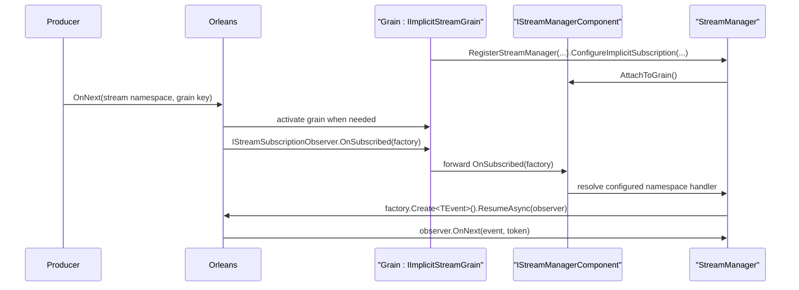
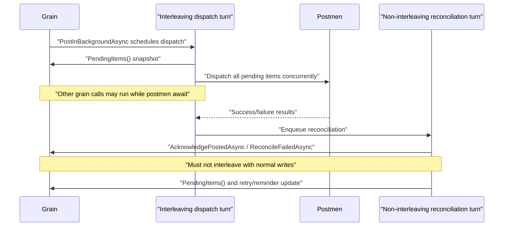

# Egil.Orleans.Messaging — API Design

Working design doc for the abstractions in the `Egil.Orleans.Messaging`
library.

Each section captures the decided shape, the rationale, and any explicit
non-goals. Decisions are settled top-down via grilling sessions; revisit
only when a new constraint surfaces.

Status legend: **Settled** = won't change without a new force; **Open** =
still under design; **Deferred** = explicitly postponed past the spike.

Constructor registration, absent-state defaults, and payload-level postmen follow
[issue #179](https://github.com/egil/framework/issues/179). These are intentional beta breaking changes.

---

## 0. Scope & packaging

**Status:** Settled.

### What this library is

A set of composable building blocks for Orleans grains that need:

1. **Atomic, recoverable state writes** — grain's observable `State` is
   never out of sync with what is durably persisted, even on ambiguous
   write failures.
2. **Outbox pattern** — durable, co-located message buffer that commits
   atomically with business-state changes.
3. **Outbox processing (postman)** — timer + reminder driven dispatch
   with retry, telemetry, and failure callbacks.
4. **Receiver-side dedup** — `MessageTracker` that tracks high-water
   positions from both outbox senders and Orleans streams.
5. **Stream subscription management** — fluent configure/resume/error
   facade over Orleans implicit and explicit stream subscriptions.

### What this library is NOT

- Not CQRS in the read/write-model-separation sense. No read-model
  projections, no query stores, no event sourcing.
- Not a replacement for `IGrainStorage`. It wraps `IPersistentState<T>`,
  not the provider layer.

### Packaging

Provider-neutral state/outbox/tracking and core stream manager APIs live in
`Egil.Orleans.Messaging`. Provider-specific integrations live in companion
packages so consumers do not inherit optional Azure/Event Hubs dependencies
unless they use those providers.

Current packages:

| Package | Contents |
| ------- | -------- |
| `Egil.Orleans.Messaging` | State manager base/default implementation, outbox, postman, tracking, stream manager, provider-neutral stream cursor/token metadata. |
| `Egil.Orleans.Messaging.Streams.EventHubs` | Orleans Event Hubs stream adapter and enriched Event Hubs sequence token support. |
| `Egil.Orleans.Messaging.State.AzureStorage` | Azure Table/Blob storage-aware state manager factory and failure classification. |

Future provider integrations should follow the same shape, for example
dedicated packages for provider-specific state manager behavior rather than
adding those dependencies to the core package. This follows Orleans' own
package shape, where optional stream and storage providers live behind
provider packages instead of the core runtime package.

### Capability namespaces and folders

Source and test files are grouped by library tool. Tests mirror production
folders so behavior is easy to find from the type under test.

| Capability | Package | Production namespace | Test folder |
| ---------- | ------- | -------------------- | ----------- |
| State management | `Egil.Orleans.Messaging` | `Egil.Orleans.Messaging.State` | `State/` |
| Outbox | `Egil.Orleans.Messaging` | `Egil.Orleans.Messaging.Outboxes` | `Outboxes/` |
| Receiver tracking | `Egil.Orleans.Messaging` | `Egil.Orleans.Messaging.Tracking` | `Tracking/` |
| Streams | `Egil.Orleans.Messaging` | `Egil.Orleans.Messaging.Streams` | `Streams/` |
| Event Hub stream enrichment | `Egil.Orleans.Messaging.Streams.EventHubs` | `Egil.Orleans.Messaging.Streams.EventHubs` | `EventHubs/` |
| Azure Storage state manager | `Egil.Orleans.Messaging.State.AzureStorage` | `Egil.Orleans.Messaging.State.AzureStorage` | `AzureStorage/` |

Extension entry points live in the namespace of the type they extend so they
are discoverable from normal Orleans, hosting, and DI imports:

- Grain registration methods: `namespace Orleans`.
- `IServiceCollection` registration methods:
  `namespace Microsoft.Extensions.DependencyInjection`.
- `ISiloBuilder` and `IEventHubStreamConfigurator` registration methods:
  `namespace Orleans.Hosting`.

C# 14 extension blocks are the preferred shape for new extension entry
points.

### Name

**`Egil.Orleans.Messaging`** — the outbox, postman, dedup, and stream
manager are all messaging infrastructure. `IStateManager` exists to make
the messaging atomic. Messaging is the reason the library exists; safe
state is the enabler.

---

## 1. `IStateManager<T>` — atomic state writes with in-flight recovery

**Status:** Settled.

### Goal

Replace direct grain use of `IPersistentState<T>` with a thin wrapper
that guarantees the grain's observable `State` is never out of sync with
what is durably persisted, even when `WriteStateAsync` fails ambiguously
(timeout, network drop, server 5xx, ETag conflict).

Grain code injects `IPersistentState<MyState>` as normal, then registers an
`IStateManager<MyState>` wrapper during activation. After that point, the raw
`IPersistentState<MyState>` should stay internal to the wrapper. This is
non-negotiable — exposing both is the loophole that lets grain authors read
stale `storage.State` after a failed write.

### Interface

```csharp
public interface IStateManager<T> where T : class, IEquatable<T>
{
    T State { get; }
    Task ReadAsync();
    Task WriteAsync(T newState);
    Task ClearAsync();
}
```

Constraints on `T`:

- `class` — atomic reference swap of `State` from `[AlwaysInterleave]`
  handlers is a single pointer load, no torn reads.
- `IEquatable<T>` — recovery path compares server-side state to
  attempted write to decide swallow-vs-rethrow. Records implement this
  for free.

Users pick one of two paths for `T`:

- **Path A — plain record + structural equality**
  (`MyState : IEquatable<MyState>`). User owns `Equals`. Works trivially
  for record-of-primitives shapes. Breaks silently if state holds
  `ImmutableArray<>` (reference-equality trap) — user must override
  `Equals` themselves in that case.
- **Path B — inherit `VersionedState`**
  (`MyState : VersionedState`). Library stamps a per-write `Guid Version`.
  Recovery path pattern-matches on `VersionedState` and compares `Version`
  directly — immune to collection-equality issues in the state graph.
  Recommended default for any non-trivial state.

See §3a for `VersionedState` and why the generic layer was removed.

### Activation and absent state

Registration in the grain constructor returns a stable handle. At lifecycle stage
`SetupState + 1`, after Orleans hydration and before `OnActivateAsync`, that handle
creates the configured provider-specific manager. Even custom manager factories
therefore see hydrated storage. Access before initialization throws clearly.
Registration in `OnActivateAsync` remains supported and creates the manager immediately.

`State` is non-null and read-only. Activation and `ReadAsync` adopt the stored value
when `RecordExists` is true; otherwise they invoke `createInitialState`, even if
the provider created its own default. Successful `ClearAsync` exposes a fresh
configured default. Defaults are never automatically written. An existing null
record or a null factory result is an error.

The optional `configureState` callback restores runtime dependencies, such as the
tracker's clock, on each adopted instance. It must not change business data or
perform storage I/O. It applies after reads and recovery as well as initial hydration.

### `WriteAsync` semantics

A single default `StateManager<T>` handles both shapes. It branches on
the non-generic `VersionedState` marker (see §3a) at runtime: if `T`
derives from it, the manager stamps a fresh `Guid Version` before every
write and uses that version for the recovery-path equality check;
otherwise it falls back to `T.Equals(...)`.

The manager retains a separate observable snapshot. It assigns the write candidate
to storage, awaits persistence, then adopts the successful value. A recovery read
adopts the server value (or an absent-record default) while retaining the refreshed
ETag. Equivalence can confirm a lost response only when a persisted record exists;
a reconstructed default must never be mistaken for proof that a write landed.

Behaviour matrix:

| Failure                            | After `WriteAsync` returns/throws               |
| ---------------------------------- | ------------------------------------------------ |
| Success                            | `State == newState`, returns                     |
| Timeout, write actually persisted  | `State == newState`, returns (silent recovery)   |
| Timeout, write did not persist     | `State == server's value`, throws original ex    |
| Recovery read finds no record     | `State == configured default`, throws original ex |
| 5xx / transient                    | Same as timeout — re-read decides                |
| `InconsistentStateException`       | `State == server's value`, **always rethrows**   |
| Re-read also fails (double failure)| `storage.State` reverted, throws original ex     |

### Double failure behaviour

When both `WriteStateAsync` and the recovery `ReadStateAsync` fail, the
manager reverts `storage.State` to `previous` and rethrows. After this
the grain holds correct data but a **stale ETag**. The next write
attempt may hit `InconsistentStateException` if the first write actually
persisted.

**Library does not auto-recover from double failure.** The grain must
call `ReadAsync()` before its next write to refresh the ETag if it
suspects this state. This is a documented contract — the library
surfaces the failure, the grain decides the policy (retry, deactivate,
alert).

### Notes

- **No internal `Deactivate` call.** Grain code decides deactivation
  policy.
- **Always rethrow on `InconsistentStateException`**, even if equality
  matches. A coincidental match would silently swallow a real concurrent
  write; the contract "if we threw conflict, your command read stale
  data" must hold.
- **`newState`'s reference is mutated for versioned state.** `Version`
  is `set` (not `init`), so `versioned.Version = ...` updates the
  caller's reference. Documented contract.
- **No `ReferenceEquals` pre-write short-circuit.** Functional
  `with { ... }` produces a fresh reference even when no fields changed.

### Provider-specific implementations

`IStateManager<T>` wraps an existing `IPersistentState<T>`, not a
replacement for grain storage providers. No new `IGrainStorage`
implementation is introduced.

Each storage provider we care to optimise for may ship its own
`IStateManager<T>` that:

- Inspects provider-specific exception types to classify failures as
  `StorageFailureKind.DidNotPersist` (skip re-read, revert + rethrow) vs
  `StorageFailureKind.UnknownOutcome` (re-read).
- Optionally exploits provider features (conditional writes, blob
  versions) to avoid the re-read.

`StorageFailureKind` is intentionally named for storage operations rather
than only writes. The same classification is useful for clear operations:
an Azure Storage HTTP 412/ETag conflict definitely did not clear the record,
while transient 5xx errors remain ambiguous and require read-back recovery.
Read failures do not use the classification because no local committed state
has been tentatively changed.

The Azure Storage companion package follows Orleans' Azure provider semantics:
the Orleans provider wraps Azure Table/Blob optimistic-update failures
(precondition failed, conflict, and not found during conditional write/clear)
as `InconsistentStateException`, so those are classified as
`DidNotPersist`.

It also understands Azure SDK `RequestFailedException` directly:

- `DidNotPersist`: rejected/client-side service responses where Azure has
  definitively not applied the mutation, including HTTP 400/401/403/404/409,
  HTTP 412, payload-too-large responses, and Azure Table/Blob error codes such
  as `UpdateConditionNotSatisfied`, `ConditionNotMet`, `BlobAlreadyExists`,
  `BlobNotFound`, `ContainerNotFound`, and table entity not-found/already-exists
  errors.
- `UnknownOutcome`: ambiguous or transient outcomes where a write/clear may
  have landed before the caller observed failure, including no HTTP response,
  HTTP 408, HTTP 429, all 5xx responses, `ServerBusy`, `OperationTimedOut`,
  `InternalError`, account IOPS throttling, `TimeoutException`, and
  cancellation-like failures.

For aggregate Azure SDK failures, any ambiguous inner failure makes the whole
operation `UnknownOutcome`; otherwise, all deterministic storage failures can
be treated as `DidNotPersist`. This preserves correctness over optimization:
read-back is skipped only when the provider response proves the mutation did
not persist.

### Why a wrapper, not extension methods

The wrapper was debated — recovery logic is stateless, could be an
extension method on `IPersistentState<T>`. But the wrapper does a fourth
thing extensions cannot: **it hides `IPersistentState<T>.State`**.

`IStateManager<T>.State` exposes the loaded or **committed** snapshot, or
the configured default for absent storage. During an in-flight write,
`IPersistentState<T>.State` already holds the uncommitted value. Read
methods marked `[AlwaysInterleave]` that access `storage.State` directly
could observe uncommitted state — and if the write fails, they returned
data that never persisted.

The wrapper is a **concurrency safety boundary**, not just convenience.
Extension methods can't provide this fence because the grain still holds
`IPersistentState<T>` and any method can access `.State` directly.

### Grain wiring

```csharp
private readonly IStateManager<MyState> stateManager;

public MyGrain([PersistentState("state")] IPersistentState<MyState> storage, TimeProvider time)
{
    stateManager = this.RegisterStateManager("state", storage,
        () => new MyState(),
        state => state.Tracker.RegisterTimeProvider(time));
}
```

`RegisterStateManager(storageName, storage, createInitialState, configureState?)`
requires `TState : class, IEquatable<TState>`. The two-argument convenience overload
requires `new()` and creates `new TState()` only when needed.

Register a keyed `IStateManagerFactory` with `AddDefaultStateManager`,
`AddAzureStorageStateManager`, or `AddStateManagerFactory`. Its `Create<T>` method
receives storage, the default factory, and optional runtime configuration.

---

## 2. `Outbox<T>` storage placement

**Status:** Settled.

The `Outbox<T>` collection lives **inside the grain's main state
record**. Atomicity is the whole point — a state change and the messages
announcing it commit in one ETag-protected write or neither commits.
Splitting into a separate `IPersistentState` blob would re-introduce
the "told one party, not the other" failure mode.

### Write amplification

Co-locating the outbox means every command's `WriteStateAsync`
re-serialises both halves. Accepted.

Provider-level mitigation is allowed: a storage provider may detect
unchanged sub-graphs and skip writing unchanged bytes. That stays a
provider concern.

### Non-goal: outbox-only writes

The grain does not expose "enqueue without committing other state."
Every outbox change rides the same `WriteAsync(newState)` as the
business-state change that produced it.

---

## 3. `Outbox<T>` — message collection inside grain state

**Status:** Settled.

### Goal

`Outbox<T>` is the per-grain durable buffer of messages that have been
*announced* (committed alongside a state change) but not yet *delivered*
(handed off to a postman successfully). It lives as a property on the
grain's state record for atomic writes.

The collection behaves like `ImmutableArray<OutboxMessageEnvelope<T>>`
— read-only iteration, indexer, value semantics, mutators return new
instances — with three additions:

- A sender-free stored `OutboxMessageId` for each item.
- A monotonic `LatestSequenceNumber` that persists independently of the
  message array contents.
- `Add` mutators that own sequence assignment and either sample system
  UTC or accept the caller's current UTC instant explicitly.

### Shape

`OutboxMessageId` stores `(SequenceNumber, Timestamp, Epoch)`. The stored envelope
contains `Id` and `Message`. The processor combines that ID with the owning grain's
identity to construct the delivery `OutboxSequenceToken`; it never writes the sender
back into the outbox. Tokens remain identical across retries and reactivation.

```csharp
public sealed record OutboxMessageId(long SequenceNumber, DateTimeOffset Timestamp, DateTimeOffset Epoch);
public sealed record OutboxMessageEnvelope<T>(OutboxMessageId Id, T Message);

// Public collection operations; mutations return new immutable instances.
Outbox<T>.Create();
outbox.Add(message);
outbox.Add(message, utcNow);
outbox.Remove(id);          // Removes only a matching FIFO head.
outbox.RemoveRange(ids);    // Removes matching IDs anywhere, preserving remaining order.
outbox.Clear();             // Preserves sequence high-water mark and epoch.
```

The actual types carry Orleans serialization metadata and JSON support. Each stored
ID field is required in JSON so malformed data cannot silently acquire default
sequence metadata. This beta changes the stored shape without a legacy migration.

### Epoch semantics

- `Create()` → `epoch = null`, `LatestSequenceNumber = 0`.
- First `Add()` → stamps `epoch = now`. Persisted with state.
- Subsequent `Add()` → same epoch, incrementing sequence number.
- `Clear()` → removes items, **preserves** `LatestSequenceNumber` and
  `Epoch`. This is the normal "postman drained successfully" path.
- `Create()` again → **resets both** epoch (to null) and sequence
  number (to 0). This is the nuclear option — the next `Add` starts a
  fresh epoch. Receivers see `token.Epoch > stored.Epoch` and accept.

**`Clear()` is the normal path.** Grains should almost never call
`Create()` on an active outbox. `Create` is for construction-time
initialisation and deliberate ops-level sequence-space resets.
Document and warn.

### Outbox depth telemetry and owner policy

The outbox can grow unbounded if postman targets are down. Mitigation:

- **Telemetry:** gauge for outbox depth per grain type, emitted on every
  write. Operators see growth before it becomes a crisis.
- **Owner policy:** the owning grain controls the outbox. In
  `ReconcileFailedAsync`, it can leave failed items pending, remove them,
  dead-letter them, or trim old entries according to domain policy.
- **Documentation:** storage providers have entity size limits (e.g.
  Azure Table = 1MB). Document the risk of unbounded growth.

### O(1) snapshot equality

`Revision` is a persisted UUIDv7, an outbox-specific ETag. `Create` and each
mutation that changes the outbox assign a fresh revision. No-op operations
preserve the existing snapshot and revision. JSON and Orleans serialization
preserve the revision; JSON requires it to be non-empty.

Equality and hashing use only `Revision`; distinct snapshots with an empty
revision cannot compare equal.
It remains O(1) without scanning payloads. Two competing appends or removals
have different revisions even when endpoint IDs and sequence metadata match.
A deserialized copy of the saved snapshot retains its revision, allowing recovery
to confirm a successful write with a lost response. Independently constructed
snapshots are unequal even when their contents match. Recovery uses revision
equality, never revision ordering. Message IDs and delivery tokens are unchanged.

### Why these choices

- **Sealed class, not record.** No `with`, no synthesized copy
  constructor. Mutation through four method families only, preserving
  sequence and epoch invariants.
- **`Add(T payload)` not `Add(envelope)`.** Outbox owns sequence
  assignment. Callers cannot fabricate sequence numbers.
- **Time is per append, never retained.** `Add(T)` samples system UTC;
  `Add(T, DateTimeOffset)` accepts the caller's current instant and
  normalizes it to UTC. Persisted values therefore contain no transient
  clock reference and require no post-deserialization registration.
- **Lazy `Epoch`.** A grain that never sends doesn't burn a fresh epoch
  on storage.
- **`Remove(id)` and `RemoveRange(ids)`.** Single removal checks the FIFO head;
  batch acknowledgment removes the successful stored IDs even across gaps.
- **`LatestSequenceNumber` is a separate field.** After flush, items are
  empty; high-water mark persists independently.

### Retry diagnostics

Envelope stays immutable. `SendAttempts` and `LastException` do NOT
appear on `OutboxMessageEnvelope<T>`. The postman tracks attempts
in-memory keyed on `OutboxSequenceToken`. On re-activation, counts
restart from zero. Acceptable for burst retry policies.

---

## 3a. `VersionedState` — version-based equality for recovery

**Status:** Settled. Generic `VersionedState<TSelf>` removed — see below.

### Problem

`ImmutableArray<T>.Equals` compares the underlying `T[]` reference, not
contents. Record-auto-generated `Equals` on state records holding
`ImmutableArray<>` returns false for identical-content different-backing
arrays. This breaks `IStateManager.WriteAsync`'s recovery path.

### Resolution

```csharp
[GenerateSerializer]
public abstract record VersionedState
{
    [Id(0)] public Guid Version { get; internal set; } = Guid.CreateVersion7();
}
```

User state:

```csharp
[GenerateSerializer]
public sealed record MyState : VersionedState
{
    [Id(1)] public Outbox<MyEvent> Outbox { get; init; } = Outbox<MyEvent>.Create();
    [Id(2)] public ImmutableArray<Something> Items { get; init; } = [];
}
```

### Why the generic `VersionedState<TSelf>` was removed

The original design had a two-layer hierarchy where the generic layer
overrode `Equals` to compare only `Version`, bypassing `ImmutableArray`
reference-equality. However:

1. **The Equals override was broken.** When the user writes
   `sealed record MyState : VersionedState<MyState>`, the compiler
   generates `MyState.Equals(MyState?)` that calls `base.Equals(other)`
   (the version-only check) **AND** adds property-level checks for all
   of `MyState`'s declared properties. So `ImmutableArray` comparisons
   still happen in the generated code.
2. **The recovery path doesn't need it.** `IStateManager<T>.WriteAsync`
   does `if (newState is VersionedState v)` and compares `v.Version`
   directly via pattern matching — it never relies on `T.Equals()` for
   VersionedState-derived types.
3. **`IEquatable<T>` on `IStateManager<T>` is satisfied automatically**
   by the record-generated equality for non-VersionedState types.

The non-generic `VersionedState` provides everything the library needs:
the `Version` property, a single type for pattern matching at runtime,
and the `[JsonInclude]` + `internal set` fence.

### Why `Version` is internal-set, not user-settable

`IPersistentState<T>.Etag` is storage concurrency. `Version` is
library-internal recovery decoration. Conflating them erases a layer.

---

## 4. `MessageTracker`

**Status:** Settled.

Receiver-side, persisted dedup state. Tracks high-water position from
each upstream source. Two source kinds:

- **Orleans streams** — keyed by `StreamId`; position is a
  `StreamCursor` wrapping `(stream namespace, StreamSequenceToken)`.
- **Outbox messages** — keyed by sender `GrainId`; position is an
  `OutboxSequenceToken`.

### Shape

**Sealed class** (not record — consistent with `Outbox<T>`, avoids
`time` field participating in record-synthesized equality).

```csharp
[GenerateSerializer]
[Alias("egil.orleans.messaging.MessageTracker")]
[JsonConverter(typeof(MessageTrackerJsonConverter))]
public sealed class MessageTracker
{
    [Id(0)] private ImmutableDictionary<StreamSource, StreamEntry> streams;
    [Id(1)] private ImmutableDictionary<GrainId, OutboxEntry> outbox;

    // Non-persisted; no [Id]. Mutable.
    [NonSerialized]
    [JsonIgnore]
    private TimeProvider time = TimeProvider.System;

    public void RegisterTimeProvider(TimeProvider time) => this.time = time;

    public bool ProcessMessage(StreamCursor cursor, out MessageTracker next);
    public bool ProcessMessage(
        string streamNamespace,
        StreamSequenceToken? token,
        out MessageTracker next);
    public bool ProcessMessage(
        string streamProviderName,
        string streamNamespace,
        StreamSequenceToken? token,
        out MessageTracker next);
    public bool ProcessMessage(OutboxSequenceToken token, out MessageTracker next);

    public StreamCursor? LatestStream(string streamNamespace);
    public StreamCursor? LatestStream(string streamProviderName, string streamNamespace);
    public StreamCursor? LatestStream(StreamId stream);
    public StreamSequenceToken? LatestStreamSequenceToken(string streamNamespace);
    public StreamSequenceToken? LatestStreamSequenceToken(string streamProviderName, string streamNamespace);
    public OutboxSequenceToken? LatestOutbox(GrainId sender);

    public MessageTracker Evict(DateTimeOffset olderThan);
    public MessageTracker EvictStreams(DateTimeOffset olderThan);
    public MessageTracker EvictOutboxes(DateTimeOffset olderThan);
    public MessageTracker Evict(StreamId stream, DateTimeOffset olderThan);
    public MessageTracker Evict(GrainId sender, DateTimeOffset olderThan);

    [GenerateSerializer]
    private readonly record struct StreamSource(
        [property: Id(0)] string StreamNamespace,
        [property: Id(1)] string? ProviderName);

    [GenerateSerializer]
    private readonly record struct StreamEntry(
        [property: Id(0)] StreamCursor LastPosition,
        [property: Id(1)] DateTimeOffset Received);

    [GenerateSerializer]
    private readonly record struct OutboxEntry(
        [property: Id(0)] DateTimeOffset Epoch,
        [property: Id(1)] long LastSequenceNumber,
        [property: Id(2)] DateTimeOffset Received);
}
```

### Identity model (no OriginId)

- Outbox identity: `OutboxSequenceToken.Sender` supplied by the processor at delivery.
  Payloads stay clean.
- Stream identity: stream namespace, plus provider name when available.
  Stream keys are intentionally not part of `MessageTracker` state because
  the tracker is scoped to one grain activation's durable state.

### `ProcessMessage(StreamCursor)` and stream token semantics

Users can pass either a `StreamCursor` or the raw Orleans
`StreamSequenceToken` plus stream namespace. Provider-qualified overloads are
available when a grain consumes the same namespace from multiple providers.
The stream namespace stays required even for grains that currently subscribe
to one stream; making it optional would encode a fragile "single stream"
assumption into persisted high-water marks.

| Prior entry                      | Decision | Effect                                         |
| -------------------------------- | -------- | ---------------------------------------------- |
| None                             | Accept   | Insert `(LastPosition = cursor, Received = now)` |
| `cursor > stored.LastPosition`   | Accept   | Update position + received                     |
| `cursor <= stored.LastPosition`  | Reject   | No change                                      |

`LatestStreamSequenceToken(...)` is a convenience for resume-token lookup.
It returns `null` both when no stream is tracked and when the tracked cursor
has a null token; callers that need to distinguish those cases should use
`LatestStream(...)`.

### `ProcessMessage(OutboxSequenceToken)` semantics

| Prior entry | Comparison                                   | Decision | Effect                   |
| ----------- | -------------------------------------------- | -------- | ------------------------ |
| None        | —                                            | Accept   | Insert                   |
| Exists      | `token.Epoch > stored.Epoch`                 | Accept   | Replace (sender reset)   |
| Exists      | Same epoch, `token.Seq > stored.LastSeq`     | Accept   | Update seq + received    |
| Exists      | Same epoch, `token.Seq <= stored.LastSeq`    | Reject   | Duplicate                |
| Exists      | `token.Epoch < stored.Epoch`                 | Reject   | Stale epoch              |

### `Evict` — uniform cleanup

Five overloads, one rule: remove entries where `entry.Received <= olderThan`.
No separate `Forget` API — `Evict(id, DateTimeOffset.MaxValue)` is the
documented idiom for unconditional clear.

### `RegisterTimeProvider` — void by design

Mutable field, non-persisted, excluded from equality. After
deserialization, grain must re-register. Falls back to
`TimeProvider.System` if skipped — correct for production, breaks
fake-clock tests.

---

## 5. `StreamManager` — stream subscription handler facade

**Status:** Settled.

Grain-level facade around Orleans stream subscription handler attachment.
The API must preserve Orleans' distinction between implicit and explicit
subscriptions:

- **Implicit subscriptions** are declared by Orleans attributes such as
  `[ImplicitStreamSubscription("namespace")]`. Orleans owns activation and
  subscription creation. The library only attaches handler logic when Orleans
  calls `IStreamSubscriptionObserver.OnSubscribed(...)`.
- **Explicit subscriptions** are created by the grain via Orleans'
  `SubscribeAsync(...)`. Orleans persists the subscription handle, and the
  grain must resume existing handles after reactivation using
  `GetAllSubscriptionHandles()` + `ResumeAsync(...)`.

Four responsibilities:

1. **Configure** stream namespaces during `OnActivateAsync`.
2. **Attach** handlers to implicit subscription handles provided by Orleans.
3. **Resume or ensure** durable explicit subscription handles.
4. **Dispatch** with projected `StreamCursor` and per-subscription error
   handling via the optional `onError` callback.

### Why a facade, not a base class

Extension/composition over inheritance. Grain inherits from `Grain`,
registers a `StreamManager`, and optionally implements marker interfaces for
runtime callbacks.

For implicit streams, the grain implements `IImplicitStreamGrain`; it does
not expose a `StreamManager` property. `StreamManager` follows the same
component pattern as `OutboxProcessor.AttachToGrain()`:

1. `RegisterStreamManager(...)` creates the manager.
2. The manager attaches itself to `grain.GrainContext` as an internal
   stream component.
3. The `IImplicitStreamGrain` default interface method receives Orleans'
   `OnSubscribed(...)` callback.
4. The default method resolves the attached component and forwards the
   callback to `StreamManager`.


```mermaid
sequenceDiagram
    participant Producer
    participant Orleans
    participant Grain as "Grain : IImplicitStreamGrain"
    participant Component as "IStreamManagerComponent"
    participant Manager as "StreamManager"

    Grain->>Manager: RegisterStreamManager(...).ConfigureImplicitSubscription(...)
    Manager->>Component: AttachToGrain()
    Producer->>Orleans: OnNext(stream namespace, grain key)
    Orleans->>Grain: activate grain when needed
    Orleans->>Grain: IStreamSubscriptionObserver.OnSubscribed(factory)
    Grain->>Component: forward OnSubscribed(factory)
    Component->>Manager: resolve configured namespace handler
    Manager->>Orleans: factory.Create<TEvent>().ResumeAsync(observer)
    Orleans->>Manager: observer.OnNext(event, token)
```

### Shape

```csharp
public interface IImplicitStreamGrain : IStreamSubscriptionObserver
{
    Task IStreamSubscriptionObserver.OnSubscribed(
        IStreamSubscriptionHandleFactory handleFactory);
}

public sealed class StreamManager
{
    public static StreamId CreateStreamId(
        string streamNamespace,
        GrainId grainId);

    public StreamManager ConfigureImplicitSubscription<TEvent>(
        string streamNamespace,
        Func<TEvent, StreamCursor, ValueTask> onNextAsync,
        Action<string, Exception>? onError = default,
        bool useTrackedResumeToken = true);

    public StreamManager ConfigureImplicitSubscription<TEvent>(
        string streamNamespace,
        Func<TEvent, StreamCursor, Task> onNextAsync,
        Action<string, Exception>? onError = default,
        bool useTrackedResumeToken = true);

    public StreamManager ConfigureExplicitSubscription<TEvent>(
        string streamProviderName,
        string streamNamespace,
        Func<TEvent, StreamCursor, ValueTask> onNextAsync,
        Action<string, Exception>? onError = default,
        bool useTrackedResumeToken = true);

    public StreamManager ConfigureExplicitSubscription<TEvent>(
        string streamProviderName,
        string streamNamespace,
        Func<TEvent, StreamCursor, Task> onNextAsync,
        Action<string, Exception>? onError = default,
        bool useTrackedResumeToken = true);

    public StreamManager ConfigureExplicitSubscription<TEvent>(
        string streamProviderName,
        StreamId streamId,
        Func<TEvent, StreamCursor, ValueTask> onNextAsync,
        Action<string, Exception>? onError = default,
        bool useTrackedResumeToken = true);

    public StreamManager ConfigureExplicitSubscription<TEvent>(
        string streamProviderName,
        StreamId streamId,
        Func<TEvent, StreamCursor, Task> onNextAsync,
        Action<string, Exception>? onError = default,
        bool useTrackedResumeToken = true);

    public Task ResumeExplicitSubscriptionsAsync(
        CancellationToken cancellationToken = default);

    public Task EnsureExplicitSubscriptionsAsync(
        CancellationToken cancellationToken = default);
}

public static class StreamManagerExtensions
{
    public static StreamManager RegisterStreamManager<TGrain>(
        this TGrain grain,
        Func<MessageTracker?>? getTracker = null)
        where TGrain : IGrainBase;
}

```

`ConfigureImplicitSubscription` intentionally has no provider-name
parameter. Orleans provides the concrete provider and stream id through
`IStreamSubscriptionHandleFactory` when the implicit subscription fires.

`ConfigureExplicitSubscription` requires a provider name because the library
must ask Orleans for the stream and durable subscription handles itself. The
string namespace overload follows the library's grain-keyed convention and
derives the stream id from the complete receiving `GrainId`. Producers call
`StreamManager.CreateStreamId(streamNamespace, target.GetGrainId())` to derive
the same id. The helper uses Orleans' textual grain identity and rejects any
custom identity which does not round-trip through `GrainId.TryParse`. Use the
`StreamId` overload for an arbitrary or application-owned stream identity.

`RegisterStreamManager()` can be called without a `MessageTracker` when the
grain does not persist stream high-water marks. In that mode the manager
attaches handlers without supplying resume tokens. Pass an accessor for the hydrated
tracker snapshot only when the grain wants `StreamManager` to resume from
persisted cursors.

Each configured subscription independently decides whether `StreamManager`
passes the tracked cursor token into Orleans resume/subscribe APIs. The
default is `useTrackedResumeToken: true` for compatibility: if a tracker
snapshot has a cursor for the stream, the previous token is supplied. Set
`useTrackedResumeToken: false` when the grain wants Orleans to attach the
handler without a resume token for that subscription, even if a tracker
snapshot is available.

### Typical implicit wiring

```csharp
public override async Task OnActivateAsync(CancellationToken ct)
{
    var state = await stateManager.ReadAsync();
    state.Tracker.RegisterTimeProvider(timeProvider);

    this.RegisterStreamManager(() => state.Tracker)
        .ConfigureImplicitSubscription("electricity-prices", HandlePriceTickAsync, LogStreamError)
        .ConfigureImplicitSubscription("tariff-events", HandleTariffChangedAsync, useTrackedResumeToken: false);
}
```

The grain must also be attributed and implement `IImplicitStreamGrain`:

```csharp
[ImplicitStreamSubscription("electricity-prices")]
public sealed class PriceProjectionGrain : Grain, IImplicitStreamGrain
{
    // OnSubscribed is supplied by IImplicitStreamGrain's default method.
}
```

No `SubscribeAsync` call belongs in implicit activation. Orleans activates
the grain and calls `OnSubscribed(...)` when an event targets the implicit
subscription.

For grains that do not track stream positions, omit the tracker:

```csharp
this.RegisterStreamManager()
    .ConfigureImplicitSubscription("electricity-prices", HandlePriceTickAsync);
```

### Typical explicit wiring

```csharp
public override async Task OnActivateAsync(CancellationToken ct)
{
    var state = await stateManager.ReadAsync();
    state.Tracker.RegisterTimeProvider(timeProvider);

    streamManager = this.RegisterStreamManager(() => state.Tracker)
        .ConfigureExplicitSubscription("StreamProvider", "tariff-events", HandleTariffChangedAsync);

    await streamManager.EnsureExplicitSubscriptionsAsync(ct);
}
```

The `TEvent` generic argument is usually inferred from the handler method
group. Users only specify it for inline lambdas or ambiguous method groups.
Publishers targeting the grain-keyed convention derive the stream id from the
target grain reference:

```csharp
var target = grainFactory.GetGrain<ITariffGrain>(customerId);
var streamId = StreamManager.CreateStreamId("tariff-events", target.GetGrainId());
var stream = streamProvider.GetStream<PriceChanged>(streamId);
```

Because the derived key contains the grain type, a grain-type rename changes
the stream id. Use the `StreamId` overload when the target stream needs an
application-owned identity or is not keyed by the receiving grain:

```csharp
streamManager = this.RegisterStreamManager(() => state.Tracker)
    .ConfigureExplicitSubscription<PriceChanged>(
        "StreamProvider",
        StreamId.Create("tariff-events", customerId),
        HandleTariffChangedAsync);
```

The full-identity convention is incompatible with the previous key-only
derivation. Existing durable handles must be recreated while publishers move
to `CreateStreamId`, or retained by configuring their previous ids explicitly.

### Implementation changes from the previous design

- Rename `AddSubscription(...)` to the more explicit
  `ConfigureImplicitSubscription(...)` and
  `ConfigureExplicitSubscription(...)`.
- Replace `SubscribeAsync(...)` with explicit-only
  `ResumeExplicitSubscriptionsAsync(...)` and
  `EnsureExplicitSubscriptionsAsync(...)`.
- Add `IImplicitStreamGrain` as a public convenience interface with a default
  `IStreamSubscriptionObserver.OnSubscribed(...)` implementation.
- Add an internal `IStreamManagerComponent`, attach `StreamManager` to
  `IGrainContext`, and let `IImplicitStreamGrain` forward through that
  component.
- Change stream handlers to receive `StreamCursor` instead of raw
  `StreamSequenceToken?`.
- Derive grain-keyed stream ids from the complete, round-trippable `GrainId`
  and expose `CreateStreamId(...)` for producers.
- Keep explicit subscription unsubscribe orchestration out of the initial API.
  The first version only resumes or ensures explicit subscriptions.

### Implicit subscription semantics

- `ConfigureImplicitSubscription(...)` records the handler shape only.
- It does not call `SubscribeAsync(...)`, inspect existing explicit handles,
  or create Orleans subscription state.
- When Orleans calls `OnSubscribed(factory)`, `StreamManager` matches
  `factory.StreamId.GetNamespace()` to a configured implicit subscription,
  creates the typed handle with `factory.Create<TEvent>()`, and calls
  `ResumeAsync(observer, token)` to attach the handler. The token comes from
  the activation-time `MessageTracker` snapshot when a cursor exists for the
  same provider and namespace and that subscription has
  `useTrackedResumeToken: true`.
- If no handler is configured for the implicit stream namespace, the manager
  throws during `OnSubscribed(...)`. A mismatched attribute/configuration is a
  delivery-path misconfiguration and should not be a log-only condition.
- Orleans controls activation and target stream identity. If the grain is not
  active, a matching stream event can activate it.
- Implicit subscriptions do not show up as explicit handles from
  `GetAllSubscriptionHandles()` and cannot be removed by `UnsubscribeAsync()`
  on an explicit handle.

### Explicit subscription semantics

- `ConfigureExplicitSubscription(...)` records the provider, stream identity,
  event type, handler, and error callback. The namespace overload derives the
  stream id from the complete receiving `GrainId`; the `StreamId` overload uses
  the caller-provided stream identity directly.
- `ResumeExplicitSubscriptionsAsync(...)` resumes all existing durable
  handles for each configured explicit stream from the activation-time
  `MessageTracker` cursor when one exists and that subscription has
  `useTrackedResumeToken: true`. It never creates a new subscription.
- `EnsureExplicitSubscriptionsAsync(...)` resumes existing handles when
  present. If none exist for a configured explicit stream, it creates exactly
  one explicit subscription with `SubscribeAsync(observer, token)`, using the
  tracked cursor token when available and enabled for that subscription.
- Repeated calls to `EnsureExplicitSubscriptionsAsync(...)` are idempotent:
  once a durable explicit handle exists, later calls resume it instead of
  creating duplicates.
- Explicit handles persist across grain deactivation until Orleans removes
  them via `UnsubscribeAsync()`. The initial version does not expose
  unsubscribe orchestration; consumers can use Orleans handles directly if
  they need to intentionally detach.

### Cursor semantics

- Stream handlers receive a `StreamCursor`, not a raw
  `StreamSequenceToken?`.
- The cursor includes the stream namespace, provider name when known, and the
  delivered Orleans sequence token.
- `MessageTracker` provides provider-aware resume tokens for both implicit
  handle resume and explicit subscribe/resume when a subscription opts into
  tracked resume tokens.
- For explicit streams, the durable Orleans subscription handle is still the
  primary subscription identity. `MessageTracker` remains the
  application-level dedup and high-water marker; handlers update it after
  accepting events.

### Per-subscription `OnError`

Signature: `Action<string, Exception>`, where the string is the stream
namespace. Default when omitted: log + emit counter, do NOT rethrow.

### One-provider-per-namespace

Accepted as a code-review convention for implicit subscriptions. Explicit
subscriptions carry a provider name in configuration, so provider/namespace
ambiguity is visible in code.

### `StreamCursor` projection constraint

`StreamCursor` carries an opaque `StreamSequenceToken`. The core package ships
an STJ converter which writes a small discriminator envelope and delegates the
token payload directly to explicitly registered `JsonConverter<TToken>`
instances. The discriminator is the token JSON `Kind` property.

| Subtype                         | Source                          |
| ------------------------------- | ------------------------------- |
| `EventSequenceToken`            | Orleans SimpleMessageStream     |
| `EventSequenceTokenV2`          | Orleans SimpleMessageStream v2  |
| `EventHubSequenceToken`         | Event Hubs companion package    |
| `EventHubSequenceTokenV2`       | Event Hubs companion package    |
| `EnrichedEventHubSequenceToken` | Event Hubs companion package    |

Unknown subtype throws at serialization time — silently dropping the
cursor would corrupt dedup. Unknown discriminator throws at deserialization
time. Provider packages register converters during their normal setup; custom
stream providers can register their own converter with
`AddStreamSequenceTokenJsonConverter<TToken, TConverter>(...)` or
`StreamSequenceTokenJsonConverters.Register(...)`.

Cursor, discriminator-envelope, and built-in token readers treat JSON object
property order as insignificant and skip unknown properties. Writers keep a
canonical order. This allows older silos to read additive payloads during
rolling upgrades or rollback; newly added properties must still be optional
because an older silo cannot preserve an unknown value when it rewrites the
payload. Custom token converters are responsible for the same forward-tolerant
read behavior inside their payloads.

### Event Hub adapter for enriched tokens

The library ships `EnrichedEventHubAdapter`, a public unsealed
`EventHubDataAdapter` subclass. It opts Event Hub streams into
`EnrichedEventHubSequenceToken`, which carries:

- `EnqueuedTime` — broker-side enqueue time for lag measurement.
- `ProviderName` — provider identity for dedup and multi-provider
  edge cases.
- `TraceParent` — W3C traceparent captured from the producer-side
  `Activity.Current?.Id`.

Users who want the built-in behavior register it with
`UseEnrichedDataAdapter()` on `IEventHubStreamConfigurator`:

```csharp
siloBuilder.AddEventHubStreams("orders", b =>
{
    b.UseEnrichedDataAdapter();
    // ... other Event Hub config
});
```

`UseEnrichedDataAdapter()` also registers Event Hubs sequence-token JSON
converters. That lets `MessageTracker` and `StreamCursor` round-trip
`EnrichedEventHubSequenceToken` without the core package referencing Event
Hubs and without losing `EventHubOffset`, `EnqueuedTime`, `ProviderName`, or
`TraceParent`.

Users who need custom adapter behavior can subclass
`EnrichedEventHubAdapter` and register their subclass via Orleans'
`UseDataAdapter` directly. The library intentionally provides no
generic registration helper for custom subclasses because those adapters
usually need extra services/options.

`StreamManager` is unaware of Event Hubs specifically — enrichment
surfaces through `StreamCursor.TryGetEnqueuedTime(...)`,
`StreamCursor.TryGetProviderName(...)`, and
`StreamCursor.TryGetTraceParent(...)`.

### OpenTelemetry trace correlation

Orleans streams lose `Activity.Current` across the queue boundary. To
correlate consumer-side spans with producer-side spans without creating
multi-hour distributed traces, `StreamManager` should use
`ActivityLink`s, not parent chaining:

- Producer side (`EnrichedEventHubAdapter.ToQueueMessage<T>`): stash
  `Activity.Current?.Id` into `EventData.Properties["traceparent"]`
  before the event hits EH.
- Adapter ingest side (`EnrichedEventHubAdapter.GetStreamPosition`):
  extract `EventData.Properties["traceparent"]` into
  `EnrichedEventHubSequenceToken.TraceParent`.
- Consumer side (in `StreamManager`'s OnNext wrapper): read the
  token's traceparent, parse into `ActivityContext`, start the OnNext span with
  `ActivityKind.Consumer` and `links: [new ActivityLink(parsedContext)]`.

This produces separate traces per delivery, each with a link back to
the producer span. OTel backends render the cross-trace arrow without
collapsing weeks of traffic into one trace.

The built-in adapter owns producer-side propagation for users who call
`UseEnrichedDataAdapter()`. Custom adapters should preserve the same
`traceparent` property behavior if they want `StreamManager` to create
links.

### Telemetry

Track at minimum (see `OutboxProcessor` for the meter pattern):

- Counter: messages delivered per `(streamNamespace, accepted|rejected)`.
- Counter: subscriptions established / torn down / errored.
- Histogram: handler latency per `streamNamespace`.
- Histogram (when `EnrichedEventHubSequenceToken` is available):
  end-to-end lag = `now - cursor.TryGetEnqueuedTime()`. Surfaces
  consumer lag against the broker, parallel to outbox sender-to-receiver
  timing.

---

## 6. Opinionated grain pattern — functional commands, interleaved reads

**Status:** Settled (guidance, not enforced by library API).

### The pattern

Grains using this library should follow a functional-command model:

1. **State is immutable.** Grain state is a `record` (or sealed record)
   composed of immutable types (`ImmutableArray<T>`, `Outbox<T>`,
   `MessageTracker`, value objects). No mutable collections, no mutable
   fields.

2. **Commands run sequentially.** Methods that mutate state ("commands")
   produce a new state value from `(currentState, commandPayload, utcNow)` and
   call `IStateManager<T>.WriteAsync(newState)`. They run under
   Orleans' default non-reentrant turn-based concurrency — one at a
   time, no interleaving.

3. **Reads interleave freely.** Methods that only read committed state
   can be marked `[AlwaysInterleave]`. They see the last
   `WriteAsync`-committed snapshot via `IStateManager<T>.State` — the
   committed-state fence (§1) ensures they never observe in-flight
   uncommitted values. Multiple reads execute in parallel.

4. **No external I/O in command handlers.** Commands should not call
   HTTP, query databases, or invoke other grains. All input needed for
   the decision must arrive in the command payload. External data is
   fetched by the caller *before* invoking the grain. If a command needs
   to trigger downstream work, enqueue it via `Outbox<T>.Add(...)` and
   let the `OutboxProcessor` dispatch it after the write.

### Why this works

- **Deterministic commands.** Same state + same payload + same UTC input → same result.
  Easy to test, easy to reason about, no ambient dependencies.
- **Safe concurrency.** Reads never block writes. Writes are serialised
  by the runtime. No custom locks.
- **Recovery-friendly.** `IStateManager<T>.WriteAsync` recovery path
  pattern-matches `VersionedState` and compares `Version` directly —
  works because the library stamps a v7 UUID on every write.
- **Outbox replaces side effects.** Instead of "write state + call
  service" (two failure points), it's "write state with outbox item"
  (one atomic write) + "processor retries delivery" (idempotent).

### What the library does NOT enforce

- No compile-time prevention of injecting `HttpClient` or calling
  external services in command methods. This is a documentation and
  code-review concern.
- No base class. The pattern emerges from the types: `VersionedState`
  is a record (immutable), `IStateManager<T>.WriteAsync` takes a new
  value (not mutation), `Outbox<T>.Add` returns a new instance.
- Future: Roslyn analyzers could warn on external I/O inside methods
  that call `WriteAsync`. Not in scope for v1.

---

## 7. `OutboxProcessor<T>` — timer + reminder driven dispatch

**Status:** Open, current direction captured here.

Grain-scoped component that owns the timer, reminder, and postman
dispatch lifecycle for draining `Outbox<T>`. Modelled after the
[spike](https://gist.github.com/egil/2f3318d1bd22045268e11a5d988ba938)
in the `Clever.PricingEngine` codebase.

### Architecture

- **Grain-scoped, not silo-scoped.** Each grain with an outbox gets its
  own `OutboxProcessor`. No external scan, no registry, no second store.
- **One processor per activation.** A second registration is rejected because
  the `IOutboxGrain` reminder bridge has one component slot. Different item
  subtypes use multiple postmen on the same processor.
- **In-process retry** for fast retry while activated.
- **Durable Reminder** for cross-activation recovery. Reactivates the
  grain if it deactivates with pending items. Retry scheduling is updated on
  activation.
- **Single active drain.** At most one send attempt may run per activation.
  `PostAsync`, `PostInBackgroundAsync`, retry callbacks, and reminder
  callbacks all coalesce through the same drain gate. If a post run is already
  active, additional requests mark another run as desired rather than starting
  concurrently.
- **Background postage interleaves by default.** `Interleave` defaults to
  `true`, allowing unrelated grain calls to continue while postmen await I/O.
  It does not by itself permit overlapping post runs.
- **Keep-alive is explicit.** `KeepAlive` controls whether background retry
  work should keep the grain activation alive while pending outbox items
  remain.

### Postman dispatch

The grain registers one or more postmen via `AddPostman<TSub>(...)`, each
handling a payload subtype of `TOutbox`. Matching is first-registered-wins against
the payload's runtime type — order from most specific to least specific (like a
`switch`).

Postmen can be inline callbacks for local/simple cases, or keyed
`IPostman<TMessage>` services for reusable delivery code:

```csharp
public interface IPostman<in TMessage>
    where TMessage : notnull
{
    ValueTask PostAsync(TMessage message, CancellationToken cancellationToken);
}

[AttributeUsage(AttributeTargets.Class, AllowMultiple = false, Inherited = false)]
public sealed class OutboxPostmanAttribute(string name) : Attribute
{
    public string Name { get; } = name;
}
```

Use inline callbacks when delivery logic is grain-local and small. Inline
callbacks are the only postman shape which can naturally close over
activation-local grain state, so they need the most care when background
postage interleaves with other grain turns. Use keyed `IPostman<TMessage>`
services when the delivery code has dependencies, should be tested outside
Orleans, or is shared across grains. Registered postman services are scoped to
the grain activation service provider and the processor does not create child
scopes. They should be state-free with respect to the owning grain: use the
message payload, injected services, and `IGrainFactory`, not grain fields.

```csharp
namespace Microsoft.Extensions.DependencyInjection;

public static class OutboxPostmanServiceCollectionExtensions
{
    extension(IServiceCollection services)
    {
        public IServiceCollection AddOutboxPostman<TPostman>()
            where TPostman : class;

        public IServiceCollection AddOutboxPostman<TPostman>(string postmanName)
            where TPostman : class;

        public IServiceCollection AddOutboxPostman<TMessage, TPostman>(string postmanName)
            where TMessage : notnull
            where TPostman : class, IPostman<TMessage>;
    }
}
```

- Per-item exceptions are caught and surfaced through `ReconcileFailedAsync`
  with attempt count (in-memory, resets on reactivation) — the grain
  decides: leave item in state to retry, or remove to dead-letter after
  N attempts.
- Different postmen dispatch concurrently. Each postman processes its matching
  items sequentially and stops after a failure. Reconciliation receives original
  stored envelopes, with acknowledgment containing only successful items; do not
  assume a contiguous prefix or global ordering across groups.
- Each item dispatches to exactly **one** postman (first-registered-wins).
  Items whose runtime type matches no postman → reported as failed with
  `NoPostmanRegisteredException`.
- `PostAsync` only throws `TimeoutException` (per-run timeout),
  `OperationCanceledException` (caller token), or callback exceptions.

Postman callbacks run on Orleans' activation scheduler. Keyed
`IPostman<TMessage>` services should not depend on activation-local grain
state. Inline postmen may close over and read activation-local state, but they
should not mutate it; durable changes belong in `AcknowledgePostedAsync` and
`ReconcileFailedAsync`.

Background postage uses Orleans activation scheduling and `Interleave` defaults
to `true`, so other grain calls can run while postmen await I/O. Orleans still
executes only one turn at a time on the activation. Reconciliation uses
`InterleaveReconciliationCallbacks` and defaults to non-interleaving, so
`AcknowledgePostedAsync` and `ReconcileFailedAsync` do not interleave with
ordinary grain calls unless the user opts in or the grain is reentrant.

The scheduling goal is to keep external postage fast without letting durable
outbox reconciliation interleave with ordinary grain writes:


```mermaid
sequenceDiagram
    participant Grain
    participant Dispatch as "Interleaving dispatch turn"
    participant Postmen
    participant Reconcile as "Non-interleaving reconciliation turn"

    Grain->>Dispatch: "PostInBackgroundAsync schedules dispatch"
    Dispatch->>Grain: "PendingItems() snapshot"
    Dispatch->>Postmen: "Dispatch all pending items concurrently"
    Note over Dispatch,Grain: "Other grain calls may run while postmen await"
    Postmen-->>Dispatch: "Success/failure results"
    Dispatch->>Reconcile: "Enqueue reconciliation"
    Reconcile->>Grain: "AcknowledgePostedAsync / ReconcileFailedAsync"
    Note over Reconcile,Grain: "Must not interleave with normal writes"
    Reconcile->>Grain: "PendingItems() and retry/reminder update"
```

Orleans has two relevant scheduling layers:

- **Task scheduling** through `IGrainContext.Scheduler` /
  `IWorkItemScheduler` queues work on the activation scheduler, but it does
  not create a grain request with interleaving metadata. It is not enough to
  make an async reconciliation callback non-interleaving until its returned
  task completes.
- **Request scheduling** applies to grain calls, reminder calls, and timer
  callbacks. This is the layer that understands `Interleave`, `[ReadOnly]`,
  `[AlwaysInterleave]`, reentrancy, and ordinary non-interleaving grain turns.

This follows directly from Orleans 10.1.0 source: `GrainTimer` schedules timer
ticks by creating a local Orleans message and setting
`msg.IsAlwaysInterleave = _interleave`, while `WorkItemGroup` /
`IWorkItemScheduler` only enqueue and execute `Task` instances on the
activation scheduler.

The two technically valid ways to get the diagram above are:

1. Enqueue reconciliation through a second due-now `GrainTimer` with
   `Interleave = false`. This works but is conceptually heavy: the timer is
   used as a request-scheduling primitive, not because reconciliation is
   time-based.
2. Move pending/acknowledge/reconcile callbacks onto an outbox grain interface
   and have the processor call the owning grain through its self-reference.
   Those methods are then ordinary Orleans grain calls. `PendingItems` should
   not be `[ReadOnly]` if it must wait behind writes; `[ReadOnly]` only
   interleaves with other read-only calls, not arbitrary writes.

Decision: use the second timer internally for the callback/reconciliation
phase while preserving the callback-based public API.

- The dispatch timer uses `Interleave = true`.
- The reconciliation timer uses `Interleave = false`.
- The reconciliation timer is not a time-based feature; it is a supported
  Orleans request-scheduling primitive which lets the processor enqueue a
  local non-interleaving activation turn without using Orleans internals.
- This guarantee is bounded by Orleans' normal scheduling rules. If the grain
  class is `[Reentrant]`, Orleans allows timer callbacks to interleave
  regardless of `GrainTimerCreationOptions.Interleave = false`. The processor
  should not try to skip the reconciliation timer for reentrant grains; instead
  documentation should state that reentrant grains opt out of the
  non-interleaving reconciliation guarantee.
- `InterleaveReconciliationCallbacks` defaults to `false`. Most users should
  keep reconciliation non-interleaving because those callbacks usually update
  durable outbox state.
- `PostAsync()` remains a direct awaitable drain. It does not use the dispatch
  or reconciliation timer, because the caller explicitly chose to wait for
  postage. On ordinary non-reentrant grains, that means the caller's grain
  turn remains occupied until dispatch and reconciliation complete.

### Grain integration pattern

```csharp
// 1. Marker interface — DIM handles ReceiveReminder.
public interface IOutboxGrain : IRemindable
{
    Task IRemindable.ReceiveReminder(string reminderName, TickStatus status)
    {
        var grainBase = (IGrainBase)this;
        var component = grainBase.GrainContext.GetComponent<IOutboxComponent>();
        if (component is null)
        {
            throw new InvalidOperationException(
                "No OutboxProcessor is attached to the grain context.");
        }

        return component.ReceiveReminderAsync(reminderName, status).AsTask();
    }
}

// 2. C# 14 extension for RegisterOutboxProcessor.
extension<TGrain>(TGrain grain) where TGrain : IOutboxGrain, IGrainBase
{
    public OutboxProcessor<TOutbox> RegisterOutboxProcessor<TOutbox>(
        OutboxProcessorOptions<TOutbox> options) where TOutbox : notnull
    {
        var services = grain.GrainContext.ActivationServices;
        var processor = new OutboxProcessor<TOutbox>(
            grain,
            services.GetRequiredService<IGrainFactory>(),
            options,
            services.GetRequiredService<ILoggerFactory>()
                    .CreateLogger<OutboxProcessor<TOutbox>>());
        processor.AttachToGrain();
        return processor;
    }
}
```

### `OutboxProcessorOptions<TOutbox>`

```csharp
public sealed class OutboxProcessorOptions<TOutbox> where TOutbox : notnull
{
    /// Snapshot of pending items. Called once per post run from a grain turn.
    public required Func<ImmutableArray<OutboxMessageEnvelope<TOutbox>>> PendingItems { get; init; }

    /// Acknowledges successfully posted items.
    /// Expected to remove those items from the durable outbox state.
    public required Func<ImmutableArray<OutboxMessageEnvelope<TOutbox>>, CancellationToken, ValueTask>
        AcknowledgePostedAsync { get; init; }

    /// Failed items with exception and attempt count (in-memory, resets on
    /// reactivation). Grain decides: leave to retry, or remove to
    /// dead-letter after N attempts. If null, failed items retry silently.
    public Func<ImmutableArray<(OutboxMessageEnvelope<TOutbox> Item, Exception Error, int Attempt)>,
        CancellationToken, ValueTask>? ReconcileFailedAsync { get; init; }

    /// Max time per post run. Set below grain's response timeout.
    public TimeSpan ProcessingTimeout { get; init; } = TimeSpan.FromSeconds(20);

    /// Clock used only to enforce ProcessingTimeout. Orleans owns the grain
    /// timers and reminders used for RetryDelay.
    public TimeProvider TimeProvider { get; init; } = TimeProvider.System;

    /// Timer + reminder period. Orleans reminders fire at most once/minute.
    public TimeSpan RetryDelay { get; init; } = TimeSpan.FromMinutes(2);

    /// Whether background posting may allow other grain calls to run while
    /// postmen are awaiting asynchronous work.
    public bool Interleave { get; init; } = true;

    /// Whether acknowledgement/failure reconciliation callbacks may interleave
    /// when posting runs in the background.
    public bool InterleaveReconciliationCallbacks { get; init; } = false;

    /// Whether background retry work should keep the grain activation alive
    /// while pending outbox items remain.
    public bool KeepAlive { get; init; } = false;
}
```

An activation-scoped clock is supplied independently at both call sites:
assign it to `OutboxProcessorOptions.TimeProvider` for deterministic
processing-timeout behavior, and pass `timeProvider.GetUtcNow()` to
`Outbox.Add(message, utcNow)` when appending. The processor does not own the
persisted outbox or re-inject transient services into it.

Naming note: `PendingItems` intentionally names the role of the callback
rather than an imperative method (`GetPending`). `OutboxAccessor` was
considered, but it is less precise because the processor does not need
general outbox access, only a pending-item snapshot.

`AcknowledgePostedAsync` and `ReconcileFailedAsync` are reconciliation
callbacks, not passive notifications:

- `AcknowledgePostedAsync` is expected to remove successfully posted items
  from the durable outbox and persist that change. If acknowledged items
  still appear in `PendingItems` after the callback returns, the processor
  treats them as pending and they may be posted again.
- `ReconcileFailedAsync` is the grain's policy hook for failed items. The
  grain may leave them in the outbox for retry, remove them, move them to
  dead-letter state, or make any other durable state change. If null, failed
  items are left pending and retried silently.
- After either callback returns, the processor reads `PendingItems` again
  before scheduling retry/reminder work. The latest pending snapshot is the
  source of truth.

### `OutboxProcessor<TOutbox>`

`TOutbox` is the base payload type. All handler families operate on payloads;
stored envelopes are confined to pending snapshots and reconciliation callbacks.
`AddPostman` callbacks take `(message)`, `(message, token)`, or
`(message, token, cancellationToken)`, returning `ValueTask` in all cases.
Argument count selects the overload. There are no competing `Task` overloads,
so ordinary async lambdas are unambiguous. Existing `Task` methods can be awaited
inside a lambda. Grain factories are captured or supplied through the resolver
of `AddGrainPostman`; the second direct-callback argument is always a delivery token.

Stream projections and selectors remain synchronous and can receive `(message, token)`.
Grain invocations take `(grain, message)`, `(grain, message, token)`, or
`(grain, message, token, cancellationToken)` and return `ValueTask`.
These adapters retain the original
stored item for acknowledgment. A covariant envelope interface is unnecessary.

```csharp
public sealed partial class OutboxProcessor<TOutbox> : IOutboxComponent
    where TOutbox : notnull
{
    public OutboxProcessor<TOutbox> AddPostman<TSub>(
        Func<TSub, ValueTask> postman) where TSub : TOutbox;
    public OutboxProcessor<TOutbox> AddPostman<TSub>(
        Func<TSub, OutboxSequenceToken, ValueTask> postman) where TSub : TOutbox;
    public OutboxProcessor<TOutbox> AddPostman<TSub>(
        Func<TSub, OutboxSequenceToken, CancellationToken, ValueTask> postman)
        where TSub : TOutbox;
    public OutboxProcessor<TOutbox> AddPostman<TSub>(
        string postmanName) where TSub : TOutbox;
    public OutboxProcessor<TOutbox> AddStreamPostman<TSub>(
        string streamProviderName,
        Func<TSub, StreamId> streamId)
        where TSub : TOutbox;
    public OutboxProcessor<TOutbox> AddStreamPostman<TSub, TEvent>(
        string streamProviderName,
        Func<TSub, StreamId> streamId,
        Func<TSub, TEvent> project)
        where TSub : TOutbox;
    public OutboxProcessor<TOutbox> AddGrainPostman<TSub, TGrain>(
        Func<TSub, IGrainFactory, TGrain> resolveGrain,
        Func<TGrain, TSub, ValueTask> call)
        where TSub : TOutbox
        where TGrain : IGrain;

    /// Posts pending items. Safe to call from grain's task scheduler.
    /// Schedules retry if items remain; unregisters retry work if empty.
    public ValueTask PostAsync(CancellationToken cancellationToken = default);

    /// Schedules posting through the same background drain path used for retry.
    /// Returns after the run has been scheduled, not after posting completes.
    /// Multiple calls coalesce into a single active drain.
    public ValueTask PostInBackgroundAsync(
        CancellationToken cancellationToken = default);

    /// Called by IOutboxGrain DIM. No-ops for unknown reminder names.
    public ValueTask ReceiveReminderAsync(string reminderName, TickStatus status);
}

internal interface IOutboxComponent
{
    ValueTask ReceiveReminderAsync(string reminderName, TickStatus status);
}
```

### Grain author experience

Two obligations (registration is checked at runtime):

1. Implement `IOutboxGrain`.
2. Call `RegisterOutboxProcessor(...)` in the constructor or `OnActivateAsync`.

No `ReceiveReminder` override needed (DIM handles it). No manual retry
lifecycle. No telemetry wiring.

Escape hatch for grains with their own reminders:

```csharp
public async Task ReceiveReminder(string name, TickStatus status)
{
    if (name == MyOwnReminder) { await DoMyReminderWork(); return; }
    await outbox.ReceiveReminderAsync(name, status);
}
```

### Why these choices

- **Grain-scoped, not silo-scoped.** Grain already knows its own outbox
  state. No external scan needed. Reminder ensures cross-activation
  recovery. Activation-local scheduling handles fast retry.
- **Callback-based, not DI service.** Grain controls dispatch logic,
  can pass its own state to the postman. DI service adds indirection
  without clear benefit.
- **`PendingItems`, not `GetPending`.** The option is a callback consumed
  by the processor, not a method users call. The name describes the data
  supplied to the processor and avoids implying ad-hoc outbox operations.
- **First-registered-wins postman matching.** Simple dispatch model.
  The metaphor is a switch statement: the first matching case handles the
  item. Order most-specific first. Unmatched items →
  `NoPostmanRegisteredException` via `ReconcileFailedAsync`.
- **`PostAsync` swallows per-item errors.** Grain observes failures via
  `ReconcileFailedAsync` with attempt count. Processor never drops items
  silently unless the grain explicitly removes them. Dead-letter and
  max-depth policies belong in this reconciliation callback because the grain
  owns the durable outbox state.
- **Acknowledgement is explicit.** Successfully posted items are not removed
  by the processor directly. The grain removes and persists them in
  `AcknowledgePostedAsync`, preserving the outbox invariant that all durable
  state changes go through the owning grain's state manager.
- **`PostInBackgroundAsync` uses the same path as retry.** It schedules a
  background drain and returns quickly so a grain command can commit an outbox
  item and return to its caller without waiting for external delivery. Reminder
  ticks schedule this background path too, so recovery postage follows the same
  interleaving policy.
- **No overlapping drains, regardless of `Interleave`.** `Interleave`
  controls Orleans callback scheduling only. Internal drain gating still
  ensures one send attempt at a time.
- **No thread-pool execution mode.** With interleavable background postage,
  normal async postmen should be awaited on the Orleans activation scheduler.
  Blocking or legacy synchronous delivery should be moved out to an injected
  service or another grain instead of making the outbox processor schedule it
  directly.
- **One postman per item.** First-registered-wins, not broadcast.
  Simpler error semantics, no partial-success ambiguity.
- **DIM on `IOutboxGrain`.** Zero ceremony. Grain author never writes
  `ReceiveReminder` unless they have their own reminders.
- **C# 14 extension members.** Generic constraint on `TGrain :
  IOutboxGrain, IGrainBase` means the extension won't compile on types
  that don't implement the marker. Type-safe opt-in.

---

## 8. Naming, serialization & telemetry conventions

**Status:** Settled.

### Namespace

Public types are grouped by capability namespace:
`Egil.Orleans.Messaging.State`, `Egil.Orleans.Messaging.Outboxes`,
`Egil.Orleans.Messaging.Tracking`, and `Egil.Orleans.Messaging.Streams`.
Provider-specific companion packages add provider namespaces such as
`Egil.Orleans.Messaging.Streams.EventHubs` and
`Egil.Orleans.Messaging.State.AzureStorage`.

### Orleans `[Alias]` on serializable types

All public serializable types get `[Alias]` for version-tolerant
serialization. Aliases are **globally scoped** — must be unique across
the entire application.

**Pattern:** `egil.orleans.messaging.TypeName`. Generic types include
backtick + arity.

Examples:

```
[Alias("egil.orleans.messaging.Outbox`1")]
[Alias("egil.orleans.messaging.OutboxMessageEnvelope`1")]
[Alias("egil.orleans.messaging.MessageTracker")]
[Alias("egil.orleans.messaging.OutboxSequenceToken")]
[Alias("egil.orleans.messaging.StreamCursor")]
[Alias("egil.orleans.messaging.VersionedState")]
```

### `[Id]` numbering

Sequential per type, scoped per inheritance level (matches Orleans
convention). New fields get the next number. Never reuse removed IDs.

```csharp
[GenerateSerializer]
public abstract record VersionedState
{
    [Id(0)] public Guid Version { get; internal set; }
}
```

> **Note:** The generic `VersionedState<TSelf>` layer was removed.
> See §3a for rationale. Child record IDs start fresh at `[Id(0)]`.

### System.Text.Json serialization

All serializable types carry `[JsonConverter]` attributes referencing
library-shipped converters. STJ discovers them automatically — users
need no registration, no `JsonSerializerOptions` configuration.

This ensures correct round-tripping through storage providers that use
STJ (e.g., Orleans's Cosmos, blob, or custom providers configured with
`System.Text.Json`).

**Newtonsoft.Json is not supported out of the box.** Users whose storage
providers use Newtonsoft can write and register their own converters.
Documented as a known limitation.

| Type | Converter approach |
|------|-------------------|
| `Outbox<T>` | `[JsonConverter(typeof(OutboxJsonConverterFactory))]` — factory creates closed `JsonConverter<Outbox<T>>` |
| `OutboxMessageEnvelope<T>` | `[JsonConverter(typeof(OutboxMessageEnvelopeJsonConverterFactory))]` |
| `MessageTracker` | `[JsonConverter(typeof(MessageTrackerJsonConverter))]` |
| `OutboxSequenceToken` | `[JsonConverter(typeof(OutboxSequenceTokenJsonConverter))]` |
| `StreamCursor` | `[JsonConverter(typeof(StreamCursorJsonConverter))]` |
| `VersionedState` | No custom converter — `[JsonInclude]` on `Version` property makes `internal set` visible to STJ |

`StreamCursorJsonConverter` and `MessageTrackerJsonConverter` share the
process-wide `StreamSequenceTokenJsonConverters` registry for polymorphic
`StreamSequenceToken` payloads. The registry ships with provider-neutral
Orleans token converters and provider packages register their own
`JsonConverter<TToken>` instances during setup. This is intentionally explicit:
unknown token types fail loudly instead of being silently downcast to an
ancestor token shape.

`MessageTrackerJsonConverter` pins every private model property to its
PascalCase wire name, independent of ambient STJ naming policies. Its
`Streams` and `Outboxes` roots are required so a naming mismatch or malformed
payload fails instead of silently producing empty deduplication state;
explicit `null` roots remain valid empty collections.

**Why custom converters (not `[JsonInclude]` on private fields):**

`Outbox<T>` and `MessageTracker` are sealed classes with private
backing fields. Exposing them via `[JsonInclude]` would leak internals
and allow malformed snapshot identity. Custom converters keep
encapsulation intact and control the exact wire format.

**`VersionedState` exception:** `Version` is a single `Guid` property
with `internal set`. `[JsonInclude]` is sufficient — no encapsulation
risk, and a full custom converter for an abstract base class is
unnecessary complexity.

**Generic converters:** STJ requires `JsonConverterFactory` for open
generic types. The factory's `CreateConverter` method creates the closed
`JsonConverter<Outbox<T>>` for the specific `T`.

### Non-serialized fields

`MessageTracker`'s transient `TimeProvider time` field gets both
`[NonSerialized]` and `[JsonIgnore]` — belt-and-suspenders:

- **No `[Id]`** → Orleans `[GenerateSerializer]` skips them.
- **`[NonSerialized]`** → .NET runtime serializers skip them.
- **`[JsonIgnore]`** → STJ skips them even if a storage provider
  bypasses our custom converter and falls back to reflection.
- **Custom converters** also skip them explicitly.

All four layers prevent accidental serialization of the non-restorable
reference. `MessageTracker.RegisterTimeProvider()` re-injects it after
deserialization. `Outbox<T>` deliberately does not use this pattern: its
clock input is sampled by the caller for each append.

### Telemetry

**Meter name:** `egil.orleans.messaging` (matches package name).

**Outbox-specific metrics only** — do not duplicate Orleans-provided
metrics for state read/write, activation lifecycle, messaging layer.

| Instrument                | Type      | Description                          |
|---------------------------|-----------|--------------------------------------|
| `outbox.post.duration`    | Histogram | Post run duration (ms)               |
| `outbox.post.item.duration` | Histogram | Per-item postman dispatch duration |
| `outbox.post.item.age`    | Histogram | Message age at dispatch time (ms), when the item carries a sent/enqueued timestamp |
| `outbox.post.items`       | Counter   | Items successfully dispatched        |
| `outbox.post.errors`      | Counter   | Items that failed dispatch           |
| `outbox.depth`            | Gauge     | Pending items per grain type         |

**Tags** (matching spike pattern):
- `grain.type` — owning grain type name
- `event.type` — outbox item type name
- `success` — `true`/`false` on per-item histograms
- `postman.execution` — `grain_scheduler` or `thread_pool`
- `failure.type` — exception type name for failed dispatch
- `postman.type` — registered postman target type or delegate owner, when available

**ActivitySource:** `egil.orleans.messaging` for distributed traces.

### Public interface surface

- `IOutboxGrain` — marker + DIM for `ReceiveReminder`. Kept: DIM saves
  real boilerplate for the 80% case (grains with no other reminders).
  Generic constraint on `RegisterOutboxProcessor` ensures type-safe
  opt-in.
- `IOutboxComponent` — internal. Not part of public API.

---

## 9. Test strategy

**Status:** Settled.

### Test runner

All tests run through `Egil.Orleans.Testing`'s `InProcessTestCluster` —
real Orleans runtime, fast boot, no mocking of Orleans internals. Even
pure-logic types (`Outbox<T>`, `MessageTracker`) are tested through
grain interactions to validate real serialization, persistence, and
concurrency behavior.

### Coverage targets

Matching `Egil.Orleans.Testing` convention:

- **100% branch coverage** on core types: `Outbox<T>`,
  `MessageTracker`, `StateManager<T>`, `VersionedState`,
  `OutboxProcessor<T>`.
- **95% branch coverage** on supporting types: `OutboxSequenceToken`,
  `StreamCursor`, `StreamManager`, `OutboxMessageEnvelope<T>`.

### Test grain shape

Purpose-built test grains in the test assembly, each targeting a
specific behavior:

- **Write recovery grain** — exercises `StateManager<T>.WriteAsync`
  failure + recovery path and double failure.
- **Outbox drain grain** — exercises `Outbox<T>` Add/Remove/Clear,
  epoch reset, `OutboxProcessor` timer/reminder lifecycle, postman
  dispatch + error callback with attempt count.
- **Dedup grain** — exercises `MessageTracker.ProcessMessage` for both
  stream cursors and outbox tokens, epoch-aware acceptance, eviction.
- **Interleaved-read grain** — exercises `[AlwaysInterleave]` reads
  seeing only committed state while a write is in-flight.
- **Stuck postman grain** — exercises `ProcessingTimeout` behavior,
  `ReconcileFailedAsync` with timeout exception.
- **Multi-reminder grain** — exercises `IOutboxGrain` DIM with grain
  that also has its own reminders (DIM shadowing).

### Serialization round-trip tests

Dedicated tests for every type with `[GenerateSerializer]`:
- **Orleans serialization:** Serialize → bytes → deserialize → assert equal.
- **System.Text.Json:** Serialize → JSON string → deserialize → assert
  equal. Validates `[JsonConverter]` attributes and converter correctness.
- Catches: missing `[Id]`, wrong `[Alias]`, `ImmutableArray<T>` edge
  cases, version-tolerance regressions, STJ converter bugs.

Types covered: `Outbox<T>`, `OutboxMessageId`, `OutboxMessageEnvelope<T>`,
`MessageTracker`, `OutboxSequenceToken`, `StreamCursor`,
`VersionedState` subtypes.

### No mocks

No mocking `IPersistentState<T>` or Orleans internals. The cluster
provides real storage (in-memory), real timers, real reminders. Test
grains exercise the library through the same code path production grains
use.
